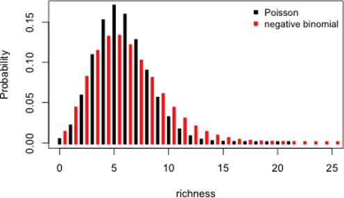

# (PART\*) GLMs with count data {-}

# What can we do with count data?

Count data is characterized by:

- Positive values: you do not count -7 individuals
- Integer values: you do not count 7.56 individuals
- Exhibits larger variance for large values

To illustrate count data we will use a new dataset called `faramea`.

```{r, echo = TRUE, eval = TRUE}
# Load the dataset
faramea <- read.csv("faramea.csv", header = TRUE)
```

In this dataset, the number of trees of the species *Faramea occidentalis* was measured in 43 quadrats in Barro Colorado Island in Panama. For each quadrat, environmental characteristics were also recorded such as elevation or precipitation. Let's take a look at the number of *Faramea occidentalis* found at each quadrat.

```{r, echo = TRUE, eval = TRUE, fig.width = 7, fig.height = 5, fig.align = "center"}
# Histogram of F. occidentalis count data
hist(faramea$Faramea.occidentalis, breaks=seq(0,45,1), xlab=expression(paste("Number of ",
italic(Faramea~occidentalis))), ylab="Frequency", main="", col="grey")
```

We can see that there are only positive and integer values.

In this example, we want to test whether elevation (a continuous
explanatory variable) influences *Faramea occidentalis* abundance.


```{r, echo=F,fig.height=4.0}
plot(faramea$Elevation, faramea$Faramea.occidentalis, ylab = 'F. occidentalis individuals', xlab = 'Elevation(m)')
```

Hence, a Poisson GLM (i.e. a simple Poisson regression) seems to be a good choice to model the number of *Faramea occidentalis* as a function of elevation. Poisson GLMs are usually a good way to start modeling count data.

## Poisson GLMs

### The Poisson distribution

The Poisson distribution specifies the probability of a
discrete random variable $Y$ and is given by:


$$f(y, \,\mu)\, =\, Pr(Y = y)\, =\, \frac{\mu^y \times e^{-\mu}}{y!}$$

$$E(Y)\, =\, Var(Y)\, =\, \mu$$

where $\mu$ is the parameter of the Poisson distribution

The Poisson distribution is particularly relevant to model count data because it:

-   specifies the probability only for integer values
-   $P(y<0) = 0$, hence the probability of any negative value is null
-   $Var(Y) = \mu$ (the mean-variance relationship) allows for heterogeneity (e.g. when
    variance generally increases with the mean)

A Poisson GLM will model the value of $\mu$ as a function of different explanatory variables:

**Step 1.**

We assume $Y_i$ follows a Poisson distribution with mean and variance $\mu_i$.

$$Y_i ∼ Poisson(\mu_i)$$

$$E(Y_i) = Var(Y_i) = \mu_i$$

$$f(y_i, \, \mu_i) = \frac{\mu^{y_i}_i \times e^{-\mu_i}}{y!}$$

$\mu_i$ corresponds to the expected number of individuals.

**Step 2.**

We specify the linear predictor of the model just as in a linear model.

$$\underbrace{\alpha}_\text{Intercept} + \underbrace{\beta_1}_\text{slope of 'Elevation'} \times \text{Elevation}_i + \underbrace{\beta_2}_\text{slope of 'Precipitation'} \times \text{Precipitation}_i$$

**Step 3.**

The link between the mean of $Y_i$ and linear predictor is a logarithmic function can be written as:

$$log(\mu_i) = \alpha + \beta_1 \times \text{Elevation}_i + \beta_2 \times \text{Precipitation}_i$$

It can also be written as:

$$\mu_i = e^{ \alpha + \beta_1 \times \text{Elevation}_i + \beta_2 \times \text{Precipitation}_i}$$

This shows that the impact of each explanatory variable is multiplicative.
Increasing Elevation by one increases μ by factor of exp( $\beta_\text{Elevation}$ ).

We can also write it as:

$$\mu_i = e^{\alpha} \times e^{\beta_1^{\text{Elevation}_i}} \times e^{\beta_2^{\text{Precipitation}_i}}$$

If $β_j = 0$ then $exp(β_j) = 1$ and $μ$ is not related to $x_j$. If $β_j > 0$ then $μ$ increases if $x_j$ increases; if $β_j < 0$ then $μ$ decreases if $x_j$ increases.

### Poisson GLMs in `R`

Fitting a Poisson GLM in R requires only setting `family = poisson` in
the `glm()` function. By default the link function is log.

```{r, echo = TRUE, eval = TRUE}
# Fit a Poisson GLM
glm.poisson = glm(Faramea.occidentalis ~ Elevation,
  data = faramea,
  family = poisson) # this is what makes it a Poisson GLM! Note the default link is log.
summary(glm.poisson)
```

Intercept = $\alpha$

Elevation = $\beta$

The output is similar to a '**lm**' output (see[Workshop 4](https://github.com/QCBSRworkshops/workshop04))
and gives us the parameter estimates which can also
be retrieved using other functions:

```{r, echo = TRUE, eval = TRUE}
# intercept
summary(glm.poisson)$coefficients[1,1]
# slope of elevation
summary(glm.poisson)$coefficients[2,1]
```

Now we can estimate the residual and null deviances. In our
model the unknown parameters are the intercept ($\alpha$)
and the slope of elevation ($\beta$):

$$log(\mu_i) = 1.769 - 0.0027 \times \text{Elevation}_i$$

which we can also write as:

$$\mu_i = e^{1.769 - 0.0027 \times \text{Elevation}_i}$$
Remember that to estimate the unknown parameter, maximum likelihood estimation is used.

The residual deviance is defined as twice the difference between
the log-likelihood of a model that provides a perfect fit and the log-likelihood of our model.

$$\text{residual deviance} = 2 \, log(L(y;\,y)) - 2 \, log(L(y;\, \mu))$$

In a Poisson GLM, the residual deviance should be close to the residual
degrees of freedom. However, our residual deviance is much higher
than the degrees of freedom of our model!

$$388.12 >> 41$$

## The problem of overdispersion

An important aspect of the summary can be found in the last lines.

```{r, echo = TRUE, eval = FALSE}
#     Null deviance: 414.81  on 42  degrees of freedom
# Residual deviance: 388.12  on 41  degrees of freedom
```

Remember that ML estimation is used to estimate the parameters. In the
goodness-of-fit section we mentioned that the deviance was a ML
equivalent of the sum of squares in linear models. Here, the null
deviance and the residual deviance are equivalent to the total sum of
squares and the residual sum of squares respectively. The residual
deviance is defined as twice the difference between the log likelihood
of a model that provides a perfect fit to the data (a saturated model)
and the log likelihood of the model. If our model is correct the
asymptotic distribution of the residual deviance is approximated using
χ² distribution with $n$-$p$-1 degrees of freedom (computed as
$n$-$p$-1, where $n$ is the number of observations and $p$ the number of covariates). This implies that residual deviance should be equal to the residual degrees of freedom. In our example, the residual deviance
equals 388.12 while we have 41 (43-1-1) degrees of freedom. This former is greater to the former by 9.5 times, the model is then **overdispersed**.

**Overdispersion** As a consequence overdispersion can be computed for
any model using the parameter φ:

                          φ = residual deviance / residual degrees of freedom

    * φ < 1 indicates underdispersion
    * φ = 1 indicates no overdispersion
    * φ > 1 indicates overdispersion

Why does a Poisson GLM exhibit overdispersion? This arises when the
variance of the data is higher than expected from the Poisson
distribution. This frequently occurs when data includes many zeros
and/or many very high values. Looking back at the distribution of our
data (above) suggests that our data contains many zero preventing us to use a Poisson GLM. Overdispersion may also result from missing
covariates, missing interaction terms or presence of strong outliers,
preventing us from using a Poisson GLM.

The Poisson distribution can account only partially for heterogeneity in the data due to the mean variance relationship, but in some cases
variance increases even higher than the mean. Computing the mean and the variance of our dataset suggests this is occurring:

```{r, echo = TRUE, eval = FALSE}
mean(faramea$Faramea.occidentalis)
var(faramea$Faramea.occidentalis)
```

In practice, Poissons GLM are useful for describing the mean *µ*~i~ but underestimates the variance in the data, making all model-based tests too liberal! There are two ways of dealing with overdispersion and will be developed below:

-   correct for it by doing a **quasi-Poisson GLM**
-   choose another distribution such as the **negative binomial**

## Quasi-Poisson GLMs

The principle behind a quasi-Poisson GLM is very simple; the
overdispersion parameter (φ) is added to the expected variance equation:

$$E(Y_i) = \mu_i$$

$$Var(Y_i) = φ.\mu_i$$

The linear predictor and the link function remains the same. The
difference is that $φ$ will first be estimated to correct the model.
Parameter Estimates will be the same but the standard errors of the
parameters are multiplied by $√φ$, in other terms, some marginally
significant p-values may no longer hold.

In R, The `quasipoisson` family object can be used to deal with
count data exhibiting overdispersion (the `quasibinomial` family
object can do the same for binomial data). The fitted φ value will be
returned in the summary of the GLM. There are two ways to perform this
GLM:

```{r, echo = TRUE, eval = TRUE}
# Option 1, fit a new quasi-Poisson GLM
glm.quasipoisson = glm(Faramea.occidentalis~Elevation, data=faramea, family=quasipoisson)
# Option 2, build from the previous model and update it:
glm.quasipoisson = update(glm.poisson,family=quasipoisson)
# output
summary(glm.quasipoisson)
```

If you look at the summary of the model you will see that $φ$ is estimated as 15.97. We then made a good choice by updating the model to account for overdispersion. However if we look at P-values we can note that elevation is no longer significant. Yet, 15.97 is quite a lot of overdispersion, and in general quasi-Poisson GLMs will be favoured when $φ$ is included between 1 and 15 though these limits are arbitrary. When overdispersion is higher than 15-20 we recommend moving to the **negative binomial**. 

Two other points are important to keep in mind when using quasi-Poisson GLMs and dealing with overdispersion:

-   **Quasi-Poisson GLMs do not have AIC scores.** An important aspect
    is that quasi-Poisson GLMs do not correspond to models with fully
    specified likelihoods and rely on quasi-ML estimation (i.e.
    pseudolikelihood). One consequence is that quasi-Poisson GLMs do not have AIC scores for model comparisons. However, variants of AIC have been developed to deal with this situation (e.g. quasi-AIC).

-   **Overdispersion affects model comparison.** Indeed overdispersion
    also influences the comparison of two nested models and has to be
    taken into account when φ is known. For instance, let's assume that we want to compare GLM1, with $p_1$ parameters to GLM2, with $p_2$ parameters, such that GLM1 is nested within GLM2 and $p_2>p_1$. Model comparison is achieved based on a generalized
    likelihood ratio test, which can be written as a function of the
    difference of deviances between the two GLMs, $D_1$ and $D_2$
    respectively. If Overdispersion is known, deviances have to be
    scaled (i.e. corrected) accordingly as $D^* = D/φ$. The final test
    will be based on the criterion $D^*_1 - D^*_2$ which is assumed to
    follow a $χ²$ distribution with $p_1-p_2$ degrees of freedom when
    GLM1 is correct.

-   In some cases $φ$ is not known. For instance, this occurs when you run
    a GLM with a normal error distribution. In that case, $φ$ can be
    estimated *a posteriori* using the residual deviance of the larger
    model so the criterion becomes:
    
$$\frac{(D_1-D_2)/(p_2-p_1)}{D_2(n-p_2)}$$
    
and is assumed to follow a F distribution with $p_1-p_2$ and $n-p_2$ degrees of freedom.

Try also deviance analysis to test for the effect of Elevation

```{r, echo = TRUE, eval = TRUE}
null.model <- glm(Faramea.occidentalis ~ 1,
                  data = faramea,
                  family = quasipoisson)
anova(null.model, glm.quasipoisson, test = "Chisq")

```

**Dispersion parameter:**


## Negative binomial GLMs

GLM with a negative binomial (NB) distribution are favored when
overdispersion is extreme. The NB distribution contains an additional
parameter $k$, particularly handy for count data containing a
preponderance of zeros. Before we go into R stuff, we should see what
lies behind a negative binomial GLM. A NB distribution is actually a
combination of two distributions: a Poisson distribution and a gamma
distribution. The NB distribution first assumes that a discrete random
variable is Poisson distributed but its mean, $µ$ is assumed to follow a gamma distribution. The mixture between the Poisson and gamma
distributions can be simplified into a density function specific to the



NB which has two parameters $µ$ and $k$.

$$Y \sim NB(µ, k)$$

$$E(Y) = µ~and~Var(Y) = µ + µ²/k$$

Here, we can see how overdispersion will be accounted for by NB
distribution in GLMs. The second term of the variance determines the
amount of overdispersion. In fact, it is indirectly determined by $k$,
where $k$ is also called the dispersion parameter. If $k$ is large
(relative to $μ²$), the second term, $µ²/k$ approximates 0, and the
variance of Y is $μ$. In such cases the NB converges to the Poisson
distribution and you might as well use a Poisson distribution. The
smaller $k$, the larger the overdispersion. Just like with others GLMs,
a NB GLM is specified following the fundamental three steps. It first
assumes that Y~i~ is negative binomial distributed with mean $μ_i$ and parameter $k$.

$$Y_i \sim NB(µ_i, k)$$

$$E(Y_i) = µ_i~and~Var(Y_i) = µ_i + µ_i²/k$$

The two last steps define the systematic part and the link function
between the mean of $Y_i$ and the predictor function. In NB GLMs the link function is logarithmic ensuring that fitted values are always positive.

$$log(µ_i) = β_0 + βX_i$$

or

$$µ_i = exp(β_0 + βX_i)$$


The negative binomial GLM can be built using the ```glm.nb()``` function from
the ```MASS``` package:

```{r, echo = FALSE, eval = TRUE, message = FALSE}
library("MASS")
```
```{r, echo = TRUE, eval = TRUE}
glm.negbin = glm.nb(Faramea.occidentalis~Elevation, data=faramea)
summary(glm.negbin)
```

The summary is similar to other GLMs summaries (e.g. Poisson GLMs),
though we now have a parameter theta, which stands for parameter $k$ in the variance of the NB distribution. Its standard error is also
provided, but care is needed with its use as the interval is not
symmetric and we are testing on the boundary.

## Plotting the final GLM to the data

The NB GLMs appear to be the best fit to our data. We can plot the
relationship between the abundance of *Faramea occidentalis* and
elevation.

Use ```summary``` to get the parameters.
```{r, echo = TRUE, eval = TRUE}
summary(glm.negbin)$coefficients[1, 1]
summary(glm.negbin)$coefficients[2, 1]
```
Use the standard errors to build the confidence envelope.
```{r, echo = TRUE, eval = TRUE}
summary(glm.negbin)$coefficients[1, 2]
summary(glm.negbin)$coefficients[2, 2]
```

```{r, echo = TRUE, eval = TRUE}
# Make model predicitions
pp <- predict(glm.negbin,
  newdata = data.frame(Elevation = 1:800),
  se.fit = TRUE)
linkinv <- family(glm.negbin)$linkinv # inverse-link function

# Prepare to plot model results
pframe <- as.data.frame(pp$fit)
names(pframe) <- "pred0"
pframe$pred <- linkinv(pp$fit)
sc <- abs(qnorm((1-0.95)/2))  # Normal approx. to likelihood
pframe <- transform(pframe, lwr = linkinv(pred0-sc*pp$se.fit), upr = linkinv(pred0+sc*pp$se.fit))

# Plot!
plot(faramea$Elevation, faramea$Faramea.occidentalis,
  ylab = 'Number of F. occidentalis', xlab = 'Elevation(m)')
lines(pframe$pred, lwd = 2) # predicted values
lines(pframe$upr, col = 2, lty = 3, lwd = 2) # show error bounds
lines(pframe$lwr, col = 2, lty = 3, lwd = 2)
```

We can see that the number of *Faramea occidentalis* significantly
decreases with elevation. However, the confidence envelope of the NB
model is large at low elevation.

### Challenge 3

Use the `mites` dataset! Model the abundance of the species Galumna as a function of the substrate characteristics (water content ```WatrCont``` and density ```SubsDens```)

Do you need to account for overdispersion?
Which covariates have a significant effect?
Select the best model!

```{r, echo = TRUE, eval = TRUE}
# Challenge 3

mites <- read.csv("data/mites.csv", header = TRUE)
```

Drop each term in turn and compare the full model with a nested model using the command:
```{r, echo = TRUE, eval = FALSE}
# This is how to do model comparison by dropping terms in turn
drop1(MyGLM, test = "Chi")
```

Specify manually a nested model, call it for example MyGLM2, and use the command:
```{r, echo = TRUE, eval = FALSE}
# You can also manually specify a nested model and compare it to your full model with this command:
anova(MyGLM, MyGLM2, test = "Chi")
```

<details>
  <summary>**Clic here to see the solution!**</summary>

```{r, echo = TRUE, eval = TRUE}
# Poisson GLM
glm.p = glm(Galumna~WatrCont+SubsDens, data=mites, family=poisson)

# quasi-Poisson GLM
glm.qp = update(glm.p,family=quasipoisson)

# model selection
drop1(glm.qp, test = "Chi")
# or
glm.qp2 = glm(Galumna~WatrCont, data=mites, family=quasipoisson)
anova(glm.qp2, glm.qp, test="Chisq")
```


</details>

## Conclusion on GLMs with count data

All the GLMs introduced (Poisson, quasi-Poisson and NB) to model count
data use the same log-linear mean function ($log(µ) = βx$), but
make different assumptions about the remaining likelihood. Quasi-Poisson and NB are favored to deal with overdispersion. However, in some cases the data may contains too many zeros and zero-augmented models can be useful as they extend the mean function by modifying (typically, increasing) the likelihood of zero counts (e.g. zero-inflated Poisson [ZIP]).
