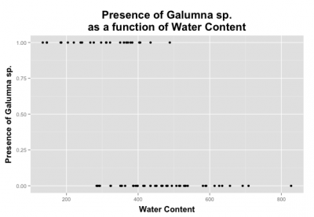

# (PART\*) GLM avec des données binaires {-}

# GLM avec une distribution binomiale

Les variables binaires sont fréquentes en écologie : on observe un phénomène $Y$ ou son \«absence\». Par exemple, on note souvent la présence ou l'absence d'espèces lors d'études de terrain. Le but est généralement de déterminer si la présence d'une espèce est influencée par différentes variables environnementales. D'autres exemples courants sont la présence/absence d'une maladie au sein d'une population sauvage, l'observation/non-observation d'un comportement spécifique et la survie/mort d'un individu. Habituellement, nous sommes interessés à une question telle que: comment l'occurence d'une espèce varie en fonction des conditions de son environnement?

$$Occurrences = f(Environment)$$
Sous un modèle linéaire, les valeurs attendues peuvent se trouver en dehors de l'étendu de `[0, 1]` avec la fonction 'lm()':

```{r, eval = FALSE, echo = TRUE}
# set up some binary data
Pres <- c(rep(1, 40), rep(0, 40))
rnor <- function(x) rnorm(1, mean = ifelse(x == 1, 12.5, 7.5), sd = 2)
ExpVar <- sapply(Pres, rnor)

# linear model with binary data...
lm(Pres ~ ExpVar)
```

```{r,echo=FALSE, fig.show="hold", out.width="50%", fig.height = 7}
par(cex = 1.2)
Pres <- c(rep(1, 40), rep(0, 40))
rnor <- function(x) rnorm(1, mean = ifelse(x == 1, 12.5, 7.5), sd = 2)
ExpVar <- sapply(Pres, rnor)
plot(ExpVar, Pres,
     ylim = c(-.5, 1.5),
     xlab = 'Explanatory variable',
     ylab = 'Presence',
     main = 'Binary variables and fitted values',
     pch = 16)
abline(lm(Pres ~ ExpVar), col = 'orange', lwd = 2)
mtext(expression(symbol("\255")), at = 1.25, side = 4, line = 0.1, cex = 6, col = 'blue')
mtext(expression(symbol("\256")), at = 3, side = 1, line = -2.2, cex = 6, col = 'blue')

# histogram
hist(Pres)
```

Lorsqu'on prédit la probabilité d'observer un phénomène Y qui est une variable binaire, la valeur prédite doit se trouver entre 0 et 1 : c'est l'étendue possible d'une probabilité !

## GLM avec des données binomiales: lien logit

Tel que vu dans la section précdente, un modèle de régression qui utilise une variable binaire comme variable réponse est l'un de plusieurs modèles linéaires généralisés (GLM) et est appelé régression logistique ou modèle logit.

Un modèle **linéaire généralisé** est composé de **prédicteurs linéaires**:

$$\underbrace{g(\mu_i)}_{Link~~function}  = \underbrace{\beta_0 + \beta_1X_1~+~...~+~\beta_pX_p}_{Linear~component}$$
Les chances mettre nos valeurs attendues sur une échelle de `0` à `+Inf`.

On prend ensuite les logarithmes, et calcule le *logit*:

$$\eta_i = \text{logit}(\mu_i) = \log(\frac{\mu_i}{1-\mu_i})$$

avec $\mu$ étant la valeur attendue (probabilité que $Y = 1$), et les valeurs attendues s'étendant de `-Inf` à `+Inf`.

Dans 'R', la présence (ou succès, survie...) est habituellement codée par un `1` et une absence (ou échec, mort...) par un `0`. On effectue une régression logistique (ou n'importe quel GLM) à l'aide de la fonction `glm()`. Cette fonction diffère un peu de la fonction de base `lm()`, car elle permet de spécifier une distribution statistique autre que la distribution normale. 


```{r, eval = FALSE, echo = TRUE}
glm(formula,
    family = ???, # this argument allows us to set a probability distribution!
    data,
    ...)
```

Nous avons déjà vu que les variables binaires ne sont pas distribuées normalement (*i.e.* on observe un pic à 0 et un pic à 1 et rien entre les deux). Dans 'R', on spécifie la distribution statistique du modèle avec l'argument `family`. Pour la régression logistique, on l'indique de la façon suivante : `family = 'binomial`'.

| Distribution de $Y$ | Nom du fonction lien | Fonction lien | Modèle      | `R` |
|---------------------|--------------------|---------------|------------|-----|
| Normale              | Identité           | $g(\mu) = \mu$  | $\mu = \mathbf{X} \boldsymbol{\beta}$ | `gaussian(link="identity")` | 
| Binomiale            | Logit              | $g(\mu) = \log\left(\dfrac{\mu}{1-\mu}\right)$  | $\log\left(\dfrac{\mu}{1-\mu}\right) = \mathbf{X} \boldsymbol{\beta}$ | `binomial(link="logit")`| 
| Poisson              | Log           | $g(\mu) = \log(\mu)$ | $-\mu^{-1} = \mathbf{X} \boldsymbol{\beta}$ | `poisson(link="log")`|
| Exponentielle              | Inverse négative          | $g(\mu) = -\mu^{-1}$  | $\log(\mu) = \mathbf{X} \boldsymbol{\beta}$ | `Gamma(link="inverse")` |

Dans `R`, nous pouvons donc construire notre GLM binomial avec un lien logit de cette façon:

```{r, eval = FALSE, echo = TRUE}
# This is the syntax for a binomial GLM with a logit link
glm(formula,
    family = binomial(link = "logit"), # this is also known as logistic
    data,
    ...)
```

## Exemple 

Construisons notre premier modèle linéaire généralisé! Ici, nous voulons construire notre modèle en utilisant le jeu de données `mites`:

```{r, echo = TRUE}
# setwd('...')

mites <- read.csv("data/mites.csv", header = TRUE)
str(mites)
```

Nous pouvons modéliser notre régression logistique avec les doonées de présence de *Galumna* sp. en relation avec le contenu en eau et la topographie comme s'en suit, en utilisant `glm()` et l'argument `family`:

```{r}
logit.reg <- glm(pa ~ WatrCont + Topo,
                 data = mites,
                 family = binomial(link = "logit"))
```

Pour la sortie du modèle:
```{r}
summary(logit.reg)
```

Est-ce que la sortie vous dit quelque chose? Ressemble-t-elle à la sortie de `summary.lm()`? En effet! Cependant, vous remarquerez qu'il ya des petites différences (p.ex. le paramètre de dispersion) qui sont discutées plus loin dans ce guide! 

## Défi 1

Avec le jeu de données `bacteria` (provenant du package `MASS`), modélisez la présence de *H. influenzae* en relation avec le traitement et la semaine du test.
Commençez avec le modèle complet, puis réduisez-le pour obtenir le modèle le plus parcimonieux.

Chargez le package `MASS` et le jeu de données `bacteria`:

```{r, echo = FALSE, eval = TRUE, warning=FALSE}
# Challenge 1 - Set up!
library(MASS)
data(bacteria)

# what does the data look like?
str(bacteria)
```

Ce jeu de données a été créée pour tester la présence de la bactérie *H. influenzae* chez les enfants avec otitis media dans les territoire nordique de l'Australie. Dr A. Leach a testé les effets d'un un médicament sur 50 enfants ayant des antécédents d'otite moyenne dans le Territoire du Nord de l'Australie. Les enfants ont été choisis aléatoirement pour recevoir le médicament ou un placebo. La présence de *H. influenzae* a été contrôlée aux semaines 0, 2, 4, 6 et 11 : 30 de ces contrôles étaient manquants et ne sont pas inclus dans ce jeu de données.

<details>
  <summary>**Cliquez pour voir la solution au Défi 1!**</summary>

```{r, echo = TRUE, eval = TRUE}
# Challenge 1 - Solution

# Fit models (full to most parsimonious)
model.bact1 <- glm(y ~ trt * week, data = bacteria, family = binomial)
model.bact2 <- glm(y ~ trt + week, data = bacteria, family = binomial)
model.bact3 <- glm(y ~ week, data = bacteria, family = binomial)

# Let's compare these models using a likelihood ratio test (LRT).
anova(model.bact1, model.bact2, model.bact3, test = "LRT")

# Which model is the best candidate?
```

En se basant sur ces résultats, on doit choisir le modèle 2
comme celui représentant le mieux le jeu de données.

</details>

## Interpréter la sortie d'une régression logistique

La sortie du modèle de régression logistique indique que les deux
variables explicatives (`WatrCont` et `Topo`) sont significatives: 

```{r, echo = TRUE, eval = TRUE}
# Extracting model coefficients
summary(logit.reg)$coefficients
```

Mais comment interprète-on les coefficients estimés? 

Rappelez-vous que nous avons effectué une transformation des valeurs prédites par le modèle (*i.e.* la probabilité que $Y = 1$), alors il faut utiliser une fonction inverse pour pouvoir interpréter correctement les résultats. 

### Un exemple avec le lien d'identité

Si nous avions utilisé une fonction de lien d'identité, l'interprétation serait beaucoup plus facile.

En assumant un résultat binaire $y$ et deux covariables $x_1$ et $x_2$ et une constante, la probabilité d'avoir un résultat favorable ( $y = 1$ ) est donné par:

$$Pr(y_i = 1) = p = g^{-1(\beta_0 + x_{1i}\beta_1 + x_{2i}\beta_2)}$$

où $g^{-1}()$ est la **fonction lien d'identité inverse**.

Pour un lien d'identité, l'interprétation du coefficient $\beta_1$ est plutôt simple:
Pour un incrément d'une unité de $x_1$, $\beta_1$ donne une différence constante du résultat.

$\Delta{y_i} = [\beta_0 + (\color{red}{x_{1i} + 1})\beta_1 + x_{2i}\beta_2] - (\beta_0 + x_{1i}\beta_1 + x_{2i}\beta_2)$

$\Delta{y_i} = \beta_1$


### Interprétation avec un lien logit

Pour un modèle linéaire logistic avec deux covariables $x_1$ et $x_2$, nous avons:

$$log({\dfrac{p}{1-p}})=\beta_0 + x_{1i}\beta_1 + x_{2i}\beta_2$$

Ce qui correspong à notre ratio du log de nos cotes! Nous pouvons ainsi utiliser une fonction exponentielle pour réécrire notre modèle et obtenir le ratio des cotes:

$$\dfrac{p}{1-p}=exp(\beta_0 + x_{1i}\beta_1 + x_{2i}\beta_2)$$

Si nous voulons ainsi convertir les cotes en probabilité, selon le coefficient $\alpha$ nous pouvons utiliser la **fonction de lien logit inverse** (aussi appelé la fonction logistic):

$$ Pr(y_i = 1) = logit^{-1}(\alpha) = \dfrac{1}{1 + exp(-\alpha)} = (\dfrac{1}{1 + exp(-\alpha)}) * (\dfrac{exp(\alpha)}{exp(\alpha)}) = \dfrac{exp(\alpha)}{exp(\alpha) + 1}$$

Pour en revenir à notre mode`le, cela nous donne:

$$Pr(y_i = 1) = \dfrac{exp(\beta_0 + x_{1i}\beta_1 + x_{2i}\beta_2)}{1 + exp{(\beta_0 + x_{1i}\beta_1 + x_{2i}\beta_2)}}$$

Puisque la fonction de lien inverse n'Est pas linéaire, cela reste difficile d'interpréter le coefficient.
Cependant, nous pouvons observer ce qui arrive à la différence avec un incrément d'une unité de $x_1$:

$$\Delta{y_i} = \dfrac{\exp[\beta_0 + (\color{red}{x_{1i} + 1})\beta_1 + x_{2i}\beta_2]}{1 + \exp{[\beta_0 + (\color{red}{x_{1i} + 1})\beta_1 + x_{2i}\beta_2]}} - \dfrac{\exp[\beta_0 + x_{1i}\beta_1 + x_{2i}\beta_2]}{1 + \exp{[\beta_0 + x_{1i}\beta_1 + x_{2i}\beta_2]}}$$

$$\Delta{y_i} = \exp(\beta_1)\ $$

Lorsque $x_1$ augmente d'une unité, les cotes augmentes par un facteur de $\exp(\beta_1)$.
à noter que les valeurs des cotes ici sont considérées dans une situation où les autres paramètres sont constants. 

Avec ceci, nous pouvons finalement interpréter nos coefficients et les résultats de nos modèles! 

```{r, echo = TRUE, eval = TRUE}
exp(logit.reg$coefficients[2])
```

Pour obtenir l'intervalle de confiance sur l'échelle des cotes :
```{r, echo = TRUE, eval = TRUE, message = FALSE}
exp(confint(logit.reg)[2,])
```

Lorsque la cote est inférieure à 1, l'interprétation est un peu plus compliquée. Si c'est le case, il faut prendre la valeur inverse de la cote (*i.e.* 1 divisé par la cote) pour faciliter l'interprétation. 

L'interprétation revient à dire comment l'observation d'un phénomène est **MOINS** probable. Pour le contenu en eau du sol, la cote est de 0.984. L'inverse est:
$$\dfrac{1}{0.984} = 1.0159$$.

Ceci signifie que l'augmentation d'une unité en contenu en eau diminue la vraisemblance d'observer la présence de *Galumna* sp. de 1.0159. On peut aussi l'exprimer en pourcentage en soustrayant 1 à cette valeur : 
$(1.0159 - 1) * 100 = 1.59%$. 

Il est 1.59 % moins vraisemblable d'observer *Galumna* sp. avec une augmentation d'une unité de contenu en eau. Pour se convaincre qu'on fait la bonne interprétation, on peut représenter graphiquement les résultats de la présence de *Galumna* sp. en fonction du contenu en eau du sol. On voit qu'en moyenne la présence de *Galumna* sp. est plus élevée lorsque le contenu en eau est faible.

{width="400"}

Lorsqu'un paramètre estimé est entre 0 et 1 sur l'échelle des cotes, la relation entre la variable réponse et la variable explicative est **négative**. Si la valeur est supérieure à 1, la relation est **positive**. Si l'intervalle de confiance inclut la valeur 1, la relation n'est pas *significative*. 

Rappelez-vous qu'une valeur de 1 sur l'échelle des cotes signifie que la probabilité d'observer un phénomène Y est la même que celle de ne pas observer ce phénomène (*i.e.* quand $p$ = 0.5, 0.5/(1-0.5) = 1).

Faisons de même avec la topographie:
```{r, echo = TRUE, eval = TRUE}
exp(logit.reg$coefficients[1])
```

Le paramètre estimé pour la topographie est de 2.091 sur l'échelle des cotes en log. Donc, la probabilité est donnée par :

$1/(1+1/exp(2.091)) = 0.89$ ce qui équivaut à $1/(1+1/8.09)$. 

Prenez note que la cote pour une variable explicative est calculée
lorsque les autres variables sont gardées constantes. La topographie a
une cote de 8.09. Ceci signifie que la probabilité d'observer *Galumna* sp. est 8.09 fois plus vraisemblable lorsque la topographie est de type `hummock` plutôt que `blanket`.

Calculons cette valeur de cote sans utiliser la fonction `exp()`:

On commence avec la valeur de cote pour la topographie du modèle `logit.reg`:  
$µ/ (1 - µ) = 8.09$

On réarrange pour isoler $µ$ :\
$µ$ = 8.09(1 - $µ$) = 8.09 - 8.09$µ$\
8.09$µ$ + $µ$ = 8.09\
$µ$(8.09 + 1) = 8.09\
$µ$ = 8.09 / (8.09 + 1)\
$µ$ = 1 / (1 + (1 / 8.09)) = 0.89\

On obtient le même résultat sans utiliser la fonction logit inverse !

## Pouvoir prédictif et validation du modèle

Une façon simple et intuitive d'estimer le pouvoir explicatif d'un GLM
est de comparer la déviance du modèle à celle d'un modèle nul. La
déviance peut être vue comme une généralisation du concept de la somme
des carrés résiduelle lorsque le modèle est estimé par maximisation de
la vraisemblance (*i.e.* la méthode par laquelle on estime les
paramètres d'un GLM). Ceci nous permet de calculer un pseudo-R^2^, une
statistique similaire au R^2^ dans une régression des moindres carrés
(*i.e.* la méthode utilisée pour estimer les paramètres d'une
régression linéaire de base). La forme générique pour calculer un pseudo-R^2^ est :

$$\text{pseudo-R}^2 = \dfrac{\text{déviance nulle} - \text{déviance résiduelle}}{\text{déviance nulle}}$$

où \«déviance du modèle nul\» est la déviance du modèle nul et
\«déviance résiduelle\» est la déviance résiduelle du modèle d'intérêt.La différence est divisée par la déviance du modèle nul afin de
contraindre le pseudo-R^2^ entre 0 et 1.

Le modèle nul correspond à un modèle sans variable explicative. Dans R, on l'indique de la façon suivante :
`null.model <- glm(Response.variable ~ 1, family = binomial)`.

Une unité de déviance est la mesure de distance entre $y$ et $μ$.

$${\displaystyle d(y,y)=0}$$
$${\displaystyle d(y,\mu )>0\quad \forall y\neq \mu }$$

La déviance totale ${\displaystyle D(\mathbf {y} ,{\hat {\boldsymbol {\mu }}})}$ d'une modèle avec ses prédictions ${\hat {\boldsymbol {\mu }}}$ de l'observation $\mathbf {y}$ est la somme de ses unités de déviances :
$${\displaystyle D(\mathbf {y} ,{\hat {\boldsymbol {\mu }}})=\sum _{i}d(y_{i},{\hat {\mu }}_{i})}$$

Maintenant, la déviance d'un modèle estimé ${\hat {\mu }}=E[Y|{\hat {\theta }}_{0}]$ peut être défini par sa **vraisemblance**:
$$D(y,{\hat {\mu }})=2{\Big (}\log {\big (}p(y\mid {\hat {\theta }}_{s}){\big )}-\log {\big (}p(y\mid {\hat {\theta }}_{0}){\big )}{\Big )}$$
avec $\hat \theta_0$ dénotant la valeurs ajustées du paramètre dans le modèle réduit, alors que ${\displaystyle {\hat {\theta }}_{s}}\hat \theta_s$ dénotes les paramètres ajustés pour le modèle saturé.

La **déviance résiduelle** est définie comme 2 fois le ratio de la vraisemblence en log du modèle saturé comparé au modèle réduit: 
$$D(y,{\hat {\mu }})=2{\Big (}\log {\big (}p(\text{modèle saturé}){\big )}-\log {\big (}p(\text{modèle réduit}){\big )}{\Big )}$$

Enfin, la **déviance nulle** est définie comme 2 fois le ratio de la vraisemblence en log du modèle saturé comparé au modèle réduit (i.e. les variables prédictrices = 1).

$$D(y,{\hat {\mu }})=2{\Big (}\log {\big (}p(\text{modèle saturé}){\big )}-\log {\big (}p(\text{modèle nul}){\big )}{\Big )}$$


Maintenant, nous pouvons le faire dans R. Comparons la déviance de notre modèle (déviance résiduelle) à la déviance d'un modèle nul (déviance nulle).

```r
null.model <- glm(response.variable ~ 1, family = binomial)
```

Le modèle **saturé (ou complet)** contient l'ensemble des variables prédisctrices:

```r
full.model <- glm(response.variable ~ ., family = binomial)
```

Les déviances résiduelles et nulles sont déjà stockées dans `glm object`:

```{r, echo = TRUE, eval = TRUE}
# Les déviances résiduelle et nulle sont déjà enregistrées dans un objet de type glm.
objects(logit.reg)
```

Nous pouvons mainteant utiliser ces déviances pour calculer la valeur du pseudo-R^2^:

```{r}
# calcule pseudo-R2
pseudoR2 <- (logit.reg$null.deviance - logit.reg$deviance) / logit.reg$null.deviance
pseudoR2
```

Les variables explicatives du modèle expliquent 46.6% de la variabilité de la variable réponse.

Un pseudo-R^2^ de McFadden ajusté, qui pénalise pour le nombre de
prédicteurs, peut être calculé comme suit:


où **K** correspond au nombre supplémentaire de prédicteurs par rapport au modèle nul.

La qualité d'ajustement des modèles de régression logistique peut être
exprimée par des variantes de statistiques pseudo-R^2^, telles que les
mesures de Maddala (1983) ou de Cragg et Uhler (1970).

Lorsqu'on parle de régressions logistiques, les valeurs faibles de **R^2^**
sont courantes.

La fonction R ```DescTools::PseudoR2()``` permet de calculer plusieurs pseudo-R^2^. En spécifiant ```which = all```, calculez toutes les statistiques en même temps.

```{r, echo = TRUE, eval = TRUE}
logit.reg <- glm(pa ~ WatrCont + Topo, 
                 data = mites, family = binomial(link = "logit"))
DescTools::PseudoR2(logit.reg, which = "all")
```


```{r, echo = FALSE, eval = FALSE}
### ENLEVÉ PARCE QUE LE PACKAGE binomTools A ÉTÉ RETIRÉ DU CRAN (à supprimer?)

Récemment, [Tjur
(2009)](http://www.tandfonline.com/doi/abs/10.1198/tast.2009.08210#.VFpKZYcc4ow)
a proposé une nouvelle statistique, le coefficient de discrimination
(*D*), afin d'évaluer le pouvoir prédictif d'une régression
logistique. Intuitivement, *D* évalue si la régression logistique peut
classer adéquatement chaque résultat comme un succès ou un échec.
Mathématiquement, c'est la différence entre la moyenne des valeurs
prédites des succès (*i.e.* Y = 1) et des échecs (*i.e.* Y = 0) :

*D = π~1~ - π~0~*

où *π~1~* est la moyenne attendue des probabilités
lorsqu'un événement est observé et *π~0~* est la
moyenne attendue des probabilités lorsqu'un événement n'est pas
observé. Une valeur de *D* près de 1 indique que le modèle accorde une
probabilité élevée d'observer un événement lorsque celui-ci a été
observé et une probabilité faible d'observer un événement lorsque
celui-ci n'a pas été observé. Une valeur de *D* près de 0 indique que
le modèle n'est pas utile pour distinguer entre les observations et les
«non-observations» d'un résultat.


# Le code suivant montre comment obtenir la valeur de *D* et comment représenter #visuellement les valeurs
de *π~1~* et *π~0~*.

install.packages("binomTools")
library("binomTools")
# La fonctions Rsq calcule indices d'ajustement
# dont le coefficient de discrimination.
# Pour plus d'information sur les autres indices, consultez Tjur (2009).
# Les histogrammes montrent la distribution des valeurs attendues lorsque le résultat est observé
# et non observé.
# Idéalement, le recouvrement entre les deux histogrammes doit être minimal.
fit <- Rsq(object = logit.reg)
fit
# R-square measures and the coefficient of discrimination, 'D':
#
#    R2mod     R2res     R2cor     D
#    0.5205221 0.5024101 0.5025676 0.5114661
#
# Number of binomial observations:  70
# Number of binary observation:  70
# Average group size:  1
plot(fit, which = "hist")


Pour évaluer l'ajustement (*i.e.* goodness-of-fit) d'une régression
logistique, les graphiques de diagnostic ne sont pas très utiles (voir
atelier 4). On utilise plutôt un [test de
Hosmer-Lemeshow](http://en.wikipedia.org/wiki/Hosmer-Lemeshow_test) pour
évaluer si un modèle est approprié ou non. Ce test sépare les valeurs
attendues (ordonnées de la plus faible à la plus grande) en groupes de
même taille. Dix groupes est généralement le nombre de groupes
recommandé. Pour chaque groupe, on compare les valeurs observées aux
valeurs attendues. Le test est similaire à un test de khi-carré avec G -
2 degrés de liberté (G est le nombre de groupes). Dans R, ce test est
disponible dans le paquet `binomTools` ou `vcdExtra`.

```{r, echo = TRUE, eval = FALSE}
fit <- Rsq(object = logit.reg)
HLtest(object = fit)
# La valeur de p est de 0.9051814. Donc, on ne rejète pas notre modèle.
# L'ajustement du modèle est bon.
```

### Défi 2

Évaluez l'ajustement et le pouvoir prédictif du modèle `model.bact2`.
Comment pouvez-vous améliorer le pouvoir prédictif du modèle ?

<details>
  <summary>**Cliquez pour voir la solution au Défi 2!**</summary>

```{r, echo = TRUE, eval = TRUE}
null.d <- model.bact2$null.deviance
resid.d <- model.bact2$deviance
bact.pseudoR2 <- (null.d - resid.d) / null.d
bact.pseudoR2
```
```{r, echo = FALSE, eval = FALSE}
#ENLEVÉ parce que le package binomTools retiré du CRAN

library(binomTools)
HLtest(Rsq(model.bact2))
# Chi-square statistic:  7.812347  with  8  df
# P-value:  0.4520122
# L'ajustement est adéquat.
```
C'est très faible!

Le pouvoir prédictif pourrait être augmenté en incluant plus de
variables explicatives.

</details>

## Représentation graphique des résultats

Lorsque le modèle a été validé, il peut être utile de représenter les
résultats graphiquement. Voici un exemple avec le paquet `ggplot2`. Revoir [l'atelier 3](r_workshop3) pour plus d'informations sur ce paquet.

```{r, echo = FALSE, eval = TRUE, warning = FALSE}
library(ggplot2)
```
```{r, echo = TRUE, eval = TRUE, fig.width = 7, fig.height = 7, fig.align = "center", warning = FALSE, message = FALSE}
ggplot(mites, aes(x = WatrCont, y = pa)) + geom_point() +
stat_smooth(method = "glm", method.args = list(family=binomial), se = TRUE) + xlab("Contenu en eau") +
ylab("Probabilité de présence") +
ggtitle("Probabilité de présence de Galumna sp. en fonction du contenu en eau")
```