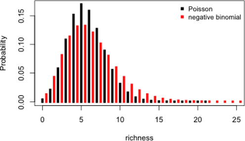

# (PART\*) GLM avec des données d'abondance {-}

# Que faire avec des données d'abondance?

Les données discrètes (ou d'abondance) sont caractérisées par:

- Des valeurs positives: on ne peut compter -7 individus
- Valeurs discrètes: on ne peut compter 7.56 individus
- Démontre une variance élevée pour des valeurs élevées

Afin d'illustrer l'utilisation des GLMs avec des données d'abondance, nous allons utiliser un nouveau jeux de données: `faramea`.

```{r, echo = TRUE, eval = TRUE}
faramea <- read.csv("faramea.csv", header = TRUE)
```

Ce jeux de données s'intéresse à l'espèce d'arbre *Faramea occidentalis* sur l'île Barro Colorado au Panama. 43 transects ont été utilisés afin de mesurer le nombre d'arbre le long d'un gradient environnemental. Des caractéristiques environnementales, comme l'élévation du terrain et la précipitation, ont aussi été mesurées au niveau de chaque transect. Examinons maintenant à quoi ressemble la distribution du nombre d'arbres par transect.

```{r, echo = TRUE, eval = TRUE, fig.width = 7, fig.height = 5, fig.align = "center"}
# Histogram of F. occidentalis count data
hist(faramea$Faramea.occidentalis, breaks=seq(0,45,1), xlab=expression(paste("Nombre de ",
italic(Faramea~occidentalis))), ylab="Fréquence", main="", col="grey")
```

Nous pouvons remarquer qu'il n'y a que des valeurs entières et
positives. 

Pour cet exemple, nous voulons tester si l'élévation (un prédicteur à valeurs continues) influence l'abondance de *Faramea occidentalis*.

```{r, echo=F,fig.height=4.0}
plot(faramea$Elevation, faramea$Faramea.occidentalis, ylab = 'F. occidentalis individuals', xlab = 'Élévation(m)')
```

Etant donné cette spécificité propre aux données de dénombrement, la distribution de Poisson, semble un choix approprié pour modéliser ces données avec l'élévation.

## GLM avec une distribution de Poisson

### La distribution de Poisson

La distribution de Poisson specifie que la probabilité d'une variable
discrète aléatoire $Y$ est donné par:


$$f(y, \,\mu)\, =\, Pr(Y = y)\, =\, \frac{\mu^y \times e^{-\mu}}{y!}$$

$$E(Y)\, =\, Var(Y)\, =\, \mu$$

où $\mu$ est le paramètre de la distribution de Poisson

La distribution de Poisson est particulièrement appropriée pour modéliser des données de dénombrement
car :

-   elle ne spécifie des probabilités que pour des valeurs entières
-   $P(y<0) = 0$, en d'autres termes la probabilité d'observer une
    valeur négative est nulle
-   la relation entre la moyenne et la variance permet de manipuler des données hétérogènes (e.g. quand la variance dans les données augmente avec la moyenne)

Un GLM de Poisson va modéliser la valeur de $\mu$ comme un fonction de différente variables prédictrices:

**Étape 1.**

Nous assumons que $Y_i$ suit une distribution de Poisson avec un moyenne et une variance $\mu_i$.

$$Y_i ∼ Poisson(\mu_i)$$

$$E(Y_i) = Var(Y_i) = \mu_i$$

$$f(y_i, \, \mu_i) = \frac{\mu^{y_i}_i \times e^{-\mu_i}}{y!}$$

$\mu_i$ est le nombre attendu d'individus.

**Étape 2.**

Nous spécifions le prédicteur linéaire du modèle en tant qu'un modèle linéaire.

$$\underbrace{\alpha}_\text{Interception} + \underbrace{\beta_1}_\text{pente de 'Élévation'} \times \text{Élévation}_i + \underbrace{\beta_2}_\text{pente de 'Précipitation'} \times \text{Précipitation}_i$$

**Étape 3.**

La fonction de lien entre la moyenne $Y_i$ et le prédicteur linéaire  est une fonction logarithmique et peut être écrit de cette façon:

$$log(\mu_i) = \alpha + \beta_1 \times \text{Élévation}_i + \beta_2 \times \text{Précipitation}_i$$

ou écrit tel que:

$$\mu_i = e^{ \alpha + \beta_1 \times \text{Élévation}_i + \beta_2 \times \text{Précipitation}_i}$$

Ceci démontre que l'impact de chaque variable prédictrice est multiplicatif. En augmentant l'élévation de 1, on augmente $μ$ par un incrément de exp( $\beta_\text{Élévation}$)

Nous pouvons aussi l'écrire de cette façon:

$$\mu_i = e^{\alpha} \times e^{\beta_1^{\text{Élévation}_i}} \times e^{\beta_2^{\text{Précipitation}_i}}$$

Si $β_j = 0$ alors $exp(β_j) = 1$ et $μ$ n'est pas lié à $x_j$. Si $β_j > 0$ alors $μ$ augmente aussi si $x_j$ augmente; si $β_j < 0$ alors $μ$ diminue si $x_j$ augmente.

### GLM de Poisson dans `R`

Pour ajuster un GLM avec une distribution de Poisson sous R, il suffit
de spécifier `family = poisson` dans la fonction `glm()`. Par défaut la fonction de lien est la fonction logarithmique.

```{r, echo = TRUE, eval = TRUE}
# Fit a Poisson GLM
glm.poisson = glm(Faramea.occidentalis ~ Elevation,
  data = faramea,
  family = poisson) # this is what makes it a Poisson GLM! Note the default link is log.
summary(glm.poisson)
```

Ordonnée à l'origine = $\alpha$

Élévation = $\beta$

Le résumé est similaire à celui de la fonction **lm** ( voir l'[atelier 4](https://github.com/QCBSRworkshops/workshop04)) et donne les estimations des paramètres. Vous pouvez aussi récupérer
les estimations des paramètres à l'aide des fonctions suivantes :

```{r, echo = TRUE, eval = TRUE}
# Ordonnée à l'origine
summary(glm.poisson)$coefficients[1,1]
# pente de elevation
summary(glm.poisson)$coefficients[2,1]
```

À partir d'ici, nous pouvons estimer les déviance résiduelle et nulle. Dans notre modèle, la paramètre inconnu est l'ordonnée à l'origine ($\alpha$) et la pente de l'élévation ($\beta$):

$$log(\mu_i) = 1.769 - 0.0027 \times \text{Élévation}_i$$

qui peut aussi être écrit comme:

$$\mu_i = e^{1.769 - 0.0027 \times \text{Élévation}_i}$$
Rappelez-vous que pour estimer une paramètre inconnu, l'estimation de la vraisemblance maximale est utilisée.

La déviance rédiuelle est défini par:

$$\text{residual deviance} = 2 \, log(L(y;\,y)) - 2 \, log(L(y;\, \mu))$$

Pour un GLM de Poisson, la déviance résiduelle devrait être proche du degré de liberté résiduel. Cependant, notre déviance résiduelle est beaucoup plus élevée que le degré de liberté de notre modèle! 

$$388.12 >> 41$$

### La validation du modèle et le problème de la surdispersion

Un aspect important du résumé se trouve dans les dernières lignes :

```{r, echo = TRUE, eval = FALSE, purl = FALSE}
##     Null deviance: 414.81  on 42  degrees of freedom
## Residual deviance: 388.12  on 41  degrees of freedom
```

L'estimation du maximum de vraisemblance est utilisé afin d'estimer
les paramètres. Nous avons déjà mentionné que la déviance est
l'équivalent en maximum de vraisemblance des sommes des carrés dans un
modèle linéaire. Ici vous pouvez considérer la déviance nulle et la
déviance résiduelle comme les équivalents de la somme totale des carrés et de la somme des carrés résiduelle. La déviance résiduelle correspond à deux fois la différence entre la log-vraisemblance de deux modèles : un modèle qui s'ajuste parfaitement aux données (i.e. un modèle saturé) et le modèle que nous voulons tester. Si notre modèle est correct, la distribution de la déviance résiduelle est estimée selon une distribution du χ² avec $n$-$p$-1 degrés de liberté (où $n$ correspond au nombre d'observations et $p$ correspond au nombre de variables explicatives). Une implication très importante en ce qui nous concerne est que la déviance résiduelle doit être égale au nombre de degrés de liberté résiduels. Dans notre example, la déviance résiduelle vaut 388.12, tandis que nous avons 41 (43-1-1) degrés de liberté. La déviance est 9.5 fois supérieure au nombre de dégrés de liberté. Le modèle peut alors être qualifié de **surdispersé**.

**La surdispersion** La surdispersion peut être évaluée à l'aide du
paramètre de surdispersion φ qui se mesure donc de la facon suivante :

                          φ = déviance résiduelle / dégrés de liberté résiduels

    * φ < 1 indique qu'il y a sousdispersion
    * φ = 1 indique que la dispersion est conforme aux attendus
    * φ > 1 indique qu'il y a surdispersion

Mais pourquoi un GLM présente-il de la surdispersion ? En fait, des
modèles GLM sont surdispersés quand la variance dans les données est
encore plus grande que ce qu'autorise la distribution de Poisson. Par
exemple, cela peut se produire lorsque les données contiennent de
nombreux zeros ou beaucoup de très grosses valeurs. Si nous revenons sur
la distribution de nos données (ci-dessus) nous pouvons remarquer que
ces deux problèmes sont présents et que la distribution de Poisson
n'était peut être pas le choix idéal. La surdispersion peut aussi
survenir lorsque des variables explicatives ou des termes
d'intéractions sont absentes ou bien encore lorsque qu'il y a des
problèmes de valeurs aberrantes.

La distribution de Poisson peut tenir compte de l'hétérogénéité
présente dans des données grace à la relation entre sa moyenne et sa
variance. Toutefois dans certains cas la variance augmente bien plus
rapidement par rapport à la moyenne si bien que la distribution de
Poisson n'est plus appropriée. Pour nous convaincre une dernière fois
d'abandonner la distribution de Poisson pour modéliser l'abondance de
l'espèce *faramea* nous pouvons rapidement calculer la moyenne et la
variance dans notre jeux de données :

```{r, echo = TRUE, eval = TRUE}
mean(faramea$Faramea.occidentalis)
var(faramea$Faramea.occidentalis)
```

Dans la pratique, les GLMs basés sur la distribution de Poisson sont
très pratique pour décrire la moyenne *µ*~i~ mais vont sous-estimer la
variance dans les données dès qu'il y a de la surdispersion. Par
conséquent, les tests qui découlent du modèle seront trop laxistes. Il y
a deux moyens de traiter les problèmes de surdispersion que nous allons
détailler ci-dessous :

-   corriger la surdispersion en utilisant un **GLM quasi-Poisson**
-   choisir une nouvelle distribution comme la **binomiale négative**

## GLM avec une distribution quasi-Poisson

Le principe d'un GLM avec une distribution «quasi» Poisson est très
simple; le paramètre de surdispersion (φ) est ajouté dans l'équation
qui spécifie la variance du modèle :

$$E(Y_i) = \mu_i$$

$$Var(Y_i) = φ.\mu_i$$

Le prédicteur linéaire, ainsi que la fonction de lien (log) restent les mêmes. La seule différence est que $φ$ va être estimé afin de corriger le modèle. Les estimations des paramètres seront eux aussi inchangés, mais leurs écarts-types seront multiplés par $√φ$. Ainsi, certains paramètres qui étaient marginalement significatifs peuvent ne plus le rester.

Dans R, la famille `quasipoisson` peut être utilisée pour traiter
ces problèmes de surdispersion (de la même manière la famille
`quasibinomial` peut être utilisée). L'estimation de $φ$ sera donné
dans le résumé du modèle GLM quasi-Poisson. Nous pouvons ajuster ce
modèle de deux manières différentes :

```{r, echo = TRUE, eval = TRUE}
# Option 1, nous ajustons un nouveau modèle GLM quasi-Poisson
glm.quasipoisson = glm(Faramea.occidentalis~Elevation, data=faramea, family=quasipoisson)
# Option 2, nous actualisons le modèle précédent :
glm.quasipoisson = update(glm.poisson,family=quasipoisson)
# regardons le résumé
summary(glm.quasipoisson)
```

En examinant le résumé du modèle, nous pouvons voir que $φ$ est estimé à 15.97. Nous avons donc eu raison de corriger le modèle afin de prendre en compte la surdispersion. Par contre, si nous regardons la
significativité du coefficient de regression associé à l'élévation,
nous remarquons qu'il n'est plus significatif. Cependant, 15.97
indique que la surdispersion est forte et en général un GLM
quasi-Poisson est favorisé lorsque $φ$ est compris entre 1 et 15. Lors que la surdispersion se trouve netre 15 et 20, il est recommandé d'utiliser une distribution **binomiale négative** à nos données.

Deux points sont importants à garder en tête lorsque vous utilisez un
GLM quasi-Poisson afin de corriger la surdispersion :

-   **Les GLMs quasi-Poisson n'ont pas d'AIC.** En effet, la
    vraisemblance d'un modèle GLM quasi-Poisson ne peut pas être
    spécifiée et s'appuie sur une procédure de pseudo-maximum de
    vraisemblance. Par conséquence les GLMs quasi-Poisson n'ont pas
    d'AIC, et ce critère ne peut pas être utilisé afin de comparer
    différents modèles. Toutefois des alternatives ont été developpées
    pour gérer cette situation (e.g. quasi-AIC).

-   **La surdispersion influence la comparaison de modèles.** En
    effet, la surdispersion influence la comparaison de deux modèles
    emboités et doit donc être prise en considération. Par exemple,
    considérons que nous voulons comparer le modèle GLM1, qui contient
    $p_1$ paramètres avec le modèle GLM2, qui contient $p_2$
    paramètres. GLM1 est emboité dans GLM2 et $p2 > p1$. La
    comparaison des deux modèles est basées sur le test du rapport des
    vraisemblances des deux modèles, $D_1$ et $D_2$ respectivement. Si la
    surdispersion est connue, les déviances doivent être corrigées de
    manière approprié selon $D^* = D/φ$, et le test final sera basé sur le
    critère $D^*_1 - D^*_2$ qui est supposé être distributé selon une
    distribution du $χ²$ avec $p_1-p_2$ degrés de liberté lorsque le
    modèle GLM1 est correct.
    
-   Mais dans certain cas $φ$ n'est pas connu. Par exemple, lorsque vous spécifiez un GLM avec un distribution normale. Dans ce cas, φ peut être estimé *a posteriori* en utilisant la déviance résiduelle du
    plus gros modèle de telle sorte que le critière de comparaison
    devienne:
    
$$\frac{(D_1-D_2)/(p_2-p_1)}{D_2(n-p_2)}$$ 

Ce critère est supposé suivre une distribution F avec $p_1-p_2$ et  $n-p_2$ degrés de liberté.

Testons l'effet de l'élévation par une analyse de déviance.

```{r, echo = TRUE, eval = TRUE}
null.model <- glm(Faramea.occidentalis ~ 1, 
                  data = faramea,
                  family = quasipoisson)
anova(null.model, glm.quasipoisson, test = "Chisq")

```

**Paramètre de dispesion:**


## GLM avec une distribution binomiale négative

Un GLM avec une distribution binomiale négative (BN) est utilisé lorsque
la surdispersion est très forte. La distribution BN contient un
paramètre supplémentaire, $k$, qui va être très utile pour gérer les
problèmes de surdispersion. Avant de rentrer dans les détails sur R,
voyons rapidement ce qui se cache derrière la distribution BN. En fait, la distribution BN est la combinaison de deux distributions; une
distribution de Poisson et une distribution Gamma. La distribution BN
définie la distribution d'une variable aléatoire discrète de la même
manière qu'une distribution de Poisson mais autorise la variance à être différente de la moyenne. 



Le mélange entre la distribution de Poisson et la distribution Gamma peut se résumer à l'aide de deux paramètres, $µ$ et $k$ qui spécifie la distribution de la facon suivante :

$$Y \sim NB(µ, k)$$

$$E(Y) = µ~et~Var(Y) = µ + µ²/k$$

De cette manière nous pouvons voir comment cette distribution va gérer
la surdispersion dans les modèles GLM. Le deuxième terme de la variance
de la distribution BN va déterminer le degré de surdispersion. En effet,
la surdispersion est indirectement déterminée par $k$, que représente le
paramètre de dispersion. Si $k$ est grand (par rapport à $μ²$), la
deuxième partie de la variance, $µ²/k$ va s'approcher de 0, et la
variance de Y sera $μ$. Dans ce cas la distribution BN converge vers la
distribution de Poisson et vous pourriez tout aussi bien utiliser cette
dernière. Par contre, plus $k$ sera petit et plus la surdispersion sera
grande. Comme avec toutes les autres distributions, un GLM avec une
distribution BN se spécifie en trois étapes. Tout d'abord le modèle
fait l'hypothèse que les Y~i~ suivent une distribution BN de moyenne
$μ_i$ et de paramètre $k$.

$$Y_i \sim NB(µ_i, k)$$

$$E(Y_i) = µ_i~and~Var(Y_i) = µ_i + µ_i²/k$$
Les deux dernières étapes définissent le prédicteur linéaire ainsi que
la fonction de lien entre la moyenne des $Y_i$ et le prédicteur linéaire.
La fonction de lien utilisée par les GLMs avec une distribution BN est
le logarithme ce qui permet de s'assurer que les valeurs prédites
soient toujours positives.

$$log(µ_i) = β_0 + βX_i$$

ou

$$µ_i = exp(β_0 + βX_i)$$

Vous pouvez ajuster un GLM avec une distribution BN à l'aide de la
fonction `glm.nb()` du package `MASS`:

```{r, echo = FALSE, eval = TRUE, message = FALSE}
library("MASS")
```
```{r, echo = TRUE, eval = TRUE}
glm.negbin = glm.nb(Faramea.occidentalis~Elevation, data=faramea)
summary(glm.negbin)
```

Le résumé du modèle et similaire à celui des autres GLMs (e.g. GLMs
Poisson). Cependant vous avez maintenant un nouveau paramètre, theta,
qui est le paramètre $k$ de la variance de votre distribution.
L'écart-type de ce paramètre est aussi fourni, mais attention à son
interprétation car l'intervalle n'est pas symétrique.

## Représentation graphique du modèle final

Le GLM avec une distribution BN semble être le meilleur modèle pour
modéliser nos données. Nous voulons maintenant représenter la relation
entre le nombre de *Faramea occidentalis* et l'élévation.

Utilisez ```summary``` pour obtenir les paramètres.
```{r, echo = TRUE, eval = TRUE}
summary(glm.negbin)$coefficients[1, 1]
summary(glm.negbin)$coefficients[2, 1]
```
Utilisez les écarts-types pour construire l'intervalle de confiance.
```{r, echo = TRUE, eval = TRUE}
summary(glm.negbin)$coefficients[1, 2]
summary(glm.negbin)$coefficients[2, 2]
```

```{r, echo = TRUE, eval = TRUE}
pp <- predict(glm.negbin, newdata = data.frame(Elevation = 1:800), se.fit = TRUE)
linkinv <- family(glm.negbin)$linkinv # inverse-link function
pframe <- as.data.frame(pp$fit)
names(pframe) <- "pred0"
pframe$pred <- linkinv(pp$fit)
sc <- abs(qnorm((1-0.95)/2))  # Normal approx. to likelihood
pframe <- transform(pframe, lwr = linkinv(pred0-sc*pp$se.fit), upr = linkinv(pred0+sc*pp$se.fit))
plot(faramea$Elevation, faramea$Faramea.occidentalis, ylab = 'Nombre de F. occidentalis', xlab = 'Élévation(m)')
lines(pframe$pred, lwd = 2)
lines(pframe$upr, col = 2, lty = 3, lwd = 2)
lines(pframe$lwr, col = 2, lty = 3, lwd = 2)
```

Nous pouvons voir que le nombre de *Faramea occidentalis* diminue de
manière significative avec l'élévation. Toutefois, l'intervalle de
confiance autour de notre modèle est assez large, notamment à
faible élévation.

### Défi 3

Utilisez le jeu de données `mites`! Modélisez l'abondance de l'espèce
Galumna en fonction des caractéristiques du substrat (son contenu en eau `WatrCont` et sa densité `SubsDens`).

Faut-il contrôler pour la surdispersion?  
Quelles variables explicatives ont un effet significatif?  
Selectionnez le meilleur modèle!  

```{r, echo = TRUE, eval = TRUE}
mites <- read.csv("mites.csv", header = TRUE)
```

Retirez une variable à la fois et comparez le modèle imbriqué au
modèle saturé (ou complet):

```{r, echo = TRUE, eval = FALSE}
drop1(MyGLM, test = "Chi")
```

Spécifiez un modèle imbriqué manuellement, appelez le `MyGLM2`,
et utilisez la fonction `anova()`:

```{r, echo = TRUE, eval = FALSE}
anova(MyGLM, MyGLM2, test = "Chi")
```

<details>
  <summary>**Cliquez pour voir la solution au Défi 3!**</summary>

```{r, echo = TRUE, eval = TRUE}
# GLM Poisson
glm.p = glm(Galumna~WatrCont+SubsDens, data=mites, family=poisson)
# GLM quasi-Poisson
glm.qp = update(glm.p,family=quasipoisson)
# sélection du modèle
drop1(glm.qp, test = "Chi")
# ou
glm.qp2 = glm(Galumna~WatrCont, data=mites, family=quasipoisson)
anova(glm.qp2, glm.qp, test="Chisq")
```


</details>

## Conclusion sur les GLM avec des données d'abondance

Tous les GLM que nous venons de voir pour modéliser des données de
d'abondance (Poisson, quasi-Poisson et BN) utilisent la même relation
log-linéaire entre moyenne et prédicteur linéaire ($log(µ) = βx$). Toutefois ils vont autoriser différentes relations entre la
moyenne et la variance et vont aussi se reposer sur des méthodes
d'estimation de la vraisemblance différentes. Les GLMs Quasi-Poisson ou BN sont privilégiés afin de traiter la surdispersion. Malheureusement dans certains cas les données peuvent contenir trop de zeros et d'autres modèles seront plus éfficaces pour traiter ces situations. C'est par exemple le cas des *«zero-augmented models»* (e.g. zero-inflated Poisson; ZIP) qui vont traiter les zéros indépendamment des autres valeurs.