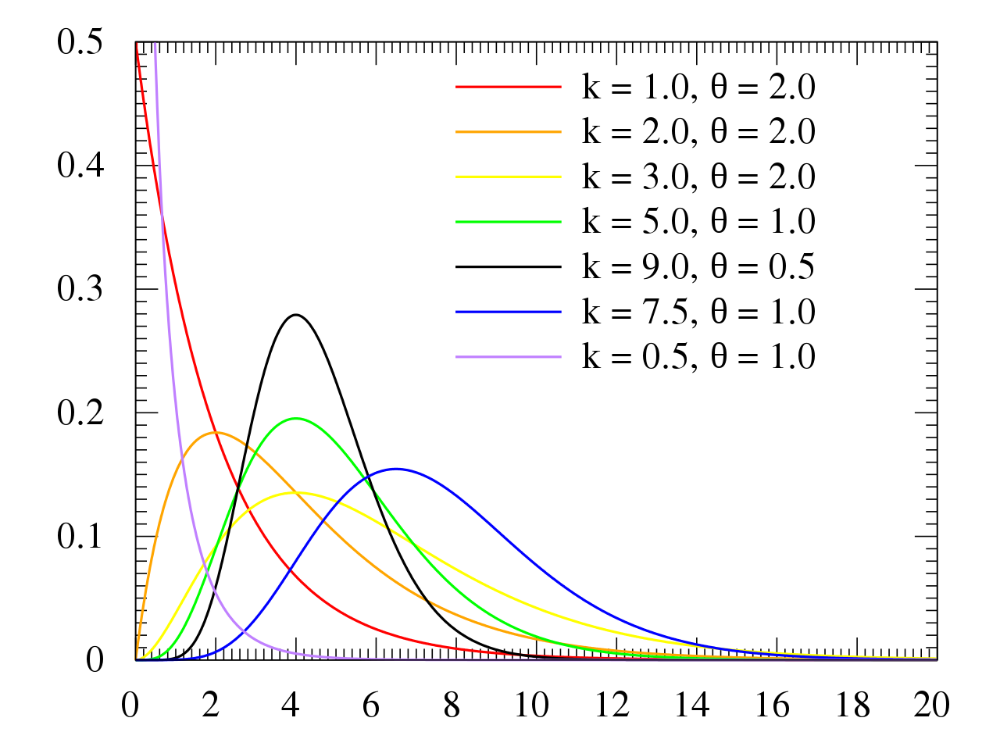
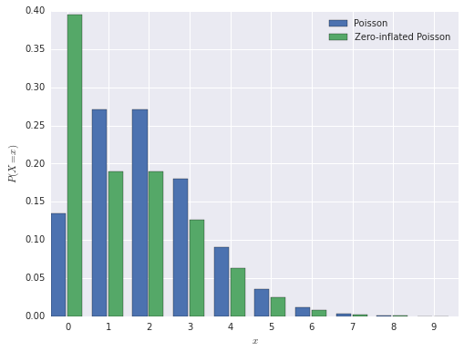

# (PART\*) Autres distributions {-}

# Autres distributions

-   Lorsque la variable réponse est constituée de pourcentages ou de proportions qui ne surviennent pas de succès et échecs de $n$ oui/non (expérience de Bernouilli) il n'est pas possible d'utiliser une distribution binomiale. Dans ce cas, il est souvent conseillé  d'effectuer une **transformation logit** des données et d'utiliser un modèle linéaire (mixte). Voir cet [article](http://onlinelibrary.wiley.com/doi/10.1890/10-0340.1/abstract).
-   Pour des données qui semblent distribuées normalement après une transformation log, log-transformation, il est parfois préférable d'utiliser une **distribution log-normale** dans un GLM, au lieu de transformer les données en log. 
-   Une **distribution gamma** peut également être utilisée. Elle est similaire à une distribution log-normale, mais est plus polyvalente.



-   La **distribution Tweedie** est une famille de distributions polyvalentes qui est utile pour les données comportant un mélange de zéros et de valeurs positives (pas nécessairement des abondances). Voir le [paquet R Tweedie](https://cran.r-project.org/web/packages/tweedie/index.html).

```{r, echo = FALSE, eval = TRUE}
#install.packages(c('GlmSimulatoR','cplm'))
library(GlmSimulatoR)
library(ggplot2)
library(cplm, quietly = TRUE)

simdata <- simulate_tweedie(weight = .2, ancillary = 1.15, link = "log")

ggplot(simdata, aes(x = Y)) + 
  geom_histogram(bins = 30)
```

-   Lorsque les données comportent un nombre excessif de zéros, qui proviennent d'un processus différent de celui qui génère les comptages, il convient d'utiliser des distributions «**zero-inflated**» Poisson ou binomial négatif «**zero-inflated**». Ces méthodes sont disponibles, dans le [paquet glmmADMB](http://glmmadmb.r-forge.r-project.org/), parmi d'autres.


