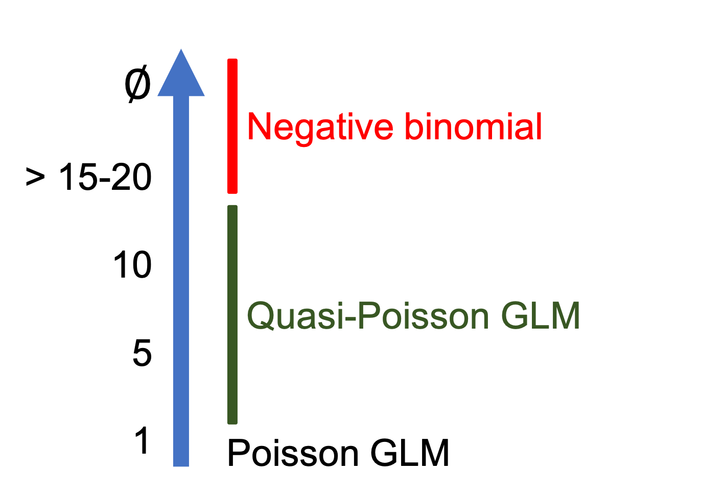

```{r setup, echo = FALSE}
knitr::opts_chunk$set(
  comment = "#",
  collapse = TRUE,
  cache = TRUE,
  warning = FALSE,
  message = FALSE,
  fig.width = 6, fig.height = 6,
  fig.retina = 3,
  fig.align = 'center'
)
mypar = list(mar = c(3,3,1,0.5), mgp = c(1.6, 0.3, 0), tck = -.02)
options(repos=structure(c(CRAN="http://cran.r-project.org")))
```

class: inverse, center, middle

```{r install_pkgs, message=FALSE, warning=FALSE, include=FALSE, results=0}
# Standard procedure to check and install packages and their dependencies, if needed.

list.of.packages <- c('ggplot2', 'lme4', 'MASS', 'vcdExtra', 'bbmle', 'DescTools')

new.packages <- list.of.packages[!(list.of.packages %in% installed.packages()[,"Package"])]

if(length(new.packages) > 0) {
  install.packages(new.packages, dependencies = TRUE) 
  print(paste0("The following package was installed:", new.packages)) 
} else if(length(new.packages) == 0) {
    print("All packages were already installed previously")
  }
```

# About this workshop

[](https://qcbsrworkshops.github.io/workshop06/pres-en/workshop06-pres-en.html)
[](https://qcbsrworkshops.github.io/workshop06/book-en/index.html)
[](https://wiki.qcbs.ca/r_workshop6)

[](https://github.com/QCBSRworkshops/workshop06) 

---

# Required packages

* [ggplot2](https://cran.r-project.org/package=ggplot2)
* [lme4](https://cran.r-project.org/package=lme4)
* [MASS](https://cran.r-project.org/package=MASS)
* [vcdExtra](https://cran.r-project.org/package=vcdExtra)
* [bbmle](https://cran.r-project.org/package=bbmle)
* [DescTools](https://cran.r-project.org/package=DescTools)

<br>

```R
install.packages(c('ggplot2', 'lme4', 'MASS', 'vcdExtra', 'bbmle', 'DescTools'))
```

---

# Outline

### 1. Why be normal? .small[(*Your data is ok; it's the model that's wrong*)]
### 2. GLM with binary and proportion data
### 3. GLM with count data

---
class: inverse, center, middle

# Why be normal?

## Your data is OK!
## It is the model that is wrong

---
# Limitations of linear (mixed) models

Load dataset and fit a linear model (`lm()`):

```{r, echo = FALSE}
mites <- read.csv('data/mites.csv')
```

```r
# make sure you're in the right working directory
mites <- read.csv('data/mites.csv')
head(mites)
str(mites)
```

The dataset that you have just loaded is a subset of the 'Oribatid mite dataset':

.small[
> 70 moss and mite samples;

> 5 environmental measurements and abundance of the mite *Galumna* sp. for each site.
]

**Goal**: Model the abundance (`abund`), occurrence (`pa`), and proportion (`prop`) of ***Galumna*** as a function of the five environmental variables.

---
# Exploring relationships

Can we see any relationship(s) between *Galumna* and the five environmental variables?

---
# Exploring relationships

.small[Can we see any relationship(s) between *Galumna* and the 5 environmental variables?]

.pull-left2[
```{r,echo = -1}
  par(mypar)
  plot(mites)
```
]
.pull-right2[
<br><br><br><br><br>
`Galumna` vs `WatrCont`?!
]

---
# Exploring relationships

A negative relationship between `Galumna` and `WatrCont`?

```{r,fig.width=12,fig.height=4.5,echo=-1}
  par(mypar)
  par(mfrow = c(1, 3), cex = 1.4)
  plot(Galumna ~ WatrCont, data = mites, xlab = 'Water content', ylab='Abundance')
  boxplot(WatrCont ~ pa,
          data = mites, xlab='Presence/Absence', ylab = 'Water content')
  plot(prop ~ WatrCont, data = mites, xlab = 'Water content', ylab='Proportion')
```

---
# Testing linearity

Fit linear models to test whether `abund`, `pa`, and/or `prop` vary as a function of water content.

--
```{r, eval = -c(2, 4, 6)}
  lm.abund <- lm(Galumna ~ WatrCont, data = mites)
  summary(lm.abund)
  lm.pa <- lm(pa ~ WatrCont, data = mites)
  summary(lm.pa)
  lm.prop <- lm(prop ~ WatrCont, data = mites)
  summary(lm.prop)
```

--
.small[
.pull-left[
```{r}
# Extracting the 4th coefficient

summary(lm.abund)$coefficients[, 4]
summary(lm.pa)$coefficients[, 4]
summary(lm.prop)$coefficients[, 4]
```
]]
.pull-right[
Significant relationship in all models!

.alert[But...]
]

---
# Testing linearity

Significant relationship in all models! .alert[Wait a minute...]
.small[
.pull-left[
```{r,echo=-1}
par(mypar); par(cex = 1.4)
plot(Galumna ~ WatrCont, data = mites)
abline(lm.abund)
```
]
]
.pull-right[
```{r,echo=-1}
par(mypar)
par(mfrow = c(2, 2), cex = 1.4)
plot(lm.abund)
```
]

---
# Testing linearity

Even worse for other models (proportion; `prop`):

.pull-left[
```{r,echo=-1}
par(mypar);par(cex = 1.4)
plot(prop ~ WatrCont, data = mites)
abline(lm.prop)
```
]

.pull-right[
```{r,echo=-1}
par(mypar)
par(mfrow = c(2, 2), cex = 1.4)
plot(lm.prop)
```
]

---
# Testing linearity

Even worse for other models (presence-absence; `pa`):

.pull-left[
```{r,echo=-1}
par(mypar);par(cex = 1.4)
plot(pa ~ WatrCont, data = mites)
abline(lm.pa)
```
]

.pull-right[
```{r,echo=-1}
par(mypar)
par(mfrow = c(2, 2), cex = 1.4)
plot(lm.pa)
```
]

---
# Model assumptions

It is common in Ecology that assumptions of homogeneity of variance and normality are not met.


*GLM are very useful to deal with these issues!*


.comment[Let us revisit the assumptions of linear models...]

---
# Model assumptions

A linear model can be represented by:

$y = \beta_0 + \beta_1x_i + \varepsilon$

where:

$y_i$ = predicted value of a response variable

$\beta_0$ = intercept

$\beta_1$ = slope

$x_i$ = explanatory variable

$\varepsilon_i$ = model residuals drawn from a normal distribution with a varying mean but a constant variance**


> .comment[.alert[**Key point!**]

Residuals (the distance between each observation and the regression line) can be predicted by drawing random values from a normal distribution.]

---
# Normally Distributed Residuals

Recall: Normal distributions have two parameters: $\mu$ (mean) and $\sigma$ (variance).

<br>
.small[
.pull-left[
Varying $\mu$, $\sigma = 5$

```{r,echo=F}
x = seq(1, 50, 0.1)
par(mypar);par(cex = 1.4)
plot(x, dnorm(x, mean = 20, sd = 5), type = 'l', lwd = 3, xlab = '# galumna', ylab = 'Probability')
points(x, dnorm(x, mean = 25, sd = 5), type = 'l', lwd = 3, col = 2)
points(x, dnorm(x, mean = 30, sd = 5), type = 'l', lwd = 3, col = 4)
legend('topleft', legend = c('20', '25', '30'), lty = 1, col = 1:3, bty = 'n', lwd = 2, cex = 1.1)
```
]
.pull-right[
$\mu = 25$, varying $\sigma$

```{r,echo=F}
x = seq(1, 50, 0.1)
par(mypar);par(cex = 1.4)
plot(x, dnorm(x, mean = 25, sd = 5), type = 'l', lwd = 3, xlab = '# galumna', ylab = 'Probability')
points(x, dnorm(x, mean = 25, sd = 7.5), type = 'l', lwd = 3, col = 2)
points(x, dnorm(x, mean = 25, sd = 10), type = 'l', lwd = 3, col = 4)
legend('topleft', legend = c('5', '7.5', '10'), lty = 1, col = 1:3, bty = 'n', lwd = 2, cex = 1.1)
```
]
]

---
# Normally Distributed Residuals

Another way to write the linear model equation is:

$$y_i \sim N(\mu = \beta_0 + \beta_1 X_i, \sigma^2)$$

<br>
Which literally means that $y_i$ is drawn from a normal distribution with parameters $\mu$ (which depends on $x_i$) and $\sigma$ (which has the same value for all $Y$s).

<br>
.comment[Let us predict *Galumna* abundances as a function of water content using the linear model we fitted earlier...]

---
# Model prediction

We need regression coefficients ( $\beta$ ) and the standard deviation ( $\sigma$ ):

```{r}
coef(lm.abund)
summary(lm.abund)$sigma
```

What are the parameters of the normal distribution used to model $y$ when water content = 300?

$$y_i \sim N(\mu = \beta_0 + \beta_1 X_i, \sigma^2)$$

--

$$\mu = 3.44 + (-0.006 x 300) = 1.63$$

$$\sigma = 1.51$$

---
# Model prediction

.pull-left[
$$y_i \sim N(\mu = \beta_0 + \beta_1 X_i, \sigma^2)$$
$$\mu = 3.44 + (-0.006 x 300) = 1.63$$
$$\sigma = 1.51$$
]
.pull-right[
At $x = 300$, residuals should follow a normal distribution with $\mu = 1.63$ and $\sigma^2 = 1.51$.

At $x = 400$, we get $\mu = 1.02$ and $\sigma^2 = 1.51$, etc.
]

--

.pull-left[

- .small[Graphically, this is our model]:

  
]

.pull-right[

**Problems**:

- $\sigma^2$ is not homogeneous, yet `lm()` forces a constant $\sigma^2$
- Predicted values should be integers
]

---
# Biological data & distributions

Statisticians have described a multitude of distributions that correspond to different types of data.

A distribution provides the probability of observing each possible outcome of an experiment or survey (e.g. $abund = 8$ *Galumna* individuals).

Distributions can be **discrete** (only includes integers
or **continuous** (includes fractions).

All distributions have **parameters** that dictate the shape of the distribution (e.g. $\mu$ and $\sigma^2$ for the normal).

---
# Biological data & distributions

*Galumna* abund follows a discrete distribution (i.e. it only takes integer values).

A useful distribution to model abundance data is the “Poisson” distribution:

  - **Poisson** is a discrete distribution with a single parameter, $\lambda$ (lambda), which defines both the mean and the variance of the distribution:

```{r,echo=F,fig.width=15}
x = seq(1, 50, 1)
par(mypar);par(mfrow = c(1, 3), cex = 1.4)
plot(x, dpois(x, lambda = 1), type = 'h', lwd = 3,
     xlab = '# Galumna', ylab = 'Probability', main = 'lambda = 1')
plot(x, dpois(x, lambda = 10), type = 'h', lwd = 3,
     xlab = '# Galumna', ylab = 'Probability', main = 'lambda = 10')
plot(x, dpois(x, lambda = 30), type = 'h', lwd = 3,
     xlab = '# Galumna', ylab = 'Probability', main = 'lambda = 30')
```

---
# Biological data & distributions

*Galumna* seems to follow a Poisson distribution with a low value of $\lambda$:

.pull-left[
```{r}
  hist(mites$Galumna)
```
]
.pull-right[
```{r}
  mean(mites$Galumna)
```
]

---
# Biological data & distributions

Presence-absence data takes yet another form:

- Only `0`s and `1`s;
- Poisson distribution would not be appropriate to model this variable.

```{r,fig.height=5,echo=-1}
  par(mypar); par(cex=1.4)
  hist(mites$pa)
```

---
# Biological data & distributions

**“Bernoulli” distribution**:

- Only two possible outcomes in its range: success (`1`) or failure (`0`);
- One parameter, $p$, the probability of success.

<br>
```{r,echo=-F,fig.width=12,fig.height=4}
  par(mypar);par(mfrow = c(1, 3), cex=1.4)
  barplot(setNames(c(.9, .1), c('absent (0)', 'present (1)')), ylim = c(0, 1), xlab = 'pa', ylab = 'probability', main = 'p = 0.1')
  barplot(setNames(c(.5, .5), c('absent (0)', 'present (1)')), ylim = c(0, 1), xlab = 'pa', ylab = 'probability', main = 'p = 0.5')
  barplot(setNames(c(.1, .9), c('absent (0)', 'present (1)')), ylim = c(0, 1), xlab = 'pa', ylab = 'probability', main = 'p = 0.9')
```

We can use the Bernouilli distribution to calculate the probability Galumna present (`1`) vs. absent (`0`)

---
# Biological data & distributions

**Binomial distribution**: When there are multiple trials (each with a success/failure), the Bernoulli distribution expands into the binomial distribution.
- Additional parameter, $n$, for number of trials;
- Predicts the probability of observing a given proportion of successes, $p$, out of a known total number of trials, $n$.

```{r,echo=F,fig.width=15}
x = seq(1, 50, 1)
par(mypar);par(mfrow = c(1, 3), cex = 1.4)
plot(x, dbinom(x, size = 50, prob = 0.1), type = 'h', lwd = 3, xlab = '# galumna', ylab = 'Probability', main = 'p = 0.1 n = 50')
plot(x, dbinom(x, size = 50, prob = 0.5), type = 'h', lwd = 3, xlab = '# galumna', ylab = 'Probability', main = 'p = 0.5 n = 50')
plot(x, dbinom(x, size = 50, prob = 0.9), type = 'h', lwd = 3, xlab = '# galumna', ylab = 'Probability', main = 'p = 0.9 n = 50')
```

---
# Biological data & distributions

**Binomial distribution**: used to model data where the number of successes are integers and where the number of trials, $n$, is known.

**Main difference with Poisson distribution**: the binomial has an upper limit to its range, corresponding to $n$. Consequently, it is right-skewed at low p values but left-skewed at high $p$ values

```{r,echo=F,fig.width=10, fig.height=5}
x = seq(1, 50, 1)
par(mypar);par(mfrow = c(1, 2), cex = 1.4)
plot(x, dbinom(x, size = 50, prob = 0.9), type = 'h', lwd = 3, xlab = '# galumna', ylab = 'Probability', main = 'p = 0.9 n = 50')
plot(x, dpois(x, lambda = 30), type = 'h', lwd = 3, xlab = '# galumna', ylab = 'Probability', main = 'lambda = 30')
```

---
# Biological data & distributions

Getting back to our problem... We can switch the distribution of error terms ( $ε_i$ ) from normal to Poisson:

$$y_i \sim Poisson(\lambda = \beta_0 + \beta_1 x_i)$$

Problems solved!

1. $\lambda$ varies with $x$ (water content) which means that the residual variance will also vary with $x$. This also means that we have relaxed the homogeneity of variance assumption!

2. Predicted values will now be integers instead of fractions;

3. The model will never predict negative values (Poisson is strictly positive).

---
# Biological data & distributions

This is **almost** a Poisson GLM, which looks like this:

.center[]

Probabilities (in orange) are now integers, and both the variance and the mean of the distribution decline as $\lambda$ decreases with increasing water content.


---
class: inverse, center, middle

# GLM with binary data

---
# Binary variables

A common response variable in ecological datasets is the **binary variable**: we observe a phenomenon $X$ or its “absence”.

- Presence or absence of a species
- Presence or absence of a disease
- Success or failure to observe behaviour
- Survival or death of organisms

We wish to determine how $P/A \sim Environment$, for instance.


.comment[We often call this situation as a logistic regression or logit model.]

---
# Binary variables

In `R`, binary variables are coded with `1` and `0`:

```{r,echo=F}
Site <- LETTERS[1:6]
Presence <- c(1, 0, 1, 1, 0, 1)
dat = data.frame(Site, Presence)
```

<br>

.pull-left[
.right[
```{r, echo=F}
print(dat)
```
]]
.pull-right[
 <br>

 1 = Presence

 <br>

 0 = Absence
]

---
exlude:true

# Binary variables

They are clearly not normally distributed!

<br>

```{r,echo=F,fig.width=7, fig.height=6}
par(mypar);par(cex = 1.4)
hist(Presence)
```

---
# Binary variables

Under a linear model, expected values can be out of the `[0,1]` range with `lm()`:

<br>

```{r,echo=F,fig.width=7.5, fig.height=5.6}
Pres <- c(rep(1, 40), rep(0, 40))
rnor <- function(x) rnorm(1, mean = ifelse(x == 1, 12.5, 7.5), sd = 2)
ExpVar <- sapply(Pres, rnor)
par(mypar);par(cex = 1.4)
plot(ExpVar, Pres, ylim = c(-.5, 1.5), xlab = 'Explanatory variable', ylab = 'Presence', main = 'Binary variables and fitted values with lm()', pch = 16)
abline(lm(Pres ~ ExpVar), col = 'orange', lwd = 2)
mtext(expression(symbol("\255")), at = 1.25, side = 4, line = 0.1, cex = 6, col = 'blue')
mtext(expression(symbol("\256")), at = 3, side = 1, line = -2.2, cex = 6, col = 'blue')
```

---
exclude: true

# Probability distribution

The Bernoulli distribution is well suited for binary response variables.

<br>

.pull-left[.right[

$E(Y) = p$

<br>

$Var(Y) = p \times (1 - p)$

]]
.pull-right[

 **Mean of distribution** .small[Probability $p$ of observing an outcome]

 **Variance of distribution** .small[Variance decreases as $p$ is close to `0` or `1`]
]

---
# Logistic regression

The `glm()` function!

<br>

```
logit.reg <- glm(formula, data, family)
```

<br>

Moving away from traditional linear models (`lm()`)...

In addition to the data (of course!), we need to specify additional elements in a generalized linear model (`glm()`):

1. The error distribution

**AND**

2. the link function to be used in the model.

In `glm()`, this is set within the `family` argument.

---
# The Link Function

For a simple linear model of a normally distributed continuous response variable, the equation for the expected values is:

<br>

$$\mu = x\beta$$

where

- $\mu$ is the expected value of the response variable;
- $x$ is the model matrix (*i.e.* your data);
- $\beta$ is the vector of estimated parameters (*i.e.* the intercept & slope).

<br>

$x\beta$ is called the **linear predictor**.

---
# The Link Function

$\mu = x\beta$ is only true for normally distributed data.

If this is not the case, we must use a transformation on the expected values $\mu$.

$$g(\mu) = x\beta$$

where $g(\mu)$ is the link function.

<br>

This allows us to relax the normality assumption.

---
# The Link Function

For binary data, the link function is called the **logit**:

<br>

$$g(p) = log\frac{p}{1-p}$$

$\mu =$ expected values (probability that $Y = 1$).

<br>

The *logit* function is the logarithm of the odds $(\frac{p}{1-p})$.

<br>

The odds puts our expected values on a `0` to `+Inf` scale.

The log-transformation puts our expected values on a `-Inf` to `+Inf`.


.small[] The expected values can now be **linearly** related to the linear predictor.

???

We can understand that as if event A has probability p of occurring, then the odds of event A occurring is the ratio of the probability that A occurs to the probability that A does not occur: p/(1−p).

For example, if the probability
that I will fail my courses  is 0.6, the odds that I will fail my courses  is 0.6/(1 − 0.6) = 1.5. This means that the probability of observing a failure in my courses is 1.5 times greater than the probability of not observing it (that is,
1.5 × 0.4 = 0.6).


---
# Exercise 1 - Our first generalized linear model, together.

Build a logistic regression model using the `mites` data

```{r, echo = TRUE}
# setwd('...')

mites <- read.csv("data/mites.csv", header = TRUE)
str(mites)
```

???

A reminder about the dataset:

70 sites (rows) x 35 morphospecies (columns). The sampling units are substrate cores 5 cm in diameter and 10 cem in depth, hereafter called "cores".

SubsDens: substratum density in g.L-1 of dry uncompressed matter (quantitative variable)

WatrCont: water content of the substratum, in percent of volume (quantitative variable)

Borcard, D., P. Legendre and P. Drapeau. 1992. Partialling out the spatial component of ecological variation. Ecology 73: 1045-1055.

Borcard, D. and P. Legendre. 1994. Environmental control and spatial structure in ecological communities: an example using Oribatid mites (Acari, Oribatei). Environmental and Ecological Statistics 1: 37-53.

---
# Exercise 1 - Our first generalized linear model, together.

Let us build a model of the presence of *Galumna* sp. as a function of water content and topography.

```{r}
logit.reg <- glm(pa ~ WatrCont + Topo, data=mites,
                 family = binomial(link = "logit"))
```
```{r,eval=F}
summary(logit.reg)
```

???

The presenter must increase focus on the `family` argument, explaining what it is. Also, refer to ?family.
---
# Exercise 1

.small[
```{r}
summary(logit.reg)
```
]

???

When explaining this summary show what the blocks are and recall that its structure resembles the one from `summary.lm()`, but that there are some special differences (e.g. dispersion parameter).

Deviance, coefficients and dispersion will be covered in the following slides.

---
# Challenge 1 

Using the `bacteria` dataset, model the presence of *H. influenzae* as a function of treatment and week of test.

Start with a full model and reduce it to the most parsimonious model.

```{r}
# install.packages("MASS")

library(MASS)
data(bacteria)
str(bacteria)
```

.tiny[

*Tests of the presence of the bacteria H. influenzae in children with otitis media in the Northern Territory of Australia.*

> Dr A. Leach tested the effects of a drug on 50 children with a history of *otitis media* in the Northern Territory of Australia. The children were randomized to the drug or a placebo.

> The presence of *H. influenzae* was checked at weeks 0, 2, 4, 6 and 11: 30 of the checks were missing and are not included in this data frame.

]
---
# Exercise 1 - Solution 

```{r}
model.bact1 <- glm(y ~ trt * week, data = bacteria, family = binomial)
```

```{r}
model.bact2 <- glm(y ~ trt + week, data = bacteria, family = binomial)
```

```{r}
model.bact3 <- glm(y ~ week, data = bacteria, family = binomial)
```

```{r, echo = TRUE}
anova(model.bact1, model.bact2, model.bact3, test = "LRT")
```

???

LRT performs a likelihood ratio (LR) test between the models. It is obtained as in the example below.

# Improve this in the future

vals <- (sum(residuals(base)^2) - sum(residuals(full)^2))/sum(residuals(full)^2) * full$df.residual

pchisq(vals, df.diff, lower.tail = FALSE)

---
# Interpreting the `glm()` coefficients

Let's go back to the summary of our `logit.reg` model to see the coefficients:
```{r}
logit.reg <- glm(pa ~ WatrCont + Topo, data=mites,
                 family = binomial(link = "logit"))
```

```{r}
summary(logit.reg)$coefficients
```

The output indicates that both water content and topography are significant drivers of the presence-absence variable.

<br>

.comment[But, how do we interpret the slope coefficients?]

---
# Interpreting the `glm()` coefficients

The direct interpretation of the coefficients in the logit model is tenuous because of the link function. If the link is *identity*, it is much easier to interpret.

Let us assume that we have a binary outcome $y$ and two covariates $x_1$ and $x_2$ (and a constant). The probability of a successful outcome ( $y = 1$ ) is given by:

$$Pr(y_i = 1) = p = g^{-1(\beta_0 + x_{1i}\beta_1 + x_{2i}\beta_2)}$$

where $g^{-1}()$ is the **inverse link function**.

Now let us focus in interpreting the $\beta_1$ coefficient.

#### Identity link

For the identity link, the interpretation is straighforward. For one-unit increase in $x_1$, $\beta_1$ dictates a constant difference in the outcome.

$\Delta{y_i} = [\beta_0 + (x_{1i} + 1)\beta_1 + x_{2i}\beta_2] - (\beta_0 + x_{1i}\beta_1 + x_{2i}\beta_2)$

$\Delta{y_i} = \beta_1$

---
# Interpreting the `glm()` coefficients

#### Logit link

If a linear logistic model has been used with the two covariates $x_1$ and $x_2$, we have the model:

$$log({\dfrac{p}{1-p}})=\beta_0 + x_{1i}\beta_1 + x_{2i}\beta_2$$

for a log odds of a positive response. We may also write that model as follows:

$$\dfrac{p}{1-p}=exp(\beta_0 + x_{1i}\beta_1 + x_{2i}\beta_2)$$

$$Pr(yi) = \dfrac{exp(\beta_0 + x_{1i}\beta_1 + x_{2i}\beta_2)}{1 + exp{(\beta_0 + x_{1i}\beta_1 + x_{2i}\beta_2)}}$$

.center[Great! Do not give up!]

---
# Interpreting the `glm()` coefficients

#### Logit link

Since the inverse link is nonlinear, the coefficient interpretation is difficult.

Let us take a look what happens to the differences for a one-unit change to $x_1$:

$$\Delta{y_i} = \dfrac{\exp[\beta_0 + (x_{1i} + 1)\beta_1 + x_{2i}\beta_2]}{1 + \exp{[\beta_0 + (x_{1i} + 1)\beta_1 + x_{2i}\beta_2]}} - \dfrac{\exp[\beta_0 + x_{1i}\beta_1 + x_{2i}\beta_2]}{1 + \exp{[\beta_0 + x_{1i}\beta_1 + x_{2i}\beta_2]}}$$
$$\Delta{y_i} = \exp{(\beta_0)}\{\exp{(\beta_1)}\} $$
As $x$ increases by one unit, the odds increase by a factor of  $\exp(\beta_1)$.

---
# Interpreting the output

###### Getting back to our `logit.reg` model!

.small[
```{r, echo = TRUE}
logit.reg
```
]

For a one-unit increase (or decrease) in water content, we can obtain the odds for the presence of mites.

```{r}
exp(logit.reg$coefficient[2])
```


---

# Predictive power and goodness-of-fit

Recall that the $R^2$ value is a measure of how well the model explains the data.

In simple linear models, $R^2$ can be obtained as the square of the sample correlation equation coefficient ( $r$ ) between the observed outcomes and the predictive values.

In some of the generalized linear models, we take different approaches.

We can obtain a $\text{pseudo-R}^2$, the analogue of the $R^2$ for models fitted by maximum likelihood.

We can calculate McFadden's (1973) $\text{pseudo-R}^2$ in this way:

$$\text{pseudo-R}^2 = \frac{\text{null deviance - residual deviance}}{\text{null deviance}}$$

<br>

> $\text{pseudo-R}^2$ is the variance explained by the model

---
# Unit deviance, total deviance and null deviance

The unit deviance is a measure of distance between $y$ and $μ$.

$${\displaystyle d(y,y)=0}$$
$${\displaystyle d(y,\mu )>0\quad \forall y\neq \mu }$$


The total deviance ${\displaystyle D(\mathbf {y} ,{\hat {\boldsymbol {\mu }}})}$ of a model with predictions ${\hat {\boldsymbol {\mu }}}$ of the observation $\mathbf {y}$ is the sum of its unit deviances:
$${\displaystyle D(\mathbf {y} ,{\hat {\boldsymbol {\mu }}})=\sum _{i}d(y_{i},{\hat {\mu }}_{i})}$$
Now, the deviance of a model that has estimates  ${\hat {\mu }}=E[Y|{\hat {\theta }}_{0}]$ can be defined by its **likelihood**:
$$D(y,{\hat {\mu }})=2{\Big (}\log {\big (}p(y\mid {\hat {\theta }}_{s}){\big )}-\log {\big (}p(y\mid {\hat {\theta }}_{0}){\big )}{\Big )}$$
with $\hat \theta_0$ denoting the fitted values of the parameters in the reduced model, while ${\displaystyle {\hat {\theta }}_{s}}\hat \theta_s$ denotes the fitted parameters for the saturated model.

---
# Unit deviance, total deviance and null deviance

Now, the deviance of a model that has estimates  ${\hat {\mu }}=E[Y|{\hat {\theta }}_{0}]$ can be defined by its **likelihood**:
$$D(y,{\hat {\mu }})=2{\Big (}\log {\big (}p(y\mid {\hat {\theta }}_{s}){\big )}-\log {\big (}p(y\mid {\hat {\theta }}_{0}){\big )}{\Big )}$$
with $\hat \theta_0$ denoting the fitted values of the parameters in the reduced model, while ${\displaystyle {\hat {\theta }}_{s}}\hat \theta_s$ denotes the fitted parameters for the saturated model.

The **residual deviance** is defined as 2 times the log-likelihood ratio of the full model compared to the reduced model. (The function below is exactly the same as above!)
$$D(y,{\hat {\mu }})=2{\Big (}\log {\big (}p(\text{saturated model}){\big )}-\log {\big (}p(\text{reduced model}){\big )}{\Big )}$$
And, the **null deviance** is defined  2 times the log-likelihood ratio of the full model compared to the null model (i.e. predictors are set to 1).

$$D(y,{\hat {\mu }})=2{\Big (}\log {\big (}p(\text{saturated model}){\big )}-\log {\big (}p(\text{null model}){\big )}{\Big )}$$
???

Under some conditions, if the proposed model describes the data nearly as well as the saturated model, then asymptotically D ∼ χ
2 K−p, where K and p are the number of parameters in the saturated and proposed models, respectively. If the proposed model is poor, D will be larger than predicted by the χ2 K−p distribution.

---
# Total deviance and null deviance

In `R`, we can do this as follows:

Let us compare the deviance of your model (residual deviance) to the deviance of a null model (null deviance).

The **null deviance model** here is a model without explanatory variables.

```r
null.model <- glm(response.variable ~ 1, family = binomial)
```

The **saturated (or full) deviance model** here is a model with all explanatory variables.

```r
full.model <- glm(response.variable ~ ., family = binomial)
```

---
# Predictive power and goodness-of-fit

In `R`, we can extract the residual and null deviances directly from the `glm object`:
.small[
```{r}
objects(logit.reg)
```

```{r}
pseudoR2 <- (logit.reg$null.deviance - logit.reg$deviance) / logit.reg$null.deviance

pseudoR2
```
]

<br>

.comment[Hence, the model explains 46.6% of the variability in the data.]

---
exclude: true

# Predictive power and goodness-of-fit

An adjusted McFadden's pseudo-R2, which penalizes for the number of predictors, can be calculated as below:
.pull-left[
\begin{equation}
R^2_{adj} = 1 - \frac{logL(M) - K}{logL(M_{null})}
\end{equation}
]

.pull-right[
where $K$ corresponds to the additional number of predictors in relation to the null model.
]

The goodness-of-fit of the logistic regression model can be expressed by some variants of pseudo-R2 statistics, such as Maddala (1983) or Cragg and Uhler (1970) measures.

When talking about *logistic regressions*, low $R^2$ values are often common.

One way to assess the goodness-of-fit of these models is to use the **Hosmer-Lemeshow goodness-of-fit test**.

It roughly involves:
1. Dividing the data into groups of similar size;
2. Ordering on the predicted probability (or equivalently, the linear predictor);
3. Comparing the observed to expected number of positive responses in each group
4. Performing a chi-squared test on the outcome.

---
# Predictive power and goodness-of-fit

The `DescTools::PseudoR2()` function computes several pseudo-R2.

```{r, echo = TRUE}
logit.reg <- glm(mites$pa ~ mites$WatrCont + mites$Topo,
                 family = binomial(link = "logit"))

library(DescTools)

fit <- PseudoR2(logit.reg, which = "all")
fit
```

---
exclude: true
### Exercise 2: Performing a Hosmer-Lemeshow goodness-of-fit test

This test is assessing whether or not the observed event rates match expected event rates in subgroups of the model population.

.pull-left[
```{r}
library(vcdExtra)

HLtest(logit.reg)
```
]
.pull-right[
```{r, echo = TRUE}
plot(HLtest(logit.reg))
```
]

.comment[A non-significant value indicates an adequate fit!]

---
# Challenge 1 

1. Using the model created with `bacteria` dataset, assess goodness-of-fit and predictive power.

2. Think how predictive power could be improved for this model.

---
# Solution 

1. Using the model created with `bacteria` dataset, assess goodness-of-fit and predictive power.

```{r,eval=F}
null.d <- model.bact2$null.deviance

resid.d <- model.bact2$deviance

bact.pseudoR2 <- (null.d - resid.d) / null.d

HLtest(model.bact2)
```

2. Think how predictive power could be improved for this model.

*Adding informative explanatory variables could increase the explanatory power of the model.*

*But, do not be afraid of non-significant results!*

---
# Proportion data and GLM

Sometimes, proportion data are more similar to logistic regression than you think...

In discrete counts, we can, for instance, measure the number of presence of individuals in relation to the total number of populations sampled.

We will thus obtain a proportional number of "success" in observing individuals by dividing the counts by the total counts.

> In `glm()`, we have to provide *prior weights* if the response variable is the proportion of successes.

---
# Proportion data and GLM

Proportions can be modeled by providing both the number of "successes" and *prior weights* in the function
```{r}
prop.reg <- glm(cbind(Galumna, totalabund - Galumna) ~ Topo + WatrCont,
                data = mites,
                family = binomial)
```

The weights can also be set explicitly in `glm()`
```{r}
prop.reg2 <- glm(prop ~ Topo + WatrCont,
                 data = mites,
                 family = binomial,
                 weights = totalabund)
```
---
exclude: true

# Exercise 3

In `R`, we have to specify the number of times something happened and the number of times something did not happen:

```{r}
prop.reg <- glm(cbind(Galumna, totalabund - Galumna) ~ Topo + WatrCont,
                data = mites,
                family = binomial)
```

```r
summary(prop.reg)
```

---
exclude: true

# Exercise 3

.small[
```{r}
summary(prop.reg)
```
]

---
exclude: true

# Exercise 3

We can also code the model directly with proportions:

```{r}
prop.reg2 <- glm(prop ~ Topo + WatrCont,
                 data = mites,
                 family = binomial,
                 weights = totalabund)
```


---
class: inverse, center, middle

# GLM with count data

---
# Modeling count data

.large[What is count data?]

First, import the `faramea.csv` into `R`.

```{r,echo=F}
faramea <- read.csv('data/faramea.csv', header = TRUE)
```
```{r,eval=F}
faramea <- read.csv('faramea.csv', header = TRUE)
```

The number of trees of the species *Faramea occidentalis* was assessed in 43 quadrats in Barro Colorado Island (Panama). For each quadrat, environmental characteristics (such as elevation and precipitation) were also recorded.

Let's investigate the histogram of the number of *Faramea occidentalis*.

---
# Modeling count data

.large[What is count data?]

```{r, echo=F,fig.height=4.6}
par(mypar);par(cex = 1.4)
hist(faramea$Faramea.occidentalis, breaks = 30, col = 'gray', xlab = 'Number of F. occidentalis', ylab = 'Frequency', main = '')
```

Count data are characterized by:

- Positive values: you do not count -7 individuals
- Integer values: you do not count 7.56 individuals
- Exhibits larger variance for large values

---
# Modeling count data

.large[How to model count data?]

Does elevation influence the abundance of *F. occidentalis*?

```{r, echo=F,fig.height=4.6}
par(mypar);par(cex = 1.4)
plot(faramea$Elevation, faramea$Faramea.occidentalis, ylab = 'F. occidentalis individuals', xlab = 'Elevation(m)')
```

The **Poisson distribution** seems to adequately fit this data distribution.

We can use the Poisson family in our GLM to begin modeling count data.

---
# The Poisson distribution

The Poisson distribution specifies the probability of a discrete random variable $Y$ and is given by:

$$f(y, \,\mu)\, =\, Pr(Y = y)\, =\, \frac{\mu^y \times e^{-\mu}}{y!}$$

$$E(Y)\, =\, Var(Y)\, =\, \mu$$

**Properties**:

- $\mu$ is the parameter of the Poisson distribution;
- specifies the probably only for integer values;
- probability for negative values is null ( $P(Y<0) = 0$ );
- $Var(Y) = \mu$ (allows for heterogeneity).

---
# Poisson GLM behind the scenes

A Poisson GLM will model the value of $\mu$ as a function of different explanatory variables.

<br>

.center[**Three steps**]


**Step 1.** We assume $Y_i$ follows a Poisson distribution with mean and variance $\mu_i$.

$$Y_i = Poisson(\mu_i)$$

$$E(Y_i) = Var(Y_i) = \mu_i$$

$$f(y_i, \, \mu_i) = \frac{\mu^{y_i}_i \times e^{-\mu_i}}{y!}$$

$\mu_i$ corresponds to the expected number of individuals

---
# Poisson GLM behind the scenes

**Step 2.** We specify the systematic part of the model just as in a linear model.

$$\underbrace{\alpha}_\text{Intercept} + \underbrace{\beta_1}_\text{slope of 'Elevation'} \times \text{Elevation}_i + \underbrace{\beta_2}_\text{slope of 'Precipitation'} \times \text{Precipitation}_i$$

**Step 3.** The link between the mean of $Y_i$ and the systematic part is a logarithmic function can be written as:

$$log(\mu_i) = \alpha + \beta_1 \times \text{Elevation}_i + \beta_2 \times \text{Precipitation}_i$$
.pull-left[
.center[or]

$$\mu_i = e^{ \alpha + \beta_1 \times \text{Elevation}_i + \beta_2 \times \text{Precipitation}_i}$$

.center[or]

$$\mu_i = e^{\alpha} \times e^{\beta_1^{\text{Elevation}_i}} \times e^{\beta_2^{\text{Precipitation}_i}}$$

]
.small[
This shows that the impact of each explanatory variable is multiplicative.
Increasing Elevation by one increases μ by factor of exp( $\beta_\text{Elevation}$ ).

If $βj = 0$ then $exp(βj) = 1$ and $μ$ is not related to $x_j$. If $βj > 0$ then $μ$ increases if $x_j$ increases; if $βj < 0$ then $μ$ decreases if $x_j$ increases.
]

---

# Fitting a Poisson GLM in `R`

The function `glm()` allows you to specify a Poisson GLM

```{r}
glm.poisson = glm(Faramea.occidentalis ~ Elevation,
                  data = faramea, family = poisson)
```

The `family` argument specifies the distribution and link function.

<br>

As with `lm()` you can access the outputs of the model using the function `summary()`:

```{r, eval=F}
summary(glm.poisson)
```

---
# Model summary

.pull-left2[
.small[
```{r}
summary(glm.poisson)
```
]]

.pull-right2[
Estimates:

Intercept = $\alpha$

Elevation = $\beta$

]

--

.pull-right2[
<br>
What about the *null deviance* and the *residual deviance*?
]

???

Note: Point out that the resiudal deviance of 388.12 is much higher than residual degrees of freedom of 41 indicating overdispersion

---
exclude: true

# Parameter estimates

In our model the unknown parameters are the intercept ( $\alpha$ ) and the slope of elevation ( $\beta$ )


$$log(\mu_i) = 1.769 - 0.0027 \times \text{Elevation}_i$$

.center[or]

$$\mu_i = e^{1.769 - 0.0027 \times \text{Elevation}_i}$$


---
exclude: true

# The deviance

Remember that to estimate the unknown parameter maximum likelihood estimation is used.

The residual deviance is defined as twice the difference between the log-likelihood of a model that provides a perfect fit and the log-likelihood of our model.

$$\text{residual deviance} = 2 \, log(L(y;\,y)) - 2 \, log(L(y;\, \mu))$$

In a Poisson GLM, the residual deviance should be close to the residual degrees of freedoms.


.center[.alert[388.12 >> 41]]

>Our residual deviance is much higher than the degrees of freedom of our model!

---
# Overdispersion

For a Poisson distribution, $var[y] = μ$. However, in practice the apparent
variance of the data often exceeds $μ$, reflecting *overdispersion* in the model parameters.

<br>

Overdispersion arises because the mean $μ$ innately varies,
even when all the explanatory variables are fixed, or because the
events that are being counted are positively correlated.

<br>

.center[*Are you able to think of a situation in biology that can cause overdispersion?*]

<br>

**Why should we care about overdispersion?**

>Tests on the explanatory variables will generally appear to be more significant and confidence intervals for the parameters will be narrower
than warranted by the data!

---

# Overdispersion

When the residual deviance is higher than the residual degrees of freedom we say that the model is **overdispersed**. We can calculate a overdispersion parameter ( $\phi$ ):

$$\phi \, = \, \frac{\text{Residual deviance}}{\text{Residual degrees of freedom}}$$

Since the Poisson GLM assumes that $var[y] = μ$, we will need to find an alternative.


.center[.large[**Solutions**]]

.pull-left[
1: Correct for overdispersion using a **quasi-Poisson** generalized linear model.
]

.pull-right[
2: Choose another distribution family, such as the **negative binomial**.
]

---
# Quasi-Poisson GLM

The variance of the distribution will account for **overdispersion**:

$$E(Y_i) = \mu_i$$

$$Var(Y_I) = \phi \times \mu_i$$

where $phi$ is the dispersion parameter.

The **systematic part** and the **link function** remain the same.

Correcting for overdispersion will not affect parameter estimates, but will affect their **significance**. Further, the standard errors of the parameters are multiplied by $\sqrt{\phi}$.

.alert[Some marginally significant p-values may no longer hold!]

---
# Fitting a quasi-Poisson GLM in `R`

Create a new `glm.object` using the '`quasipoisson`' family or update the previous one:

```{r}
glm.quasipoisson = glm(Faramea.occidentalis ~ Elevation, data = faramea,
                       family=quasipoisson)

glm.quasipoisson = update(glm.poisson, family = quasipoisson)
```

---
# Fitting a quasi-Poisson GLM in `R`

.pull-left2[
.small[
```{r}
summary(glm.quasipoisson)
```
]]
.pull-right2[
**Same estimates but**

.small[The standard errors of the parameters are multiplied by]

$$\sqrt{\phi} = 4$$

`0.0006436 * 4 = 0.00257`

<- $\phi$

<br>

<- .small[AIC is not defined]
]

---
# Fitting a quasi-Poisson GLM in R

Try also deviance analysis to test for the effect of Elevation

```{r}
null.model <- glm(Faramea.occidentalis ~ 1, data = faramea,
                  family = quasipoisson)
anova(null.model, glm.quasipoisson, test = "Chisq")
```

---
# Dispersion parameter

.center[]

---
# Negative binomial GLM

Negative binomial GLMs are favor when overdispersion is high

- It has **two parameters** $\mu$ and $k$. $k$ controls for the dispersion parameter (smaller $k$ indicates higher dispersion)
- It corresponds to a combination of two distributions (**Poisson** and **gamma**)
- It assumes that the $Y_i$ are Poisson distributed with the mean $\mu$ assumed to follow a gamma distribution!

$$E(Y_i) = \mu_i$$

$$Var(Y_i) = \mu_i + \frac{\mu^2_i}{k}$$


---
# Fitting a negative binomial in R

NB is not in the `glm()` function so you need to install and charge the `MASS` package

```r
install.packages('MASS')
```

```{r}
glm.negbin = glm.nb(Faramea.occidentalis ~ Elevation, data = faramea)
```

```r
summary(glm.negbin)
```

---

.pull-left2[
.small[
```{r,echo=-1}
summary(glm.negbin)
```
]]
.pull-right2[

<br><br><br><br><br><br><br><br><br><br><br><br><br>
`theta` $= k$
]

---
# Plotting the final GLM model

**Step 1** Plot the data and the use estimates of the parameters to draw model line

$$\mu_i = e^{2.369 - 0.007 \times Elevation_i}$$

Use `summary()` to get the parameters

```r
summary(glm.negbin)$coefficients[1, 1]
summary(glm.negbin)$coefficients[2, 1]
```

**Step 2** Use the standard errors to build the confidence envelope

```r
summary(glm.negbin)$coefficients[1, 2]
summary(glm.negbin)$coefficients[2, 2]
```

$$\text{Upper limit} = e^{[\alpha - 1.96 \times SE_{\alpha}] + [\beta - 1.96 \times SE_{\beta}] \times \text{Elevation}_i}$$

$$\text{Upper limit} = e^{[\alpha + 1.96 \times SE_{\alpha}] + [\beta + 1.96 \times SE_{\beta}] \times \text{Elevation}_i}$$

---
.small[
```{r,eval=F}
pp <- predict(glm.negbin, newdata = data.frame(Elevation = 1:800), se.fit = TRUE)
linkinv <- family(glm.negbin)$linkinv ## inverse-link function
pframe$pred0 <- pp$fit
pframe$pred <- linkinv(pp$fit)
sc <- abs(qnorm((1-0.95)/2))  ## Normal approx. to likelihood
pframe <- transform(pframe, lwr = linkinv(pred0-sc*pp$se.fit), upr = linkinv(pred0+sc*pp$se.fit))

plot(faramea$Elevation, faramea$Faramea.occidentalis, ylab = 'Number of F. occidentalis', xlab = 'Elevation(m)')
lines(pframe$pred, lwd = 2)
lines(pframe$upr, col = 2, lty = 3, lwd = 2)
lines(pframe$lwr, col = 2, lty = 3, lwd = 2)
```
]

```{r,echo=F, fig.height=5}
pframe <- data.frame(Elevation = 1:800)
pp <- predict(glm.negbin, newdata = pframe, se.fit = TRUE)
linkinv <- family(glm.negbin)$linkinv ## inverse-link function

pframe$pred0 <- pp$fit
pframe$pred <- linkinv(pp$fit)
alpha <- 0.95
sc <- abs(qnorm((1-alpha)/2))  ## Normal approx. to likelihood
alpha2 <- 0.5
pframe <- transform(pframe,
                    lwr=linkinv(pred0-sc*pp$se.fit),
                    upr=linkinv(pred0+sc*pp$se.fit))

par(mypar);par(cex = 1.4)
plot(faramea$Elevation, faramea$Faramea.occidentalis,
      ylab = 'Number of F. occidentalis', xlab = 'Elevation(m)')
lines(pframe$pred, lwd = 2)
lines(pframe$upr, col = 2, lty = 3, lwd = 2)
lines(pframe$lwr, col = 2, lty = 3, lwd = 2)
```

---
# Challenge 3 

Use the `mites` dataset! Model the abundance of the species Galumna as a function of the substrate characteristics (water content `WatrCont` and density `SubsDens`)

- Do you need to account for overdispersion?
- Which covariates have a significant effect?
- Select the best model!

```{r,echo=F}
mites <- read.csv("data/mites.csv", header = TRUE)
```
```{r,eval=F}
mites <- read.csv("data/mites.csv", header = TRUE)
```

---
# Challenge 3: tips 

Drop each term in turn and compare the full model with a nested model using the command:

```r
drop1(MyGLM, test = "Chi")
```

Specify manually a nested model, call it for example MyGLM2, and use the command:

```r
anova(MyGLM, MyGLM2, test = "Chi")
```

---
# Challenge 3: solution 

.small[
```{r}
# Poisson GLM
glm.p = glm(Galumna~WatrCont+SubsDens, data=mites, family=poisson)
# quasi-Poisson GLM
glm.qp = update(glm.p,family=quasipoisson)
# model selection
drop1(glm.qp, test = "Chi")
```
```r
# or
glm.qp2 = glm(Galumna~WatrCont, data=mites, family=quasipoisson)
anova(glm.qp2, glm.qp, test="Chisq")
```
]


---
# Challenge 3: solution 

<br>

.center[
```{r,echo=F, fig.height=5,fig.width=6}
glm.qp = glm(Galumna~WatrCont, data=mites, family=poisson)
glm.qp2 = update(glm.qp, family=quasipoisson)
pframe <- data.frame(WatrCont = 100:850)
pp <- predict(glm.qp2, newdata = pframe, se.fit = TRUE)
linkinv <- family(glm.qp2)$linkinv ## inverse-link function

pframe$pred0 <- pp$fit
pframe$pred <- linkinv(pp$fit)
alpha <- 0.95
sc <- abs(qnorm((1-alpha)/2))  ## Normal approx. to likelihood
alpha2 <- 0.5
pframe <- transform(pframe,
                    lwr=linkinv(pred0-sc*pp$se.fit),
                    upr=linkinv(pred0+sc*pp$se.fit))

par(mypar);par(cex = 1.4)
plot(mites$WatrCont, mites$Galumna,
      ylab = 'Number of Galumna', xlab = 'Water content of the substrate (g/L)')
lines(pframe$pred, lwd = 2)
lines(pframe$upr, col = 2, lty = 3, lwd = 2)
lines(pframe$lwr, col = 2, lty = 3, lwd = 2)
```
]


---
# Other distributions

- **Logit transformation of the data** often used with `lm(m)` for percentages or proportions when the binomial distribution is not appropriate. When not selections from fixed quantities (e.g. percent cover, school grades, etc).
- **Log-normal distribution in glm**, avoids having to log-transform the data.
- **Gamma distribution**. Similar to log-normal, more versatile.
- **Tweedie distribution**. Versatile family of distributions. Useful for data with a mix of zeros and positive values (not necessarily counts).
- **Zero-inflated Poisson or zero-inflated negative binomial**. When the data comprise an excess number of zeros, that arise from a different process than the process that generates the counts.


---
# Additional GLMM resources

**Books**:

- B. Bolker (2009) Ecological Models and Data in R. Princeton University Press.
- A. Zuur et al. (2009) Mixed Effects Models and Extensions in Ecology with R. Springer.

**Websites**:

- GLMM for ecologists (http://glmm.wikidot.com) .small[.comment[A great website on GLMM with a Q&A section!]]


---
class: inverse, center, bottom

# Thank you for attending this workshop!


