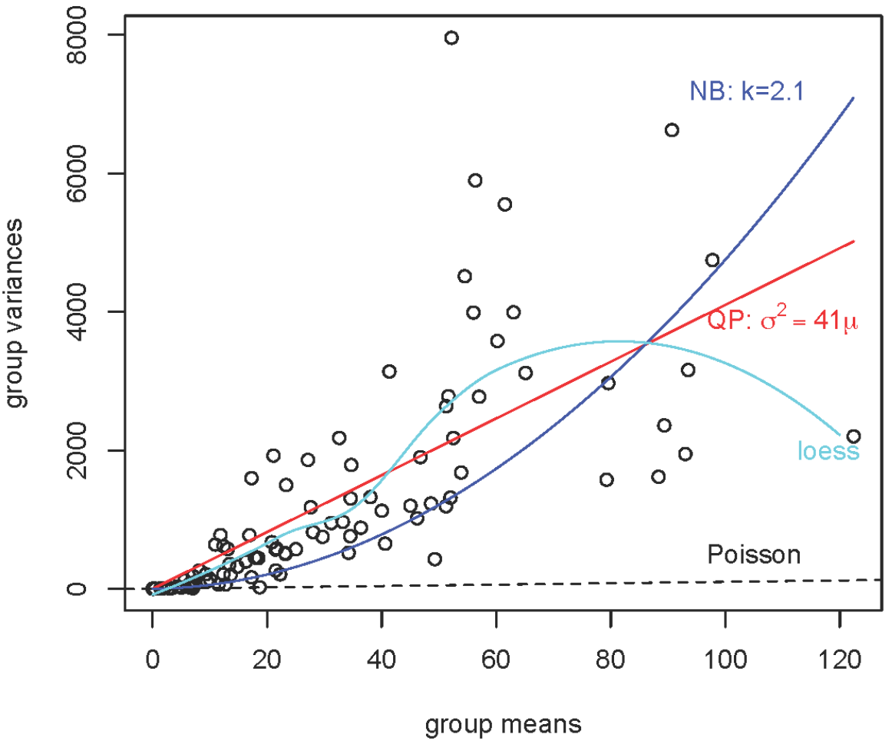

```{r setup, echo = F}
knitr::opts_chunk$set(
  comment = "#",
  collapse = TRUE,
  #cache = TRUE,
  warning = FALSE,
  message = FALSE,
  fig.width=6, fig.height=6,
  fig.retina = 3,
  fig.align = 'center'
)
mypar = list(mar = c(3,3,1,0.5), mgp = c(1.6, 0.3, 0), tck = -.02)
```

```{r, echo =F}
options(repos=structure(c(CRAN="http://cran.r-project.org")))
```

```{r package, echo = F}

# add packages
if (!suppressPackageStartupMessages(require(ggplot2))) {
  install.packages("ggplot2")
}
if (!suppressPackageStartupMessages(require(MASS))) {
  install.packages("MASS")
}
if (!suppressPackageStartupMessages(require(binomTools))) {
  # file name
  f = file.path(tempdir(), "biomTools")
  # download package file
  download.file('https://cran.r-project.org/src/contrib/Archive/binomTools/binomTools_1.0-1.tar.gz', destfile = f, method = 'curl')
  # install from source
  system(paste('R CMD INSTALL', f))
}
if (!suppressPackageStartupMessages(require(gridExtra))) {
  install.packages("gridExtra")
}
if (!suppressPackageStartupMessages(require(lme4))) {
  install.packages("lme4")
}
if (!suppressPackageStartupMessages(require(lattice))) {
  install.packages("lattice")
}
if (!suppressPackageStartupMessages(require(bbmle))) {
  install.packages("bbmle")
}
if (!suppressPackageStartupMessages(require(coda))) {
  install.packages("coda")
}
if (!suppressPackageStartupMessages(require(reshape2))) {
  install.packages("reshape2")
}
if (!suppressPackageStartupMessages(require(coefplot2))) {
 install.packages("coefplot2", repos = "http://www.math.mcmaster.ca/bolker/R", type="source")
}

# if (!suppressPackageStartupMessages(require(coefplot2))) {
#   # file name
#   f = file.path(tempdir(), "coefplot2")
#   # download package file
#   download.file('http://download.r-forge.r-project.org/src/contrib/coefplot2_0.1.3.3.tar.gz', destfile = f, method = 'curl')
#   # install from source
#   system(paste('R CMD INSTALL', f))
# }


```


## Outline

1. Why be normal? .small[(*Your data is ok; it's the model that's wrong*)]
2. GLM with binary data
3. GLM with count data
4. GLMMs

---
class: inverse, center, middle

# Why be normal?

## Your data is ok;
## it's the model that's wrong

---
## Limitations of linear (mixed) models

Load dataset and fit a linear model (`lm()`):

```{r,echo=FALSE}
  mites <- read.csv('data/mites.csv')
```

```{r,eval=F}
  # make sure you're in the right working directory
  mites <- read.csv('mites.csv')
  head(mites)
  str(mites)
```

The dataset that you just loaded is a subset of the 'Oribatid mite dataset'

.small[
> 70 moss and mite samples

> 5 environmental measurements and abundance of the mite *Galumna sp.*
]

**Goal**: Model the abundance (`abund`), occurrence (`pa`), and proportion (`prop`) of Galumna as a function of the 5 environmental variables.

---
## Exploring relationships

Can we see any relationship(s) between Galumna and the 5 environmental variables?

---
## Exploring relationships

.small[Can we see any relationship(s) between Galumna and the 5 environmental variables?]

.pull-left2[
```{r,echo = -1}
  par(mypar)
  plot(mites)
```
]
.pull-right2[
<br><br><br><br><br>
`Galumna` vs `WatrCont`?!
]

---
## Exploring relationships

A negative relationship between `Galumna` and water `content`?

```{r,fig.width=12,fig.height=4.5,echo=-1}
  par(mypar)
  par(mfrow = c(1, 3), cex = 1.4)
  plot(Galumna ~ WatrCont, data = mites, xlab = 'Water content', ylab='Abundance')
  boxplot(WatrCont ~ pa, data = mites, xlab='Presence/Absence', ylab = 'Water content')
  plot(prop ~ WatrCont, data = mites, xlab = 'Water content', ylab='Proportion')
```

---
## Testing linearity

Fit linear models to test whether `abund`, `pa`, and/or `prop` varies as a function of water content.

--
```{r, eval = -c(2, 4, 6)}
  lm.abund <- lm(Galumna ~ WatrCont, data = mites)
  summary(lm.abund)
  lm.pa <- lm(pa ~ WatrCont, data = mites)
  summary(lm.pa)
  lm.prop <- lm(prop ~ WatrCont, data = mites)
  summary(lm.prop)
```

--
.pull-left[
```{r}
summary(lm.abund)$coefficients[, 4]
summary(lm.abund)$coefficients[, 4]
summary(lm.abund)$coefficients[, 4]
```
]
.pull-right[
Significant relationship in all models!

.alert[But...]
]

---
## Testing linearity

Significant relationship in all models! .alert[Wait a minute...]

.pull-left[
```{r,echo=-1}
par(mypar);par(cex = 1.4)
plot(Galumna ~ WatrCont, data = mites)
abline(lm.abund)
```
]

.pull-right[
```{r,echo=-1}
par(mypar)
par(mfrow = c(2, 2), cex = 1.4)
plot(lm.abund)
```
]

---
## Testing linearity

Even worse for other models (Proportion `prop`):

.pull-left[
```{r,echo=-1}
par(mypar);par(cex = 1.4)
plot(prop ~ WatrCont, data = mites)
abline(lm.prop)
```
]

.pull-right[
```{r,echo=-1}
par(mypar)
par(mfrow = c(2, 2), cex = 1.4)
plot(lm.prop)
```
]

---
## Testing linearity

Even worse for other models (Presence/Absence `pa`):

.pull-left[
```{r,echo=-1}
par(mypar);par(cex = 1.4)
plot(pa ~ WatrCont, data = mites)
abline(lm.pa)
```
]

.pull-right[
```{r,echo=-1}
par(mypar)
par(mfrow = c(2, 2), cex = 1.4)
plot(lm.pa)
```
]

---
## Model assumptions

Common in Ecology that assumptions of homogeneity of variance and normality are not met.
  - Main reason why we need GLMs!

.comment[Let's revisit the assumptions of lm...]

---
## Model assumptions

Equation of lm:

$y = \beta_0 + \beta_1x_i + \varepsilon$

where:

$y_i$ = predicted value of response variable

$\beta_0$ = intercept

$\beta_1$ = slope

$x_i$ = explanatory variable

$\varepsilon_i$ = model residuals drawn from a normal distribution with a varying mean but a constant variance**

.comment[.alert[**Key point!] Residuals (the distance between each observation and the regression line) can be predicted by drawing random values from a normal distribution.]

---
## Normally distributed residuals

Recall: Normal distributions have two parameters, $\mu$ (mean) and $\sigma$ (variance):

<br>
.pull-left[
Varing $\mu$, $\sigma = 5$

```{r,echo=F}
x = seq(1, 50, 0.1)
par(mypar);par(cex = 1.4)
plot(x, dnorm(x, mean = 20, sd = 5), type = 'l', lwd = 3, xlab = '# galumna', ylab = 'Probability')
points(x, dnorm(x, mean = 25, sd = 5), type = 'l', lwd = 3, col = 2)
points(x, dnorm(x, mean = 30, sd = 5), type = 'l', lwd = 3, col = 4)
legend('topleft', legend = c('20', '25', '30'), lty = 1, col = 1:3, bty = 'n', lwd = 2, cex = 1.1)
```
]
.pull-right[
$\mu = 25$, varing $\sigma$

```{r,echo=F}
x = seq(1, 50, 0.1)
par(mypar);par(cex = 1.4)
plot(x, dnorm(x, mean = 25, sd = 5), type = 'l', lwd = 3, xlab = '# galumna', ylab = 'Probability')
points(x, dnorm(x, mean = 25, sd = 7.5), type = 'l', lwd = 3, col = 2)
points(x, dnorm(x, mean = 25, sd = 10), type = 'l', lwd = 3, col = 4)
legend('topleft', legend = c('5', '7.5', '10'), lty = 1, col = 1:3, bty = 'n', lwd = 2, cex = 1.1)
```
]

---
## Normally distributed residuals

Another way to write the lm equation is:

$y_i \sim N(\mu = \beta_0 + \beta_1 X_i, \sigma^2)$

<br>
Which literally means that $y_i$ is drawn from a normal distribution with parameters $\mu$ (which depends on $x_i$) and $\sigma$ (which has the same value for all $Y$s)

<br>
.comment[Lets predict Galumna abund as a function of water content using the `lm` we fitted earlier...]

---
## Model prediction

We need regression coefficients ( $\beta$) and $\sigma$:

```{r}
coef(lm.abund)
summary(lm.abund)$sigma
```

What are the parameters of the normal distribution used to model $y$ when water content = 300?

$y_i \sim N(\mu = \beta_0 + \beta_1 X_i, \sigma^2)$

--

$\mu = 3.44 + (-0.006 x 300) = 1.63$

$\sigma = 1.51$

---
## Model prediction

- At $x = 300$, residuals should follow a normal distribution with $\mu = 1.63$ and $\sigma^2 = 1.51$.

- At $x = 400$, we get $\mu = 1.02$ and $\sigma^2 = 1.51$, etc.

<br>
Graphically, this is our model:

--
.pull-left[
.center[
  
]]
--
.pull-right[
**Problems**:
- $\sigma^2$ is not homogeneous, yet `lm()` forces a constant $\sigma^2$
- Predicted values should be integers
]

---
## Biological data & distributions

Statisticians have described a multitude of distributions that correspond to different types of data

A distribution provides the probability of observing each possible outcome of an experiment or survey (e.g. $abund = 8$ Galumna)

Distributions can be **discrete** (only includes integers
or **continuous** (includes fractions)

All distributions have **parameters** that dictate the shape of the distribution (e.g. $\mu$ and $\sigma^2$ for the normal)

---
## Biological data & distributions

Galumna abund follows a discrete distribution (can only take integer values).

A useful distribution to model abundance data is the “Poisson” distribution:

  - a discrete distribution with a single parameter, $\lambda$ (lambda), which defines both the mean and the variance of the distribution:

```{r,echo=F,fig.width=15}
x = seq(1, 50, 1)
par(mypar);par(mfrow = c(1, 3), cex = 1.4)
plot(x, dpois(x, lambda = 1), type = 'h', lwd = 3, xlab = '# galumna', ylab = 'Probability', main = 'lambda = 1')
plot(x, dpois(x, lambda = 10), type = 'h', lwd = 3, xlab = '# galumna', ylab = 'Probability', main = 'lambda = 10')
plot(x, dpois(x, lambda = 30), type = 'h', lwd = 3, xlab = '# galumna', ylab = 'Probability', main = 'lambda = 30')
```

---
## Biological data & distributions

Galumna seems to follow a Poisson distribution with a low value of $\lambda$:

.pull-left[
```{r}
  hist(mites$Galumna)
```
]
.pull-right[
```{r}
  mean(mites$Galumna)
```
]

---
## Biological data & distributions

Presence-absence takes yet another form:

- only `0`s and `1`s
- Poisson distribution would not be appropriate to model this variable

```{r,fig.height=5,echo=-1}
  par(mypar);par(cex=1.4)
  hist(mites$pa)
```

---
## Biological data & distributions

**“Bernoulli” distribution**:

- Only two possible outcomes in its range: success (`1`) or failure (`0`)
- One parameter, $p$, the probability of success

<br>
```{r,echo=-F,fig.width=12,fig.height=4}
  par(mypar);par(mfrow = c(1, 3), cex=1.4)
  barplot(setNames(c(.9, .1), c('absent (0)', 'present (1)')), ylim = c(0, 1), xlab = 'pa', ylab = 'probability', main = 'p = 0.1')
  barplot(setNames(c(.5, .5), c('absent (0)', 'present (1)')), ylim = c(0, 1), xlab = 'pa', ylab = 'probability', main = 'p = 0.5')
  barplot(setNames(c(.1, .9), c('absent (0)', 'present (1)')), ylim = c(0, 1), xlab = 'pa', ylab = 'probability', main = 'p = 0.9')
```

We can use the Bernouilli distribution to calculate the probability Galumna present (`1`) vs. absent (`0`)

---
## Biological data & distributions

**Binomial distribution**: When there are multiple trials (each with a success/failure), the Bernoulli distribution expands into the binomial
- Additional parameter, n, for number of trials
- Predicts the probability of observing a given proportion of successes, p, out of a known total number of trials, $n$

```{r,echo=F,fig.width=15}
x = seq(1, 50, 1)
par(mypar);par(mfrow = c(1, 3), cex = 1.4)
plot(x, dbinom(x, size = 50, prob = 0.1), type = 'h', lwd = 3, xlab = '# galumna', ylab = 'Probability', main = 'p = 0.1 n = 50')
plot(x, dbinom(x, size = 50, prob = 0.5), type = 'h', lwd = 3, xlab = '# galumna', ylab = 'Probability', main = 'p = 0.5 n = 50')
plot(x, dbinom(x, size = 50, prob = 0.9), type = 'h', lwd = 3, xlab = '# galumna', ylab = 'Probability', main = 'p = 0.9 n = 50')
```

---
## Biological data & distributions

**Binomial distribution**: used to model data where the number of successes are integers and where the number of trials, n, is known.

**Main difference with Poisson distribution**: the binomial has an upper limit to its range, corresponding to `n`. Consequently, it is right-skewed at low p values but left-skewed at high `p` values

```{r,echo=F,fig.width=10, fig.height=5}
x = seq(1, 50, 1)
par(mypar);par(mfrow = c(1, 2), cex = 1.4)
plot(x, dbinom(x, size = 50, prob = 0.9), type = 'h', lwd = 3, xlab = '# galumna', ylab = 'Probability', main = 'p = 0.9 n = 50')
plot(x, dpois(x, lambda = 30), type = 'h', lwd = 3, xlab = '# galumna', ylab = 'Probability', main = 'lambda = 30')
```

---
## Biological data & distributions

Getting back to our problem... can switch the distribution of error terms (εi) from normal to Poisson:

$$y_i \sim Poisson(\lambda = \beta_0 + \beta_1 x_i)$$

Problems solved!

1. $\lambda$ varies with $x$ (water content) which means residual variance will also vary with $x$, which means that we just relaxed the homogeneity of variance assumption!

2. Predicted values will now be integers instead of fractions

3. The model will never predict negative values (Poisson is strictly positive)

---
## Biological data & distributions

This is **almost** a Poisson GLM, which looks like this:

.center[]

Probabilities (in orange) are now integers, and both the variance and the mean of the distribution decline as $\lambda$ decreases with increasing water content.


---
class: inverse, center, middle

# GLM with binary data

---
## Binary variables

Common response variable in ecological datasets is the binary variable: we observe a phenomenon X or its “absence”

- Presence/Absence of a species
- Presence/Absence of a disease
- Success/Failure to observe behaviour
- Survival/Death of organisms

Wish to determine if $P/A \sim Environment$ .comment[*]

.comment[Called a logistic regression or logit model]

---
## Binary variables

In `R`, binary variables are coded with `1` and `0`:

```{r,echo=F}
Site <- LETTERS[1:6]
Presence <- c(1, 0, 1, 1, 0, 1)
dat = data.frame(Site, Presence)
```

<br>

.pull-left[
.right[
```{r, echo=F}
print(dat)
```
]]
.pull-right[
 <br>

 1 = Presence

 <br>

 0 = Absence
]

---
## Binary variables

Clearly not normally distributed!

<br>

```{r,echo=F,fig.width=7, fig.height=6}
par(mypar);par(cex = 1.4)
hist(Presence)
```

---
## Binary variables

Expected values can be out of the `[0,1]` range with `lm()`:

<br>

```{r,echo=F,fig.width=7.5, fig.height=5.6}
Pres <- c(rep(1, 40), rep(0, 40))
rnor <- function(x) rnorm(1, mean = ifelse(x == 1, 12.5, 7.5), sd = 2)
ExpVar <- sapply(Pres, rnor)
par(mypar);par(cex = 1.4)
plot(ExpVar, Pres, ylim = c(-.5, 1.5), xlab = 'Explanatory variable', ylab = 'Presence', main = 'Binary variables and fitted values with lm()', pch = 16)
abline(lm(Pres ~ ExpVar), col = 'orange', lwd = 2)
mtext(expression(symbol("\255")), at = 1.25, side = 4, line = 0.1, cex = 6, col = 'blue')
mtext(expression(symbol("\256")), at = 3, side = 1, line = -2.2, cex = 6, col = 'blue')
```

---
## Probability distribution

The Bernoulli distribution is well suited for binary response variables

<br>

.pull-left[.right[

$E(Y) = p$

<br>

$Var(Y) = p \times (1 - p)$

]]
.pull-right[

 **Mean of distribution** .small[Probability $p$ of observing an outcome]

 **Variance of distribution** .small[Variance decreases as $p$ is close to `0` or `1`]
]

---
## Logistic regression

The `glm()` function!

<br>

`logit.reg <- glm(formula, data, family)`

<br>

To move away from traditional linear models, need to specify two things (`family`):

1. probability distribution

**AND**

2. a link function

---
## The Link Function

For a simple linear model of a normally distributed continuous response variable, the equation for the expected values is:

<br>

$$\mu = x\beta$$

where

- $\mu$ is the expected value of the response variable
- $x$ is the model matrix (*i.e.* your data)
- $\beta$ is the vector of estimated parameters (*i.e.* the intercept & slope)

<br>

$x\beta$ is called the **linear predictor**

---
## The Link Function

$\mu = x\beta$ is only true for normally distributed data

If this is not the case, must use a transformation on the expected values $\mu$

$$g(\mu) = x\beta$$

where $g(\mu)$ is the link function

<br>

This allows us to relax the normality assumption

---
## The Link Function

For binary data, the link function is called the **logit**:

<br>

$$g(\mu) = log\frac{\mu}{1-\mu}$$

$\mu =$ expected values (probability that $Y = 1$)

<br>

- Get the odds ( $\frac{\mu}{1-\mu}$)
- log-transform them

---
## The Link Function

$$g(\mu) = log\frac{\mu}{1-\mu}$$

- Get the odds ( $\frac{\mu}{1-\mu}$)
- log-transform them

<br>
The odds puts our expected values on a `0` to `+Inf` scale

The log transformation puts our expected values on a `-Inf` to `+Inf`

 The expected values can now be **linearly** related to the linear predictor

---
## Exercise 1

Build a logistic regression model using the mites data

```{r,eval=F}
#setwd('...')
mites <- read.csv("mites.csv", header = TRUE)
str(mites)

```{r,echo=F}
mites <- read.csv("data/mites.csv", header = TRUE)
str(mites)
```

---
## Exercise 1

Build a model of the presence of Galumna sp. as a function of water content and topography

```{r}
logit.reg <- glm(pa ~ WatrCont + Topo, data=mites,
family = binomial(link = "logit"))
```
```{r,eval=F}
summary(logit.reg)
```

---
## Exercise 1

.small[
```{r}
summary(logit.reg)
```
]

---
## Challenge 1 

Using the 'bacteria' dataset, model the presence of *H. influenzae* as a function of treatment and week of test.

Start with a full model and reduce it to the most parsimonious model.

```{r}
#install.packages("MASS")
library(MASS)
data(bacteria)
str(bacteria)
```

---
## Solution 

```{r}
model.bact1 <- glm(y ~ trt * week, data = bacteria, family = binomial)
```

```{r}
model.bact2 <- glm(y ~ trt + week, data = bacteria, family = binomial)
```

```{r}
model.bact3 <- glm(y ~ week, data = bacteria, family = binomial)
```

```{r}
anova(model.bact1, model.bact2, model.bact3, test = "LRT")
```

---
## Interpreting the output

Let's go back to the summary of our `logit.reg` model to see the coefficients:

```{r}
summary(logit.reg)$coefficients
```

The output indicates that both water content and topography are significant

.comment[But how do we interpret the slope coefficients?]

---
## Interpreting the output

Remember we used a logit transformation on the expected values!

To properly interpret the regression parameters, we have to use a 'reverse' function:

<br>
The natural exponential function to obtain the odds: $e^x$

The inverse logit function to obtain the probabilities:

$$logit^{-1} = \frac{1}{1 + \frac{1}{e^x}}$$

---
## Interpreting the output

On the odds scale for water content:

```{r}
exp(logit.reg$coefficient[2])
```

On the probability scale for water content:

```{r}
1 / (1 + 1/exp(logit.reg$coefficient[2]))
```

---
## Predictive Power and goodness of fit

Get the pseudo-R², the analogue of the $R^2$ for models fitted by maximum likelihood:

$$\text{pseudo-R}^2 = \frac{\text{null deviance - residual deviance}}{\text{null deviance}}$$

<br>

$\text{pseudo-R}^2 = \text{variance explained by the model}$

---
## Predictive Power and goodness of fit

Comparing deviance of your model (residual deviance) to the deviance of a null model (null deviance)

The **null model** is a model without explanatory variables

```R
null.model <- glm(Response.variable ~ 1, family = binomial)
```

---
## Predictive Power and goodness of fit

In R, we can extract the residual and null deviances directly from the glm object:

```{r}
objects(logit.reg)
```

```{r}
pseudoR2 <- (logit.reg$null.deviance - logit.reg$deviance) / logit.reg$null.deviance
pseudoR2
```

.comment[Hence, the model explains 46.6% of the variability in the data]

---
## Predictive Power and goodness of fit

New statistic - **coefficient of discrimination (D)** evaluates the predictive power of logistic regression

- Measure of how well logistic regression classifies an outcome as a success or a failure

To assess goodness of fit, diagnostic plots are not useful, instead must use **Hosmer-Lemeshow test**:

- Compare observed and expected number of outcomes
- Similar to a Chi square test

---
## Exercise 2

In R these tests are available in the `binomTools` package

Compute the coefficient of discrimination D

```{r}
fit <- binomTools::Rsq(object = logit.reg)
fit
```

---
#### Exercise 2: Perform a Hosmer-Lemeshow test .comment[*]

.small[
```{r}
binomTools::HLtest(binomTools::Rsq(model.bact2))
```
]

.comment[A non significant value indicates an adequate fit!]

---
## Challenge 1 

1. Using the model created with bacteria dataset, assess goodness of fit and predictive power.

2. Think how predictive power could be improved for this model.

---
## Solution 

1:
```{r,eval=F}
null.d <- model.bact2$null.deviance
resid.d <- model.bact2$deviance
bact.pseudoR2 <- (null.d -resid.d) / null.d
HLtest(Rsq(model.bact2)
```

2: Adding informative explanatory variables could increase the explanatory power of the model

---
## Proportion data and GLM

Sometimes, proportion data is more similar to logistic regression than you think...

If we measure the number of occurrences and we know the total sample size, it is not count data!

Suppose we measure disease prevalence in ten deer populations on 10 deer individuals per population:


.pull-left[

$$\frac{x\,\, \text{infected deer}}{10\,\,\text{deer}}$$

]

.pull-right[
 always bound between `0` and `1`!
]

---
## Exercise 3

In R, we have to specify the number of times something happened and the number of times something did not happen:

```{r}
prop.reg <- glm(cbind(Galumna, totalabund - Galumna) ~ Topo + WatrCont, data = mites, family = binomial)
```

```r
summary(prop.reg)
```

---
## Exercise 3

.small[
```{r}
summary(prop.reg)
```
]

---
## Exercise 3

We can also code the model directly with proportions :

```{r}
prop.reg2 <- glm(prop ~ Topo + WatrCont, data = mites,
                 family = binomial, weights = totalabund)
```


---
class: inverse, center, middle

# GLM with count data

---
## Modeling count data

.large[What is count data?]

Import the `faramea.csv` into R

```{r,echo=F}
faramea <- read.csv('data/faramea.csv', header = TRUE)
```
```{r,eval=F}
faramea <- read.csv('faramea.csv', header = TRUE)
```

The number of trees of the species *Faramea occidentalis* was assessed in 43 quadrats in Barro Colorado Island (Panama). For each quadrat, environmental characteristics were also recorded such as elevation or precipitation.

Let's investigate the histogram of the number of *Faramea occidentalis*

---
## Modeling count data

.large[What is count data?]

```{r, echo=F,fig.height=4.6}
par(mypar);par(cex = 1.4)
hist(faramea$Faramea.occidentalis, breaks = 30, col = 'gray', xlab = 'Number of F. occidentalis', ylab = 'Frequency', main = '')
```

Count data are characterized by:

- positive values: you do not count -7 individuals
- integer values: you do not count 7.56 individuals
- exhibits larger variance for large values

---
## Modeling count data

.large[How to model count data?]

Does elevation influence the abundance of *F. occidentalis*?

```{r, echo=F,fig.height=4.6}
par(mypar);par(cex = 1.4)
plot(faramea$Elevation, faramea$Faramea.occidentalis, ylab = 'Number of F. occidentalis', xlab = 'Elevation(m)')
```

the **Poisson distribution** seems to be the perfect choice to model this data, hence **Poisson GLMs** are usually the good way to start modeling count data.

---
## The Poisson distribution

The Poisson distribution specifies the probability of a discrete random variable Y and is given by:

$$f(y, \,\mu)\, =\, Pr(Y = y)\, =\, \frac{\mu^y \times e^{-\mu}}{y!}$$

$$E(Y)\, =\, Var(Y)\, =\, \mu$$

**Properties**:

- $\mu$ is the parameter of the Poisson distribution
- specifies the probably only for integer values
- probability for negative values is null ( $P(Y<0) = 0$)
- mean = variance (allows for heterogeneity)

---
## Poisson GLM behind the scenes

A Poisson GLM will model the value of µ as a function of different explanatory variables

<br>

.center[**Three steps**]

**Step 1.** We assume Yi follows a Poisson distribution with mean and variance $\mu_i$

$$Y_i = Poisson(\mu_i)$$

$$E(Y_i) = Var(Y_i) = \mu_i$$

$$f(y_i, \, \mu_i) = \frac{\mu^{y_i}_i \times e^{-\mu_i}}{y!}$$

$\mu_i$ corresponds to the expected number of individuals

---
## Poisson GLM behind the scenes

**Step 2.** We specify the systematic part of the model just as in a linear model
Interpreting the output

$$\underbrace{\alpha}_\text{One intercept} + \underbrace{\beta}_\text{slope of 'Elevation'} \times \text{Elevation}_i$$

**Step 3.** The link between the mean of $Y_i$ and the systematic part is a logarithmic

$$log(\mu_i) = \alpha + \beta \times \text{Elevation}_i$$

.center[or]

$$\mu_i = e^{ \alpha + \beta \times \text{Elevation}_i}$$

---
## Fitting a Poisson GLM in R

The function `glm()` allows you to specify a Poisson GLM

```{r}
glm.poisson = glm(Faramea.occidentalis~Elevation, data=faramea, family=poisson)
```

`family` argument specify the distribution and link function

<br>

As with `lm()` you can access the outputs of the model using the function `summary()`

```{r,eval=F}
summary(glm.poisson)
```

---
## Model summary

.pull-left2[
.small[
```{r}
summary(glm.poisson)
```
]]

.pull-right2[
Estimates:

Intercept = $\alpha$

Elevation = $\beta$

]

--

.pull-right2[
<br>
What about `Null deviance` and `Residual deviance`?!
]


---
## Parameter estimates

In our model the unknown parameters are the intercept ( $\alpha$) and the slope of elevation ( $\beta$)


$$log(\mu_i) = 1.769 - 0.0027 \times \text{Elevation}_i$$

.center[or]

$$\mu_i = e^{1.769 - 0.0027 \times \text{Elevation}_i}$$


---
## The deviance

Remember that to estimate the unknown parameters maximum likelihood estimation is used

The residual deviance is defined as twice the difference between the log likelihood of a model that provides a perfect fit and the log likelihood of our model

$$\text{Res dev} = 2 \, log(L(y;\,y)) - 2 \, log(L(y;\, \mu))$$

In a Poisson GLM, the residual deviance should equal the residual degrees of freedoms

.center[.alert[388.12 >> 41]]


---
## Overdispersion

When the residual deviance is higher than the residual degrees of freedom we say that the model is **overdispersed**

$$\phi \, = \, \frac{\text{Residual deviance}}{\text{Residual degrees of freedom}}$$

Occurs when the variance in the data is even higher than the mean, hence the Poisson distribution is not the best choice (many zeros, many very high values, missing covariates, etc)

.center[.large[**Solutions**]]

.pull-left[
1: Correct for overdispersion using **quasi-Poisson GLM**
]

.pull-right[
2: Choose another distribution: **the negative binomial**
]

---
## Quasi-Poisson GLM

The variance of the distribution will account for **overdispersion**:

$$E(Y_i) = \mu_i$$

$$Var(Y_I) = \phi \times \mu_i$$

the **systematic part** and the **link function** remain the same

$phi$ is the dispersion parameter. It will be estimated prior to estimate parameters. Correcting for overdispersion will not affect parameter estimates but will affect their **significance**. Indeed, the standard errors of the parameters are multiplied by $\sqrt{\phi}$

.alert[Some marginally significant p-values may no longer hold!]

---
## Fitting a quasi-Poisson GLM in R

Create a new GLM using the 'quasipoisson' family or update the previous one

```{r}
glm.quasipoisson = glm(Faramea.occidentalis ~ Elevation, data = faramea,
                       family=quasipoisson)
glm.quasipoisson = update(glm.poisson, family = quasipoisson)
```

---
## Fitting a quasi-Poisson GLM in R

.pull-left2[
.small[
```{r}
summary(glm.quasipoisson)
```
]]
.pull-right2[
**Same estimates but**

.small[The standard errors of the parameters are multiplied by]

$$\sqrt{\phi} = 4$$

`0.0006436 * 4 = 0.00257`

<- $\phi$

<br>

<- .small[AIC is not defined]
]

---
## Fitting a quasi-Poisson GLM in R

Try also deviance analysis to test for the effect of Elevation

```{r}
null.model <- glm(Faramea.occidentalis ~ 1, data = faramea,
                  family = quasipoisson)
anova(null.model, glm.quasipoisson, test = "Chisq")
```

---
## Dispersion parameter

.center[]

---
## Negative binomial GLM

Negative binomial GLMs are favor when overdispersion is high

- It has **two parameters** $\mu$ and $k$. $k$ controls for the dispersion parameter (smaller $k$ indicates higher dispersion)
- It corresponds to a combination of two distributions (**Poisson** and **gamma**)
- It assumes that the $Y_i$ are Poisson distributed with the mean $\mu$ assumed to follow a gamma distribution!

$$E(Y_i) = \mu_i$$

$$Var(Y_i) = \mu_i + \frac{\mu^2_i}{k}$$


---
## Fitting a negative binomial in R

NB is not in the `glm()` function so you need to install and charge the `MASS` package

```r
install.packages('MASS')
```

```{r}
glm.negbin = glm.nb(Faramea.occidentalis ~ Elevation, data = faramea)
```

```r
summary(glm.negbin)
```

---

.pull-left2[
.small[
```{r,echo=-1}
summary(glm.negbin)
```
]]
.pull-right2[

<br><br><br><br><br><br><br><br><br><br><br><br><br>
`theta` $= k$
]

---
## Plotting the final GLM model

**Step 1** Plot the data and the use estimates of the parameters to draw model line

$$\mu_i = e^{2.369 - 0.007 \times Elevation_i}$$

Use `summary()` to get the parameters

```r
summary(glm.negbin)$coefficients[1, 1]
summary(glm.negbin)$coefficients[2, 1]
```

**Step 2** Use the standard errors to build the confidence envelope

```r
summary(glm.negbin)$coefficients[1, 2]
summary(glm.negbin)$coefficients[2, 2]
```

$$\text{Upper limit} = e^{[\alpha - 1.96 \times SE_{\alpha}] + [\beta - 1.96 \times SE_{\beta}] \times \text{Elevation}_i}$$

$$\text{Upper limit} = e^{[\alpha + 1.96 \times SE_{\alpha}] + [\beta + 1.96 \times SE_{\beta}] \times \text{Elevation}_i}$$

---
.small[
```{r,eval=F}
pp <- predict(glm.negbin, newdata = data.frame(Elevation = 1:800), se.fit = TRUE)
linkinv <- family(glm.negbin)$linkinv ## inverse-link function
pframe$pred0 <- pp$fit
pframe$pred <- linkinv(pp$fit)
sc <- abs(qnorm((1-0.95)/2))  ## Normal approx. to likelihood
pframe <- transform(pframe, lwr = linkinv(pred0-sc*pp$se.fit), upr = linkinv(pred0+sc*pp$se.fit))

plot(faramea$Elevation, faramea$Faramea.occidentalis, ylab = 'Number of F. occidentalis', xlab = 'Elevation(m)')
lines(pframe$pred, lwd = 2)
lines(pframe$upr, col = 2, lty = 3, lwd = 2)
lines(pframe$lwr, col = 2, lty = 3, lwd = 2)
```
]

```{r,echo=F, fig.height=5}
pframe <- data.frame(Elevation = 1:800)
pp <- predict(glm.negbin, newdata = pframe, se.fit = TRUE)
linkinv <- family(glm.negbin)$linkinv ## inverse-link function

pframe$pred0 <- pp$fit
pframe$pred <- linkinv(pp$fit)
alpha <- 0.95
sc <- abs(qnorm((1-alpha)/2))  ## Normal approx. to likelihood
alpha2 <- 0.5
pframe <- transform(pframe,
                    lwr=linkinv(pred0-sc*pp$se.fit),
                    upr=linkinv(pred0+sc*pp$se.fit))

par(mypar);par(cex = 1.4)
plot(faramea$Elevation, faramea$Faramea.occidentalis,
      ylab = 'Number of F. occidentalis', xlab = 'Elevation(m)')
lines(pframe$pred, lwd = 2)
lines(pframe$upr, col = 2, lty = 3, lwd = 2)
lines(pframe$lwr, col = 2, lty = 3, lwd = 2)
```

---
## Challenge 3 

Use the `mites` dataset! Model the abundance of the species Galumna as a function of the substrate characteristics (water content `WatrCont` and density `SubsDens`)

- Do you need to account for overdispersion?
- Which covariates have a significant effect?
- Select the best model!

```{r,echo=F}
mites <- read.csv("data/mites.csv", header = TRUE)
```
```{r,eval=F}
mites <- read.csv("mites.csv", header = TRUE)
```

---
## Challenge 3: tips 

Drop each term in turn and compare the full model with a nested model using the command:

```r
drop1(MyGLM, test = "Chi")
```

Specify manually a nested model, call it for example MyGLM2, and use the command:

```r
anova(MyGLM, MyGLM2, test = "Chi")
```

---
## Challenge 3: solution 

.small[
```{r}
# Poisson GLM
glm.p = glm(Galumna~WatrCont+SubsDens, data=mites, family=poisson)
# quasi-Poisson GLM
glm.qp = update(glm.p,family=quasipoisson)
# model selection
drop1(glm.qp, test = "Chi")
```
```r
# or
glm.qp2 = glm(Galumna~WatrCont, data=mites, family=quasipoisson)
anova(glm.qp2, glm.qp, test="Chisq")
```
]


---
## Challenge 3: solution 

<br>

.center[
```{r,echo=F, fig.height=5,fig.width=6}
glm.qp = glm(Galumna~WatrCont, data=mites, family=poisson)
glm.qp2 = update(glm.qp, family=quasipoisson)
pframe <- data.frame(WatrCont = 100:850)
pp <- predict(glm.qp2, newdata = pframe, se.fit = TRUE)
linkinv <- family(glm.qp2)$linkinv ## inverse-link function

pframe$pred0 <- pp$fit
pframe$pred <- linkinv(pp$fit)
alpha <- 0.95
sc <- abs(qnorm((1-alpha)/2))  ## Normal approx. to likelihood
alpha2 <- 0.5
pframe <- transform(pframe,
                    lwr=linkinv(pred0-sc*pp$se.fit),
                    upr=linkinv(pred0+sc*pp$se.fit))

par(mypar);par(cex = 1.4)
plot(mites$WatrCont, mites$Galumna,
      ylab = 'Number of Galumna', xlab = 'Water content of the substrate (g/L)')
lines(pframe$pred, lwd = 2)
lines(pframe$upr, col = 2, lty = 3, lwd = 2)
lines(pframe$lwr, col = 2, lty = 3, lwd = 2)
```
]


---
## Other distributions

- **Logit transformation of the data** often used with `lm(m)` for percentages or proportions when the binomial distribution is not appropriate. When not selections from fixed quantities (e.g. percent cover, school grades, etc).
- **Log-normal distribution in glm**, avoids having to log-transform the data.
- **Gamma distribution**. Similar to log-normal, more versatile.
- **Tweedie distribution**. Versatile family of distributions. Useful for data with a mix of zeros and positive values (not necessarily counts).
- **Zero-inflated Poisson or zero-inflated negative binomial**. When the data comprise an excess number of zeros, that arise from a different process than the process that generates the counts.


---
class: inverse, center, middle

# GLMMs

---
## Review: Linear Mixed Models

**Review of LMM Workshop**:

- Structure in the dataset or correlation among observations can result in **lack of independence among observations** sampled from same sites or time points
- Account for this by including r**andom effect terms**

**Random effects**:

- Parameter is a sample from the population, i.e. the subjects you happen to be working with
- Explains the variance of the response variable

**Fixed effects**:

- Parameter is reproducible, i.e. would be the same across studies
- Explain the mean of the response variable

---
## Review: Linear Mixed Models

.pull-left[
**Shrinkage estimates**

- Random effects are often called **shrinkage estimates** because they represent a weighted average of the data and the overall fit (fixed effect)
- The random effect shrinkage toward the overall fit (fixed effect) is more severe if the within-group variability is large compared to the among-group variability
]

.pull-right[
<br>

]


---
## Generalized Linear Mixed Models

Extension of GLMs to account for additional structure in dataset

Follows similar steps introduced in LMM Workshop

1. LMMs incorporate random effects
2. GLMs handle non-normal data (letting errors take on different distribution families - e.g. Poisson or negative binomial)

---
## How to run a GLMM in R

Import the `Arabidopsis` dataset `banta_totalfruits.csv` into R.

```{r, echo=F}
dat.tf <- read.csv("data/banta_totalfruits.csv")
```

```r
dat.tf <- read.csv("banta_totalfruits.csv")
```
```r
# popu factor with a level for each population
# gen factor with a level for each genotype
# nutrient factor with levels for low (value = 1) or high (value = 8)
# amd factor with levels for no damage or simulated herbivory
# total.fruits integer indicating the number of fruits per plant
```

The effect of nutrient availability and herbivory (**fixed effects**) on the fruit production of the mouse-ear cress (Arabidopsis thaliana) was evaluated by measuring 625 plants across 9 different populations, each comprised of 2 to 3 different genotypes (**random effects**)

---
## Choosing error distribution

The response variable is count data which suggests to that a **Poisson distribution** should be used (i.e. the variance is equal to the mean)

```{r,echo=F, fig.height=5, fig.width=6}
par(mypar);par(cex = 1.4)
hist(dat.tf$total.fruits, breaks = 50, col = 'blue', main = '',
     xlab = 'Total fruits', ylab = 'Count')
```

However, as we will soon see, the variance increases with the mean much more rapidly than expected under the Poisson distribution


---
## Exploring variance

To illustrate heterogeneity in variance we will first create boxplots of the response variable versus different environmental factors

Let's create new variables that represents every combination of **nutrient** x **clipping** x **random factor**

```{r}
dat.tf <- within(dat.tf,
{
  # genotype x nutrient x clipping
  gna <- interaction(gen,nutrient,amd)
  gna <- reorder(gna, total.fruits, mean)
  # population x nutrient x clipping
  pna <- interaction(popu,nutrient,amd)
  pna <- reorder(pna, total.fruits, mean)
})
```

---
## Exploring variance

.small[
```{r, fig.height=4, fig.width=8}
# Boxplot of total fruits vs genotype x nutrient x clipping interaction
library(ggplot2)
ggplot(data = dat.tf, aes(factor(x = gna),y = log(total.fruits + 1))) +
  geom_boxplot(colour = "skyblue2", outlier.shape = 21,
  outlier.colour = "skyblue2") +
  theme_bw() + theme(axis.text.x=element_blank()) +
  stat_summary(fun.y=mean, geom="point", colour = "red")
```
]

.comment[Similarly, the boxplot of total fruits vs population x nutrient x clipping interaction shows a large amount of heterogeneity among populations.]


---
## Choosing error distribution

As we just saw, there is a large amount of heterogeneity among group variances even when the response variable is transformed

If we plot the **group variances vs group means** (example with genotype x nutrient x clipping grouping shown here), we can appreciate that the Poisson family is the least appropriate distribution (i.e. variances increase much faster than the means)

.small[.pull-left[

]
.pull-right[

<font color="blue">NB = negative binomial</font>

<br>

<font color="red">QP = quasi-Poisson</font>

<br>
<font color="LightBlue">loess = Locally weighted regression smoothing</font>
]]


---
## Poisson GLMM

Given the mean-variance relationship, we will most likely need a model with overdispersion

- but let's start with a Poisson model:

To run a GLMM in R we simply need to use the `glmer()` function of the lme4 package

```{r}
library(lme4)
mp1 <- glmer(total.fruits ~ nutrient*amd + rack + status +
             (1|popu)+
             (1|gen),
             data = dat.tf, family = "poisson")
```

**Random effects**: `(1|popu)` contains a random intercept shared by measures that have the same value for `popu`

---
## Overdispersion check

We can check for overdispersion using the `overdisp_fun()` function (Bolker *et al*. 2011) which divides the Pearson residuals by the residual degrees of freedom and tests whether ratio is greater than unity

```{r}
# Download the glmm_funs.R code from the wiki page and source it to run the function
source(file="data/glmm_funs.R")
# Overdispersion?
overdisp_fun(mp1)
```

- Ratio is significantly $>>$ 1
- As expected, we need to try a different distribution where the variance increase more rapidly than the mean


---
## Negative binomial GLMM .small[(Poisson-gamma)]

Recall that the negative binomial (or Poisson-gamma) distribution meets the assumption that the **variance is proportional to the square of the mean**

```{R}
mnb1 <- glmer.nb(total.fruits ~ nutrient*amd + rack + status +
                 (1|popu)+
                 (1|gen),
                 data=dat.tf, control=glmerControl(optimizer="bobyqa"))
# Control argument specifies the way we optimize the parameter values
```

.pull-left[
```r
# Overdispersion?
overdisp_fun(mnb1)
```
]
.pull-right[
.small[.alert[Ratio is now much closer to 1 although p-value is still less than 0.05]]
]

---
## Poisson-lognor mal GLMM

- Another option is the **Poisson-lognormal** distribution.
- This can be achieved simply by placing an observation-level random effect in the formula.

.small[
```{r}
mpl1 <- glmer(total.fruits ~ nutrient*amd + rack + status +
              (1|X) +
              (1|popu)+
              (1|gen),
data=dat.tf, family="poisson",
control = glmerControl(optimizer = "bobyqa"))
```

`(1|X)` deals with overdisp. by adding **observation-level random effects**

```{r}
overdisp_fun(mpl1)
```

.alert[Ratio now meets our criterion]
]

---
.small[
**Visualization the model parameters**: A graphical representation of the model parameters can be obtained using the `coefplot2()` function from the `coefplot2` package:

.pull-left[
```{r, fig.height=6, fig.width=6,echo=-1}
par(mypar);par(cex = 1.4)
library(coefplot2)
# Variance terms
coefplot2(mpl1, ptype = "vcov", intercept = TRUE)
```
]
.pull-right[
```{r, fig.height=6, fig.width=6,echo=-1}
par(mypar);par(cex = 1.4)
# Fixed effects
coefplot2(mpl1, intercept = TRUE)
```
]

.alert[Note]: error bars are only shown for the fixed effects because glmer doesn't provide information on uncertainty of variance terms
]


---
## Visualization the random effects

You can extract the random effect predictions using `ranef()` and plot them using a `dotplot()` from the `lattice` package

Regional variability among populations:

- Spanish populations (SP) larger values than Swedish (SW) or Dutch (NL)

Difference among genotypes largely driven by genotype 34

```r
library(gridExtra)
# dotplot code
pp <- list(layout.widths=list(left.padding=0, right.padding=0),
           layout.heights=list(top.padding=0, bottom.padding=0))
r2 <- ranef(mpl1, condVar = TRUE)
d2 <- lattice::dotplot(r2, par.settings = pp)

grid.arrange(d2$gen, d2$popu, nrow = 1)
```


---
## Visualization the random effects

<br>

```{r,echo=F,fig.width=9}
pp <- list(layout.widths=list(left.padding=0, right.padding=0),
           layout.heights=list(top.padding=0, bottom.padding=0))
r2 <- ranef(mpl1, condVar = TRUE)
d2 <- lattice::dotplot(r2, par.settings = pp, scales=list(x=list(cex=1.4),y=list(cex=1.3)))
grid.arrange(d2$gen, d2$popu, nrow = 1)
```


---
## Model selection

The same methods can be used with a glmm or lmm to choose between models with various random intercepts and/or random slopes and to choose fixed effects to keep in final model.

- an **information theoretic approach** (e.g., AICc - Workshop 5)
- a **frequentist approach** (where the significance of each term is evaluated using `anova()` and the likelihood ratio test; LRT)


---
## Model selection

We first code potential models and compare them using AICc.comment[*]:

```{r}
mpl2 <- update(mpl1, . ~ . - rack) # model without rack
mpl3 <- update(mpl1, . ~ . - status) # model without status
mpl4 <- update(mpl1, . ~ . - amd:nutrient) # without amd:nutrient interaction
bbmle::ICtab(mpl1, mpl2, mpl3, mpl4, type = c("AICc"))
```

.comment[*NB: We do not cover all possible models above, however, the interaction `amd:nutrient` can only be evaluated if both amd and nutrient (i.e., the main effects) are included in the model.
]


---
## Model selection

Alternatively, we can use `drop1()` and `dfun()` functions to evaluate our fixed effects (`dfun()` converts the AIC values returned by the `drop1()` into $\Delta$AIC values)

.small[
```{r}
dd_LRT <- drop1(mpl1,test="Chisq")
(dd_AIC <- dfun(drop1(mpl1)))
```
]

- Strong **rack** effect (dAIC = 55.08 if we remove this variable)
- Effects of **status** and **interaction** term are weak (dAIC < 2)
- Start by **removing the non-significant interaction** term to test main effects of nutrient and clipping


---
## Model selection

.small[
.pull-left2[
```{r}
mpl2 <- update(mpl1, . ~ . - and:nutrient)
# Use AIC
mpl3 <- update(mpl2, . ~ . - rack) # no rack or interaction
mpl4 <- update(mpl2, . ~ . - status) # no status or interaction
mpl5 <- update(mpl2, . ~ . - nutrient) # no nutrient or interaction
mpl6 <- update(mpl2, . ~ . - amd) # no clipping or interaction
# bbmle::ICtab(mpl2, mpl3, mpl4, mpl5, mpl6,
#              type = c("AICc"))

# Or use drop1
dd_LRT2 <- drop1(mpl2,test="Chisq")
dd_AIC2 <- dfun(drop1(mpl2))
```
]
.pull-right2[
```{r}
library(bbmle)
ICtab(mpl2, mpl3 ,mpl4,
      mpl5, mpl6,
      type = c("AICc"))
```
]]

<br><br><br><br><br><br><br><br>

- Both the main effects of **nutrient** and **clipping** are strong (large change in AIC of $135.6$ (`mpl5`) and $10.2$ (`mpl6`) if either nutrient or clipping are dropped, respectively).
- Final model includes the fixed nutrient and clipping effects, rack, and observation-level random e ffects `(1|X)` to account for over-dispersion


---
## Up for a challenge? 

Use the `inverts` dataset (larval development times (`PLD`) of 74 marine invertebrate and vertebrate species reared at different temperatures and time), answer the following questions:

- What is the effect of feeding type and climate (fixed effects) on `PLD`?
- Does this relationship vary among taxa (random effects)?
- What is the best distribution family for this count data?
- Finally, once you determined the best distribution family, re-evaluate your random and fixed effects.


---
## Additional GLMM resources

**Books**:

- B. Bolker (2009) Ecological Models and Data in R. Princeton University Press.
- A. Zuur et al. (2009) Mixed Effects Models and Extensions in Ecology with R. Springer.

**Websites**:

- GLMM for ecologists (http://glmm.wikidot.com) .small[.comment[A great website on GLMM with a Q&A section!]]


---
class: inverse, center, bottom

# Thank you for attending this workshop!


