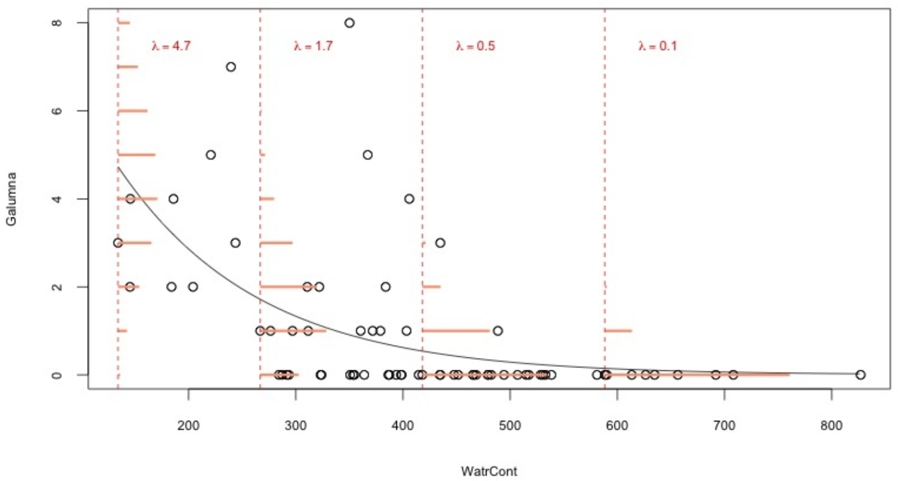

```{r setup, echo = FALSE}
knitr::opts_chunk$set(
  comment = "#",
  collapse = TRUE,
  cache = TRUE,
  warning = FALSE,
  message = FALSE,
  fig.width=6, fig.height=6,
  fig.retina = 3,
  fig.align = 'center'
)
mypar = list(mar = c(3,3,1,0.5), mgp = c(1.6, 0.3, 0), tck = -.02)
options(repos=structure(c(CRAN="http://cran.r-project.org")))
```


class: inverse, center, middle

```{R install_pkgs, echo = FALSE, results = "asis"}
cat(
  qcbsRworkshops::first_slides(7,
    c('ggplot2', 'lme4', 'MASS', 'vcdExtra', 'bbmle', 'DescTools'),
    lang = "fr")
)
```

---

# Objectifs d'apprentissage
<br>

##### 1. Pourquoi être normal?
##### 2. GLM avec variable binaire
##### 3. GLM avec des données d'abondance
##### 4. GLM avec effet aléatoires

---
class: inverse, center, middle

# Pourquoi être normal?

<hr>

### Y aurait-il un meilleur modèle?


---
# Limitations des modèles linéaires (mixtes)

Charger les données et appliquer un modèle linéaire (`lm()`) :

```{r,echo=FALSE}
mites <- read.csv('data/mites.csv')
```

```{r,eval=F}
# vérifiez que vous êtes dans le bon répertoire de travail
mites <- read.csv('data/mites.csv')
head(mites)
str(mites)
```

Le jeu de données chargé contient une partie du jeu de données classique des
[mites Oribatid (Acari,
Oribatei)](http://adn.biol.umontreal.ca/~numericalecology/data/oribates.html)
des sphaignes (Sphagnum sp.) du Lac Geai, [Station de Biologie de l'Université
de Montreal](https://goo.gl/maps/PxN1Q7KUPnUt92Eu5) :

.small[
> 70 échantillons de mousses et mites

> 5 variables environmentales, abondance de la mite *Galumna sp.*, et abondance totale des mites
]

--

.alert[Objectif]: Modéliser l'abondance (`abund`), l'occurrence (`pa`), et la proportion (`prop`) de Galumna en fonction des 5 paramètres environnementaux.


---
# Explorer les relations

Pouvons-nous voir une/des relation(s) entre *Galumna* et les 5 variables environnementales?

--

.pull-left2[
```{r,echo = -1}
par(mypar)
plot(mites)
```
]
.pull-right2[
<br><br><br><br>
`Galumna` vs `WatrCont`?!
]


---
# Explorer les relations

Une relation negative entre `Galumna` et le contenu en eau du sol?

```{r,fig.width=12,fig.height=4.5,echo=-1}
par(mypar)
par(mfrow = c(1, 3), cex = 1.4)
plot(Galumna ~ WatrCont, data = mites, xlab = 'Contenu en eau', ylab='Abondance')
boxplot(WatrCont ~ pa, data = mites, xlab='Présence/Absence', ylab = 'Contenu en eau')
plot(prop ~ WatrCont, data = mites, xlab = 'Contenu en eau', ylab='Proportion')
```

---
# Tester la linéarité

Utiliser des modèles linéaires pour voir si l'abondance, `abund`, la présence/absence, `pa`, et/ou la proportion, `prop`, varient en fonction du contenu d'eau.

--
```{r, eval = -c(2, 4, 6)}
lm.abund <- lm(Galumna ~ WatrCont, data = mites)
summary(lm.abund)
lm.pa <- lm(pa ~ WatrCont, data = mites)
summary(lm.pa)
lm.prop <- lm(prop ~ WatrCont, data = mites)
summary(lm.prop)
```

---
# Tester la linéarité

Utiliser des modèles linéaires pour voir si l'abondance, `abund`, la présence/absence, `pa`, et/ou la proportion, `prop`, varient en fonction du contenu d'eau.

.pull-left[
```{r}
summary(lm.abund)$coefficients[, 4]
summary(lm.abund)$coefficients[, 4]
summary(lm.abund)$coefficients[, 4]
```
]
.pull-right[
Un effet significatif dans tous les modèles!

.alert[Mais...]
]

---
# Tester la linéarité

Un effet significatif dans tous les modèles! .alert[Attends une minute...]

.pull-left[
```{r,echo=-1}
par(mypar);par(cex = 1.4)
plot(Galumna ~ WatrCont, data = mites)
abline(lm.abund)
```
]

.pull-right[
```{r,echo=-1}
par(mypar)
par(mfrow = c(2, 2), cex = 1.4)
plot(lm.abund)
```
]

---
# Tester la linéarité

Encore pire pour les autres modèles (Proportion `prop`) :

.pull-left[
```{r,echo=-1}
par(mypar);par(cex = 1.4)
plot(prop ~ WatrCont, data = mites)
abline(lm.prop)
```
]

.pull-right[
```{r,echo=-1}
par(mypar)
par(mfrow = c(2, 2), cex = 1.4)
plot(lm.prop)
```
]

---
# Tester la linéarité

Encore pire pour les autres modèles (Présence/Absence `pa`) :

.pull-left[
```{r,echo=-1}
par(mypar);par(cex = 1.4)
plot(pa ~ WatrCont, data = mites)
abline(lm.pa)
```
]

.pull-right[
```{r,echo=-1}
par(mypar)
par(mfrow = c(2, 2), cex = 1.4)
plot(lm.pa)
```
]

---
# Conditions d'application du modèle linéaire

<br>

Il est **très commun** en écologie que les conditions d'application du modèle
linéaire ne soient pas respectées. C'est pourquoi nous avons souvent besoin des
**modèles linéaires généralisées** (GLMs).

<br>

.alert[Rafraîchissons-nous la mémoire à propos des conditions d'application du modèle linéaire.]

---
# Conditions d'application du modèle linéaire

Équation du modèle:

$$y_i = \beta_0 + \beta_1x_i + \varepsilon_i$$

où:

- $y_i$ = valeur estimée pour la i<sup>ème</sup> variable réponse,
- $\beta_0$ = ordonnée à l'origine de la droite,
- $\beta_1$ = pente,
- $x_i$ = i<sup>ème</sup> valeur de la variable observée.
- $\varepsilon_i$ = résidus du modèle obtenus d'une distribution normale de moyenne 0 et de variance constante (qui est à estimer).


---
# Distribution normale
<br>

Une autre manière d'écrire le modèle linéaire est :

$$Y_i \sim \mathcal{N}(\mu = \beta_0 + \beta_1x_i, \sigma^2)$$

<br>
Ce qui signifie que $y_i$ (réalisation de la variable aléatoire $Y_i$) est échantillonnée dans une distribution normale ayant les paramètres $\mu$ (dont la valeur dépend de $x_i$) et $\sigma$ (indépendantes de $x_i$)

<br>
Essayons de prédire l'abondance de `Galumna` en fonction du contenu d'eau en utilisant `lm()` que nous avons vu plus tôt.

---
# Distribution normale

**Rappel** : La distribution normale a deux paramètres, $\mu$ (moyenne) et $\sigma$ (variance)

<br>
.pull-left[
3 valeurs pour $\mu$, $\sigma = 5$

```{r, echo=FALSE}
x = seq(1, 50, 0.1)
par(mypar);par(cex = 1.4)
plot(x, dnorm(x, mean = 20, sd = 5), type = 'l', lwd = 3, xlab = '# galumna', ylab = 'Probabilité')
points(x, dnorm(x, mean = 25, sd = 5), type = 'l', lwd = 3, col = 2)
points(x, dnorm(x, mean = 30, sd = 5), type = 'l', lwd = 3, col = 4)
legend('topleft', legend = c('20', '25', '30'), lty = 1, col = c(1, 2, 4), bty = 'n', lwd = 2, cex = 1.1)
```
]
.pull-right[
$\mu = 25$, 3 valeurs pour $\sigma$

```{r, echo=FALSE}
par(mypar);par(cex = 1.4)
x = seq(1, 50, 0.1)
plot(x, dnorm(x, mean = 25, sd = 5), type = 'l', lwd = 3, xlab = '# galumna', ylab = 'Probabilité')
points(x, dnorm(x, mean = 25, sd = 7.5), type = 'l', lwd = 3, col = 2)
points(x, dnorm(x, mean = 25, sd = 10), type = 'l', lwd = 3, col = 4)
legend('topleft', legend = c('5', '7.5', '10'), lty = 1, col = c(1, 2, 4), bty = 'n', lwd = 2, cex = 1.1)
```
]


---
# Distribution normales des résidus

.large[.alert[Pour utiliser correctement le modèle linéaire, il faut s'assurer que les résidus sont distribués selon une loi normale centrée.]]

<br>

Il faut donc **vérifier la normalité des résidus** et non celle la distribution de la variable de réponse, comme le Andrew MacDonald dans un tweet à propos de cette dernière pratique:

<blockquote class="twitter-tweet"><p lang="en" dir="ltr">This is the wrong thing to do because what matters is how your &quot;response variable&quot; is distributed *AFTER* you do your model, not before! <a href="https://twitter.com/rlmcelreath?ref_src=twsrc%5Etfw">@rlmcelreath</a> called this practice &quot;histomancy&quot;, which name I love</p>&mdash; Andrew MacDonald 🌈 (@polesasunder) <a href="https://twitter.com/polesasunder/status/1225100358738948101?ref_src=twsrc%5Etfw">February 5, 2020</a></blockquote> <script async src="https://platform.twitter.com/widgets.js" charset="utf-8"></script>
<br>


---
# Prédiction du modèle
<br>

Nous avons besoin des coefficients de régression ( $\beta_0$ et $\beta_1$) et de $\sigma$ :

```{r}
coef(lm.abund)
summary(lm.abund)$sigma
```

Quels sont les paramètres de la distribution normale utilisés pour modéliser $y$ lorsque le contenu d'eau = 300?

$$y_i \sim N(\mu = \beta_0 + \beta_1 x_i, \sigma^2)$$

--

$\mu = 3.44 + (-0.006 x 300) = 1.63$

$\sigma = 1.51$

---
# Prédiction du modèle

- Lorsque $x_i = 300$, $Y_i$ suit une distribution normale avec $\mu = 1.63$ et $\sigma^2 = 1.51$.

- Lorsque $x_i = 400$, $Y_i$ suit une distribution normale avec $\mu = 1.02$ et $\sigma^2 = 1.51$, etc.


<br>
Graphiquement, notre modèle ressemble à :

--
.pull-left[
.center[
  
]]

--
.pull-right[
**Problèmes**:
- $\sigma^2$ n'est pas homogène, mais `lm()` nous contraint d'utiliser toujours la même valeur de $\sigma^2$,
- Les valeurs estimées devraient être des nombres entiers.
]

---
# Données biologiques & distributions

<br>

- Les statisticiens ont développé [de nombreuses lois de probabilité (distributions)](https://www.causascientia.org/math_stat/Dists/Compendium.pdf) correspondant à divers types de données

- Une distribution donne la probabilité d'observer chaque issue possible d'une expérience ou échantillonage (e.g. $abund = 8$ Galumna)

- Les distributions peuvent être **discrètes** (que des nombres entiers) ou **continues** (incluent aussi des fractions)

- Toutes les distributions ont des **paramètres** qui déterminent leur forme (e.g. $\mu$ et $\sigma^2$ pour la distribution normale)

---
# Données biologiques & distributions

L'abondance de *Galumna* suit une distribution discrète (que des nombres entiers). Pour modéliser les données d'abondance, la [loi de Poisson](https://fr.wikipedia.org/wiki/Loi_de_Poisson) est souvent utilisée:

- une distribution discrète avec un seul paramètre, $\lambda$ (lambda), qui détermine la moyenne et la variance de la distribution:

```{r,echo=F,fig.width=15}
x = seq(1, 50, 1)
par(mypar);par(mfrow = c(1, 3), cex = 1.4)
plot(x, dpois(x, lambda = 1), type = 'h', lwd = 3, xlab = '# galumna', ylab = 'Probabilité', main = 'lambda = 1')
plot(x, dpois(x, lambda = 10), type = 'h', lwd = 3, xlab = '# galumna', ylab = 'Probabilité', main = 'lambda = 10')
plot(x, dpois(x, lambda = 30), type = 'h', lwd = 3, xlab = '# galumna', ylab = 'Probabilité', main = 'lambda = 30')
```

---
# Données biologiques & distributions

*Galumna* semble suivre une loi de Poisson avec une faible valeur de $\lambda$ :

```{r}
  mean(mites$Galumna)
  hist(mites$Galumna)
```

---
# Données biologiques & distributions

Présence-absence par contre prend une autre forme :

- Inclut seulement des `0`s et des `1`s
- La loi de Poisson n'est pas appropriée pour cette variable

```{r, fig.height=4, echo=-1}
  par(mypar);par(cex=1.4)
  hist(mites$pa)
```

---
# Données biologiques & distributions

**Distribution de [Bernoulli](https://fr.wikipedia.org/wiki/Loi_de_Bernoulli)** :

- N'inclut que deux issues possibles dans son ensemble: succès (`1`) ou échec (`0`)
- N'a qu'un paramètre, $p$, la probabilité de succès

<br>
```{r,echo=-F,fig.width=12,fig.height=4}
  par(mypar);par(mfrow = c(1, 3), cex=1.4)
  barplot(setNames(c(.9, .1), c('absent (0)', 'present (1)')), ylim = c(0, 1), xlab = 'pa', ylab = 'probability', main = 'p = 0.1')
  barplot(setNames(c(.5, .5), c('absent (0)', 'present (1)')), ylim = c(0, 1), xlab = 'pa', ylab = 'probability', main = 'p = 0.5')
  barplot(setNames(c(.1, .9), c('absent (0)', 'present (1)')), ylim = c(0, 1), xlab = 'pa', ylab = 'probability', main = 'p = 0.9')
```
Nous pouvons utiliser la loi de Bernoulli pour calculer la probabilité d'obtenir l'issue "Galumna present" (`1`) vs. "Galumna absent" (`0`)

---
# Données biologiques & distributions

**[Distribution binomiale](https://fr.wikipedia.org/wiki/Loi_binomiale)** : Lorsqu'il y a plusieurs épreuves (chacune avec un succès/échec), la loi de Bernoulli se transforme en loi binomiale

- Inclut le paramètre additionel $n$, le nombre d'épreuves
- Prédit la probabilité d'observer une certaine proportion de succès, $p$, sur le nombre total d'épreuves, $n$

```{r,echo=F,fig.width=15}
x = seq(1, 50, 1)
par(mypar);par(mfrow = c(1, 3), cex = 1.4)
plot(x, dbinom(x, size = 50, prob = 0.1), type = 'h', lwd = 3, xlab = '# galumna', ylab = 'Probabilité', main = 'p = 0.1 n = 50')
plot(x, dbinom(x, size = 50, prob = 0.5), type = 'h', lwd = 3, xlab = '# galumna', ylab = 'Probabilité', main = 'p = 0.5 n = 50')
plot(x, dbinom(x, size = 50, prob = 0.9), type = 'h', lwd = 3, xlab = '# galumna', ylab = 'Probabilité', main = 'p = 0.9 n = 50')
```

---
# Données biologiques & distributions

**Distribution binomiale** : utilisée pour modéliser des données lorsque le nombre de succès est donné par un nombre entier, et lorsque le nombre d'épreuves, $n$, est connu.

**Différence principale avec la loi de Poisson** : L'étendue de la loi binomiale a une limite supérieure, $n$. Par conséquent, elle est asymétrique et décalée à gauche lorsque $p$ est faible, mais décalée à droite lorsque $p$ est élevé.

```{r,echo=F,fig.width=10, fig.height=4}
x = seq(1, 50, 1)
par(mypar);par(mfrow = c(1, 2), cex = 1.4)
plot(x, dbinom(x, size = 50, prob = 0.9), type = 'h', lwd = 3, xlab = '# galumna', ylab = 'Probability', main = 'p = 0.9 n = 50')
plot(x, dpois(x, lambda = 30), type = 'h', lwd = 3, xlab = '# galumna', ylab = 'Probability', main = 'lambda = 30')
```

---
# Données biologiques & distributions

Retournons à notre problème pour changer la distribution de $Y_i$ de normale à Poisson :

$$Y_i \sim Poisson(\lambda = \beta_0 + \beta_1 x_i)$$

Le problème est résolu!

1. $\lambda$ varie avec $x$ (contenu d'eau) et la variance des résidus changera aussi avec $x$, et nous venons de nous défaire de la supposition d'homogénéité de la variance!

2. Les valeurs estimées seront des nombres entiers plutôt que des nombres décimaux;

3. Ce modèle ne prédira jamais de valeurs négatives (Poisson est toujours strictement positif).

---
# Données biologiques & distributions

Ce modèle est **presque** un GLM de Poisson, qui ressemble à ça:

.center[]

Les probabilités (en orange) sont maintenant des nombres entiers, et la variance et la moyenne de la distribution déclinent lorsque $\lambda$ diminue avec le contenu d'eau.

---
class: inverse, center, middle

# GLM avec variable binaire

<hr>

---
# Variables binaires
<br>

Une variable réponse commune dans les jeux de données en écologie : variable binaire, on observe un phénomène X ou son "absence"

- Présence/Absence d'une espèce
- Présence/Absence d'une maladie
- Succès/Échec d'observer un comportement
- Survie/Mort d'un organisme

On veut déterminer si $P/A \sim Environment$

.comment[Régression logistique ou modèle logit]

---
# Variables binaires

Dans `R`, on code une variable binaire avec `1` et `0`:

```{r,echo=F}
Site <- LETTERS[1:6]
Presence <- c(1, 0, 1, 1, 0, 1)
dat = data.frame(Site, Presence)
```

<br>

.pull-left[
.right[
```{r, echo=F}
print(dat)
```
]]
.pull-right[
 <br>

 1 = Présence

 <br>

 0 = Absence
]

---
# Variables binaires


```{r,echo=F,fig.width=7, fig.height=6}
par(mypar);par(cex = 1.4)
hist(Presence)
```

.alert[Avec un modèle linéaires, les résidus ne seront pas distribués normalement!]

---
# Variables binaires

Les valeurs prédites peuvent se trouver hors de l'intervalle `[0,1]` avec `lm()`:

<br>

```{r,echo=F,fig.width=7.5, fig.height=5.6}
Pres <- c(rep(1, 40), rep(0, 40))
rnor <- function(x) rnorm(1, mean = ifelse(x == 1, 12.5, 7.5), sd = 2)
ExpVar <- sapply(Pres, rnor)
par(mypar);par(cex = 1.4)
plot(ExpVar, Pres, ylim = c(-.5, 1.5), xlab = 'Variable explicative', ylab = 'Présence', main = "Valeurs prédites d'un lm() avec une variable binaire", pch = 16)
abline(lm(Pres ~ ExpVar), col = 'orange', lwd = 2)
mtext(expression(symbol("\255")), at = 1.25, side = 4, line = 0.1, cex = 6, col = 'blue')
mtext(expression(symbol("\256")), at = 3, side = 1, line = -2.2, cex = 6, col = 'blue')
```

---
# Distribution de probabilité

La distribution de Bernoulli est adaptée pour des variables réponses binaires

<br>

.pull-left[.right[

$E(Y) = p$

<br>

$Var(Y) = p \times (1 - p)$

]]
.pull-right[

 **Moyenne de la distribution** .small[Probabilité $p$ d'observer un résultat]

 **Variance de la distribution** .small[La variance décroît quand $p$ est proche de `0` ou `1`]
]

---
# Régression logistique

La fonction `glm()`!

<br>

```R
logit.reg <- glm(formula, data, family)
```

<br>

Pour utiliser la bonne distribution, il faut spécifier:

1. distribution de probabilité

--
**ET**

--
2. une [fonction de lien](https://en.wikipedia.org/wiki/Generalized_linear_model#Link_function) (il y a une fonction de lien par défaut pour une distribution donnée!) qui définit aussi une relation entre la moyenne et la variance.

<br>

--

Dans R, cela se fait en utilisant l'argument `family` (voir `?family`) :

---
# La fonction de lien

Pour un modèle linéaire de base d'une variable réponse normalement distribuée, l'équation pour la valeur attendue est :

$$\mu = x\beta$$

où

- $\mu$ représente les valeurs prédites par le modèle,
- $x$ est la matrice du modèle (*i.e.* les variables explicatives),
- $\beta$ est le vecteur des paramètres estimés (*i.e.* intercept & pente).


###### $x\beta$ est appelé le **prédicteur linéaire**

---
# La fonction de lien

$\mu = x\beta$ est vrai seulement pour la distribution normale

Si ce n'est pas le cas, on utilise une transformation $g$ sur $\mu$

$$g(\mu) = x\beta$$

où $g$ est appelée **fonction de lien**. Cela permet de travailler avec des distributions autres que la loi normale.

---
# La fonction de lien

Pour les données binaires, on utilise la transformation **logit** :

<br>

$$g(\mu) = log\left(\frac{\mu}{1-\mu}\right)$$

$\mu =$ variables prédites (probabilité que $Y = 1$)

--

1. $\frac{\mu}{1-\mu}$ met les valeurs prédites sur une échelle de  `0` à `+Inf`
2. La transformer en log ce qui projette les valeurs prédites sur entre`-Inf` à `+Inf`

--

<br>

 Les valeurs prédites **transformées** sont reliées **linéairement** au prédicteur linéaire

---
# Exercice 1

Spécifiez un modèle de régression logistique avec le jeu de données mites.

```{r,eval=F}
#setwd('...')
mites <- read.csv("mites.csv", header = TRUE)
str(mites)

```{r,echo=F}
mites <- read.csv("data/mites.csv", header = TRUE)
str(mites)
```

---
# Exercice 1

Spécifiez un modèle de la présence et de l'absence de *Galumna sp.* en fonction du contenu en eau du sol et de la topographie.

```{r}
logit.reg <- glm(pa ~ WatrCont + Topo, data=mites,
family = binomial(link = "logit"))
```
```{r,eval=F}
summary(logit.reg)
```

---
# Exercice 1

.small[
```{r}
summary(logit.reg)
```
]

---
# Défi 1 

En utilisant le jeu de données 'bacteria', spécifiez un modèle de la présence de *H. influenzae* en fonction du traitement et de la semaine de test.

Commencez avec un modèle saturé et trouvez le modèle le plus parcimonieux.


```{r}
#install.packages("MASS")
library(MASS)
data(bacteria)
str(bacteria)
```

---
# Solution 

```{r}
model.bact1 <- glm(y ~ trt * week, data = bacteria, family = binomial)
```

```{r}
model.bact2 <- glm(y ~ trt + week, data = bacteria, family = binomial)
```

```{r}
model.bact3 <- glm(y ~ week, data = bacteria, family = binomial)
```

```{r}
anova(model.bact1, model.bact2, model.bact3, test = "LRT")
```

---
# Interpréter la sortie

Regardez à nouveau les coefficients du modèle `logit.reg` :

```{r}
summary(logit.reg)$coefficients
```

La sortie indique que le contenu d'eau et la topographie sont significatifs

.comment[Mais comment interprète-on les coefficients de la pente?]

---
# Interpréter la sortie

Rappelez-vous que nous avons utilisé une transformation logit!

Pour bien interpréter les coefficients du modèle, il faut les utiliser avec la fonction de lien inverse ( $g^{-1}$ ):

$$g^{-1}(\beta_0 + \beta_1x)$$


<!-- La fonction exponentielle pour obtenir les cotes : $e^x$ -->

Dans notre exemple, la fonction $logit$ inverse est utiliser pour obtenir les probabilités :

$$logit^{-1} = \frac{1}{1 + e^{-(\beta_0 + \beta_1 WatrCont + \beta_2 TopoHummock)}}$$


---
# Pouvoir prédictif et ajustement du modèle
<br>

Le [pseudo-R²](https://stats.idre.ucla.edu/other/mult-pkg/faq/general/faq-what-are-pseudo-r-squareds/), un concept analogue au $R^2$ pour les modèles estimés par maximisation de la vraisemblance:

$$\text{pseudo-R}^2 = \frac{\text{déviance nulle - déviance résiduelle}}{\text{déviance nulle}}$$

<br>

$\text{pseudo-R}^2 = \text{variance expliquée par le modèle}$

---
# Pouvoir prédictif et ajustement du modèle

Comparer la déviance du modèle (déviance résiduelle) à la déviance d'un modèle nul (déviance nulle)

Le **modèle nul** est un modèle sans variables explicatives, simplement l'ordonnée à l'origine

```R
null.model <- glm(Response.variable ~ 1, family = binomial)
```

---
# Pouvoir prédictif et ajustement du modèle

Dans R, nous pouvons extraire les déviances résiduelles et nulles directement à partir de l'objet glm :

```{r}
objects(logit.reg)
```

---
# Pouvoir prédictif et ajustement du modèle

Dans R, nous pouvons extraire les déviances résiduelles et nulles directement à partir de l'objet glm :

```{r}
pseudoR2 <- (logit.reg$null.deviance - logit.reg$deviance) / logit.reg$null.deviance
pseudoR2
```

.comment[Ainsi, le modèle explique 46.6% de la variabilité des données]

---
# Pouvoir prédictif et ajustement du modèle

Nouvelle statistique - **coefficient de discrimination (D)** évalue le pouvoir prédictif d'une régression logistique

- Mesure à quel point la régression logistique est capable de bien classifier un résultat en succès ou échec

Pour évaluer l'ajustement du modèle, les graphiques de diagnostique ne sont pas utiles, il vaut mieux utiliser le [test de Hosmer-Lemeshow](https://en.wikipedia.org/wiki/Hosmer%E2%80%93Lemeshow_test):

- Compare le nombre de résultats obtenus et attendus
- Similaire à un test de $Chi^2$

---
# Exercice 2

La fonction R `PseudoR2` dans le package` DescTools` permet de calculer plusieurs Pseudo R2. En spécifiant `which = all`, calculez toutes les statistiques en même temps.


```{r, echo = -1}
logit.reg <- glm(mites$pa ~ mites$WatrCont + mites$Topo, family = binomial(link = "logit")) # needed for the rmd presentation, or else problem with PseudoR2 environment...
library(DescTools)
fit <- PseudoR2(logit.reg, which = "all")
fit
```

---
# Exercice 2: Faites le test de Hosmer-Lemeshow

```{r}
library(vcdExtra)
HLtest(logit.reg)
```

.comment[Une valeur non significative indique un ajustement adéquat!]


---
# Défi 2 
<br>


1. En utilisant le modèle créé avec le jeu de données 'bacteria', évaluez le pouvoir prédictif et l'ajustement de ce modèle.

2. Comment faire pour améliorer le pouvoir explicatif du modèle?

---
# Solution 

1 :
```{r,eval=F}
null.d <- model.bact2$null.deviance
resid.d <- model.bact2$deviance
bact.pseudoR2 <- (null.d - resid.d) / null.d
HLtest(model.bact2)
```

2 : Ajouter des variables explicatives pertinentes pourrait certainement augmenter le pouvoir explicatif du modèle.

---
# GLM et données de proportions

Parfois, les données de proportions sont plus similaires à un régression logistique que ce que vous pensez...

Si on mesure un nombre d'occurences et qu'on connaît la taille d'échantillon, on obtient des données de proportions!

Supposons qu'on mesure la prévalence d'une maladie sur dix cerfs dans 10 populations différentes :

.pull-left[

$$\frac{x\,\, \text{infected deer}}{10\,\,\text{deer}}$$

]

.pull-right[
 toujours entre `0` et `1`!
]

---
# Exercice 3

Dans R, on doit spécifier le nombre de fois qu'un événement s'est produit et le nombre de fois qu'un événement ne s'est pas produit:

```{r}
prop.reg <- glm(cbind(Galumna, totalabund - Galumna) ~ Topo + WatrCont, data = mites, family = binomial)
```

```r
summary(prop.reg)
```

---
# Exercice 3

.small[
```{r}
summary(prop.reg)
```
]

---
# Exercice 3

On peut coder le modèle directement avec les proportions:

```{r}
prop.reg2 <- glm(prop ~ Topo + WatrCont, data = mites,
                 family = binomial, weights = totalabund)
```

---
class: inverse, center, middle

# GLM avec des données d'abondance

<hr>

---
# Modéliser des données d'abondance

.large[Que sont des données d'abondance?]

Importez le jeu de données `faramea.csv` dans R

```{r,echo=F}
faramea <- read.csv('data/faramea.csv', header = TRUE)
```
```{r,eval=F}
faramea <- read.csv('faramea.csv', header = TRUE)
```

Le nombre d'arbres de l'espèce *Faramea occidentalis* a été compté dans 43 quadrats sur l'île de Barro Colorado (Panama). Des données environnementales, comme l'élévation et la précipitation ont aussi été mesurées.

Examinons maintenant à quoi ressemble la distribution du nombre d'arbres par transect.

---
# Modéliser des données d'abondance

.large[Que sont des données d'abondance?]

```{r, echo=F,fig.height=5}
par(mypar);par(cex = 1.4)
hist(faramea$Faramea.occidentalis, breaks = 30, col = 'gray', xlab = 'Nombre de F. occidentalis', ylab = 'Fréquence', main = '')
```

---
# Modéliser des données d'abondance

.large[Que sont des données d'abondance?]

Les données d'abondance sont charactérisées par:

- des valeurs positives : on ne peut pas compter -7 individus
- des valeurs entières : on ne peut pas compter 7.56 individus
- une plus grande variance pour les fortes valeurs

---
# Modéliser des données d'abondance

.large[Comment modéliser des données d'abondance?]

L'élévation influence-t-elle l'abondance de *F. occidentalis*?

```{r, echo=F,fig.height=5}
par(mypar);par(cex = 1.4)
plot(faramea$Elevation, faramea$Faramea.occidentalis, ylab = 'Nombre de F. occidentalis', xlab = 'Élevation(m)')
```

---
# Modéliser des données d'abondance

.large[Comment modéliser des données d'abondance?]

L'élévation influence-t-elle l'abondance de *F. occidentalis*?

La **distribution de Poisson** semble être le choix parfait pour modéliser ces données, ainsi des **GLMs Poisson** sont généralement une bonne façon pour commencer à modéliser des donnes d'abondance.

---
# La distribution de Poisson

La distribution de poisson, qui spécifie la probabilité d'une variable aléatoire discrète Y, est données par :

$$f(y, \,\mu)\, =\, Pr(Y = y)\, =\, \frac{\mu^y \times e^{-\mu}}{y!}$$

$$E(Y)\, =\, Var(Y)\, =\, \mu$$

**Propriétés** :

- $\mu$ est le paramètre de la distribution de Poisson
- spécifie la probabilité pour des valeurs entières uniquement
- la probabilité pour des valeurs négatives est nulle ( $P(Y<0) = 0$)
- moyenne = variance (permet l'hétérogénéité)

---
# Que se cache-t-il derrière un GLM Poisson?

Un GLM Poisson va modéliser la valeur de $\mu$ en fonction de différentes variables explicatives.

.center[**Trois étapes**]

**Étape 1.** On suppose que $Y_i$ suit une distribution de Poisson de moyenne et variance $\mu_i$

$$Y_i = Poisson(\mu_i)$$

$$E(Y_i) = Var(Y_i) = \mu_i$$

$$f(y_i, \, \mu_i) = \frac{\mu^{y_i}_i \times e^{-\mu_i}}{y!}$$

$\mu_i$ correspond au nombre attendu d'individus

---
# Que se cache-t-il derrière un GLM Poisson?

**Étape 2.** On spécifie le prédicteur linéaire comme dans un modèle linéaire

$$\underbrace{\alpha}_\text{One intercept} + \underbrace{\beta}_\text{slope of 'Elevation'} \times \text{Elevation}_i$$

**Étape 3.** La fonction de lien entre la moyenne de $Y_i$ et la partie systématique est un log

$$log(\mu_i) = \alpha + \beta \times \text{Elevation}_i$$

.center[ou]

$$\mu_i = e^{ \alpha + \beta \times \text{Elevation}_i}$$

---
# Ajuster un GLM Poisson sous R

La fonction `glm()` permet de spécifier un GLM Poisson

```{r}
glm.poisson = glm(Faramea.occidentalis~Elevation, data=faramea, family=poisson)
```

L'argument `family` permet de spécifier le type de distribution et la fonction de lien (log)

<br>

Tout comme avec `lm()`, vous pouvez accéder au résumé du modèle à l'aide de la fonction `summary()`

```{r,eval=F}
summary(glm.poisson)
```

---
# Résumé du modèle

.pull-left2[
.small[
```{r}
summary(glm.poisson)
```
]]

.pull-right2[
Estimés :

Intercept = $\alpha$

Élevation = $\beta$

]

--

.pull-right2[
<br>
Qu'en est-il de `Null deviance` et `Residual deviance`?!
]


---
# Estimation des paramètres

Dans notre modèle, les paramètres à estimer sont l'ordonnée à l'origine ( $\alpha$ ) et le coefficient de régression de l'élevation ( $\beta$ )


$$log(\mu_i) = 1.769 - 0.0027 \times \text{Élevation}_i$$

.center[ou]

$$\mu_i = e^{1.769 - 0.0027 \times \text{Élevation}_i}$$


---
# La déviance

Rappelez vous que pour estimer les paramètres inconnus, l'estimation par maximum de vraisemblance est utilisée

La déviance résiduelle est approximativement la différence entre la vraisemblance d'un modèle saturé (n paramètres pour chaque observation) et le modèle complet (p paramètres):

$$\text{Res dev} = 2 \, log(L(y;\,y)) - 2 \, log(L(y;\, \mu))$$

Dans un GLM Poisson, la déviance résiduelle doit être égale au nombre de degrés de liberté résiduels

.center[.alert[388.12 >> 41]]

---
# La surdispersion

Quand la déviance résiduelle est supérieure au nombre de degrés de liberté résiduels, le modèle est **surdispersé**

$$\phi ~ = ~\frac{\text{Déviance résiduelle}}{\text{Degrés de liberté résiduels}}$$

Se produit lorsque la variance dans les données est plus grande que la moyenne. Dans ce cas la distribution de Poisson n'est plus appropriée (beaucoup de zéros, covariables manquantes, etc.)

.center[.large[**Solutions**]]

.pull-left[
1: Corriger la surdispersion en utilisant en **GLM quasi-Poisson**
]

.pull-right[
2: Choisir une autre distribution : **la [negative binomial](https://fr.wikipedia.org/wiki/Loi_binomiale_n%C3%A9gative)**
]

---
# GLM Quasi-Poisson

La variance du modèle tient compte de la **surdispersion** en ajoutant le paramètre de surdispersion:

$$E(Y_i) = \mu_i$$

$$Var(Y_I) = \phi \times \mu_i$$

le **prédicteur linéaire** et la **fonction de lien** restent les même

$\phi$ est le paramètre de dispersion. Il sera estimé avant les paramètres. Corriger pour la surdispersion ne va pas affecter l'estimation des paramètres, mais leur **significativité**. En effet, les écarts-types des paramètres seront multipliés par $\sqrt{\phi}$.

.alert[Certaines p-values marginalement significatives peuvent devenir non significatives!]

---
# Ajuster un GLM quasi-Poisson sous R

Créez un nouveau GLM à l'aide de la famille 'quasipoisson' ou actualisez le modèle précédent:

```{r}
glm.quasipoisson = glm(Faramea.occidentalis ~ Elevation, data = faramea,
                       family=quasipoisson)
glm.quasipoisson = update(glm.poisson, family = quasipoisson)
```

---
# Ajuster un GLM quasi-Poisson sous R

.pull-left2[
.small[
```{r}
summary(glm.quasipoisson)
```
]]
.pull-right2[
**Mêmes estimés mais**

.small[Les écarts-types des paramètres sont multipliés par]

$$\sqrt{\phi} = 4$$

`0.0006436 * 4 = 0.00257`

<- $\phi$

<br>

<- .small[Pas d'AIC!]
]

---
# Ajuster un GLM quasi-Poisson sous R

Testons l'effet de l'élévation par une analyse de déviance :

```{r}
null.model <- glm(Faramea.occidentalis ~ 1, data = faramea,
                  family = quasipoisson)
anova(null.model, glm.quasipoisson, test = "Chisq")
```

---
# Paramètre de dispersion

.center[]

---
# GLM binomiale négative

Une distribution binomiale négative est favorisée quand la surdispersion est forte

- La distribution a **deux paramètres** $\mu$ and $k$. $k$ contrôle pour la dispersion (plus la dispersion est forte, plus $k$ est petit)
- C'est une combinaison de deux distributions (**Poisson** et **gamma**)
- Les $Y_i$ suivent une distribution de Poisson dont la moyenne $\mu$ suit une distribution Gamma!

$$E(Y_i) = \mu_i$$

$$Var(Y_i) = \mu_i + \frac{\mu^2_i}{k}$$


---
# Ajuster une binomiale négative sous R

NB La distribution binomiale n'est pas dans la fonction `glm()` donc il faut installer et charger la paquet `MASS`

```r
install.packages('MASS')
```

```{r}
glm.negbin = glm.nb(Faramea.occidentalis ~ Elevation, data = faramea)
```

```r
summary(glm.negbin)
```

---
# Ajuster une binomiale négative sous R

.pull-left2[
.small[
```{r,echo=-1}
summary(glm.negbin)
```
]]
.pull-right2[

<br><br><br><br><br><br><br><br><br><br><br><br><br>
`theta` $= k$
]

---
# Représenter le modèle final

**Étape 1** Représenter les données et utiliser les estimations des paramètres pour représenter le modèle

$$\mu_i = e^{2.369 - 0.007 \times Elevation_i}$$

Utilisez `summary()` pour obtenir les paramètres

```r
summary(glm.negbin)$coefficients[1, 1]
summary(glm.negbin)$coefficients[2, 1]
```

---
# Représenter le modèle final

**Étape 2** Utilisez les écarts-types pour construire l'intervalle de confiance

```r
summary(glm.negbin)$coefficients[1, 2]
summary(glm.negbin)$coefficients[2, 2]
```

$$\text{Limite sup} = e^{[\alpha - 1.96 \times SE_{\alpha}] + [\beta - 1.96 \times SE_{\beta}] \times \text{Élevation}_i}$$

$$\text{Limit inf} = e^{[\alpha + 1.96 \times SE_{\alpha}] + [\beta + 1.96 \times SE_{\beta}] \times \text{Élevation}_i}$$

---
# Représenter le modèle final

.small[
```{r,eval=F}
pp <- predict(glm.negbin, newdata = data.frame(Elevation = 1:800), se.fit = TRUE)
linkinv <- family(glm.negbin)$linkinv ## inverse-link function
pframe$pred0 <- pp$fit
pframe$pred <- linkinv(pp$fit)
sc <- abs(qnorm((1-0.95)/2))  ## Normal approx. to likelihood
pframe <- transform(pframe, lwr = linkinv(pred0-sc*pp$se.fit), upr = linkinv(pred0+sc*pp$se.fit))
# sinon, utiiser predic() avec type="response"

plot(faramea$Elevation, faramea$Faramea.occidentalis, ylab = 'Number of F. occidentalis', xlab = 'Elevation(m)')
lines(pframe$pred, lwd = 2)
lines(pframe$upr, col = 2, lty = 3, lwd = 2)
lines(pframe$lwr, col = 2, lty = 3, lwd = 2)
```
]

```{r,echo=F, fig.height=4}
pframe <- data.frame(Elevation = 1:800)
pp <- predict(glm.negbin, newdata = pframe, se.fit = TRUE)
linkinv <- family(glm.negbin)$linkinv ## inverse-link function

pframe$pred0 <- pp$fit
pframe$pred <- linkinv(pp$fit)
alpha <- 0.95
sc <- abs(qnorm((1-alpha)/2))  ## Normal approx. to likelihood
alpha2 <- 0.5
pframe <- transform(pframe,
                    lwr=linkinv(pred0-sc*pp$se.fit),
                    upr=linkinv(pred0+sc*pp$se.fit))

par(mypar);par(cex = 1.4)
plot(faramea$Elevation, faramea$Faramea.occidentalis,
      ylab = 'Nombre de F. occidentalis', xlab = 'Élevation(m)')
lines(pframe$pred, lwd = 2)
lines(pframe$upr, col = 2, lty = 3, lwd = 2)
lines(pframe$lwr, col = 2, lty = 3, lwd = 2)
```

---
# Défi 3 


Utilisez le jeu de données `mites`! Modélisez l'abondance de l'espèce *Galumna* en fonction des caractéristiques du substrat (son contenu en eau `WatrCont` et sa densité `SubsDens`)

- Faut-il contrôler pour la surdispersion?
- Quelles variables explicatives ont un effet significatif?
- Selectionnez le meilleur modèle!

```{r,echo=F}
mites <- read.csv("data/mites.csv", header = TRUE)
```
```{r,eval=F}
mites <- read.csv("mites.csv", header = TRUE)
```

---
# Défi 3 : conseils 

Sélection pas à pas en retirant à chaque fois une variable et en comparant le modèle emboité au modèle complet :

```r
drop1(MyGLM, test = "Chi")
```

Spécifiez un modèle emboîté manuellement, appelez le `MyGLM2`, et utilisez la fonction anova():

```r
anova(MyGLM, MyGLM2, test = "Chi")
```

---
# Défi 3 : solution 

.small[
```{r}
# GLM Poisson
glm.p = glm(Galumna~WatrCont+SubsDens, data=mites, family=poisson)
# GLM quasi-Poisson
glm.qp = update(glm.p,family=quasipoisson)
# sélection du modèle
drop1(glm.qp, test = "Chi")
```
```r
# ou
glm.qp2 = glm(Galumna~WatrCont, data=mites, family=quasipoisson)
anova(glm.qp2, glm.qp, test="Chisq")
```
]


---
# Défi 3 : solution 

<br>

.center[
```{r,echo=F, fig.height=5,fig.width=6}
glm.qp = glm(Galumna~WatrCont, data=mites, family=poisson)
glm.qp2 = update(glm.qp, family=quasipoisson)
pframe <- data.frame(WatrCont = 100:850)
pp <- predict(glm.qp2, newdata = pframe, se.fit = TRUE)
linkinv <- family(glm.qp2)$linkinv ## inverse-link function

pframe$pred0 <- pp$fit
pframe$pred <- linkinv(pp$fit)
alpha <- 0.95
sc <- abs(qnorm((1-alpha)/2))  ## Normal approx. to likelihood
alpha2 <- 0.5
pframe <- transform(pframe,
                    lwr=linkinv(pred0-sc*pp$se.fit),
                    upr=linkinv(pred0+sc*pp$se.fit))

par(mypar);par(cex = 1.4)
plot(mites$WatrCont, mites$Galumna,
      ylab = 'Nombre de Galumna', xlab = "Contenu d'eau du substrat (g/L)")
lines(pframe$pred, lwd = 2)
lines(pframe$upr, col = 2, lty = 3, lwd = 2)
lines(pframe$lwr, col = 2, lty = 3, lwd = 2)
```
]


---
# Autres distributions
<br>

- **Transformation logit des données** souvent utilisée avec `lm()` pour les pourcentages et les proportions quand la distribution binomiale n'est pas appropriée. Quand non selectionné à partir de quantités fixées (e.g. pourcentage de couverture, grades scolaires, etc).
- **Distribution log-normal dans un glm**, évite d'avoir à log-transformer les données.
- **Distribution Gamma**. Similaire à une log-normal, plus flexible.
- **Distribution tweedie**. Famille de distributions flexible. Utile pour des données avec un mélange de 0 et de valeurs positives (pas forcément des comptes).
- **Poisson ou negative binomiale à inflation de zéro**. Quand les données comprennent un nombre excessif de zéros, venant d'un processus différent de celui qui génère les comptes.

---
class: inverse, center, middle

# GLMMs

<hr>
<br>

---
# Révision: Modèles Linéaires Mixtes

**Rappel de l'atelier LMM**:

- Structure dans le jeu de données ou corrélation entre les observations peut entraîner une **dépendance entre les observations** échantillonnés à partir des même sites ou points dans le temps
- On en tient compte en incluant des **termes d'effet aléatoire**

**Effets aléatoires**:

- Un échantillon de la population, i.e. les sujets que vous avez échantillonnés par hasard
- Explique la variation de la variable réponse

**Effets fixes**:

- Reproductible, i.e serait le même dans toutes les études
- Explique la moyenne de la variable réponse

---
# Révision: Modèles Linéaires Mixtes

.pull-left[
**"Shrinkage estimates"**

- Les effets aléatoires sont souvent appelés des **estimations de rétrécissement** parce qu'ils représentent une moyenne pondérée des données et de l'ajustement global (effet fixe)
- La baisse des coeff. vers l'ajustement global est plus sévère si la variabilité intra-groupe est grande par rapport à la variabilité inter-groupe
]

.pull-right[
<br>

]


---
# Modèles Linéaires Généralisés Mixtes (GLMMs)

Extension des GLMs tenant compte de structures supplémentaires dans les données

Suivre les étapes similaires à celles introduites lors de l'atelier sur les LMMs:

1. LMMs incorporent les effets aléatoires
2. GLMs peuvent gérer des données non-normales (en laissant les erreurs prendre différentes familles de distribution - e.g Poisson ou binomial négatif)

---
# Comment modéliser un GLM sous R

Chargez les données `Arabidopsis` `banta_totalfruits.csv` dans R.

```{r, echo=F}
dat.tf <- read.csv("data/banta_totalfruits.csv")
```

```r
dat.tf <- read.csv("banta_totalfruits.csv")
```
```r
# popu facteur avec un niveau pour chaque population
# gen facteur avec un niveau pour chaque génotype
# nutrient facteur avec niveau bas (valeur = 1) ou haut (valeur = 8)
# amd facteur précisant l'absence ou la présence d'herbivorie
# total.fruits nombre entier indiquant le nombre de fruits par plante
```

L'effet de la disponibilité de nutriments et d'herbivorie (**effets fixes**) sur la production de fruits d'*Arabidopsis thaliana* (arabette des dames) a été évalué en mesurant 625 plantes à travers neuf populations différentes, constituées chacune de 2 à 3 génotypes (**effets aléatoires**)


---
# Choisir la distribution des erreurs

La variable réponse constitue des données d'abondance, donc nous devons choisir une **distribution de Poisson** (i.e variance égale à la moyenne)

```{r,echo=F, fig.height=5, fig.width=6}
par(mypar);par(cex = 1.4)
hist(dat.tf$total.fruits, breaks = 50, col = 'blue', main = '',
     xlab = 'Fruits totaux', ylab = 'Compte')
```
Cependant, comme nous le verrons, la variance de chaque groupe augmente beaucoup plus rapidement que prévu...

---
# Exploration de la variance

Pour illustrer l'hétérogénéité de la variance, nous allons d'abord créer des boîtes à moustaches (boxplots) de la variable réponse par rapport aux différents facteurs environnementaux

Créons de nouvelles variables qui représentent toutes les combinaisons de **nutriments** x **herbivorie** x **facteur aléatoire**

```{r}
dat.tf <- within(dat.tf,
{
  # génotype x nutriment x herbivorie
  gna <- interaction(gen,nutrient,amd)
  gna <- reorder(gna, total.fruits, mean)
  # population x nutriment x herbivorie
  pna <- interaction(popu,nutrient,amd)
  pna <- reorder(pna, total.fruits, mean)
})
```

---
# Exploration de la variance

.small[
```{r, fig.height=3.5, fig.width=8}
# Boxplot du total des fruits vs interaction génotype x nutriment x herbivorie
library(ggplot2)
ggplot(data = dat.tf, aes(factor(x = gna),y = log(total.fruits + 1))) +
  geom_boxplot(colour = "skyblue2", outlier.shape = 21,
  outlier.colour = "skyblue2") +
  theme_bw() + theme(axis.text.x=element_blank()) +
  stat_summary(fun.y=mean, geom="point", colour = "red")
```
]

.comment[De même, la boîte à moustaches total des fruits vs population x nutriments x herbivorie montre une grande quantité d'hétérogénéité entre les populations.]


---
# Choisir la distribution des erreurs

Comme nous venons de le voir, il existe une importante hétérogénéité parmi la variance de chaque groupe, même lorsque la variable réponse est transformée

Si nous représentons graphiquement les **écarts vs moyennes par groupes** (génotypes x nutriment x herbivorie), on voit que la distribution de Poisson est la moins appropriée (i.e. écart augmentent beaucoup plus vite que la moyenne)

.small[.pull-left[

]
.pull-right[

<font color="blue">NB = negative binomial</font>

<br>

<font color="red">QP = quasi-Poisson</font>

<br>
<font color="LightBlue">loess = Locally weighted regression smoothing</font>
]]


---
# GLMM Poisson

Compte tenu de la relation moyenne-variance, nous avons besoin d'un modèle avec surdispersion.

- Mais commençons avec un modèle de Poisson :

Pour lancer un GLMM dans R, nous faisons appel à la fonction `glmer()`, du paquet lme4

```{r}
library(lme4)
mp1 <- glmer(total.fruits ~ nutrient*amd + rack + status +
             (1|popu)+
             (1|gen),
             data = dat.tf, family = "poisson")
```

**Effets aléatoires** : `(1|popu)` contient un intercept aléatoire partagé par les mesures qui ont la même valeur pour `popu`

---
# Vérification de la surdispersion

Nous pouvons vérifier la surdispersion en utilisant la fonction `overdisp_fun()` (Bolker *et al*. 2011) qui divise la déviance des résidus (résidus de Pearson) par les degrés de liberté des résidus et teste si le rapport est plus grand que 1

```{r}
# Téléchargez le code glmm_funs.R de la page wiki et sourcez le pour exécuter la fonction dans R
source(file="data/glmm_funs.R")
# Surdispersion?
overdisp_fun(mp1)
```

- Ratio est significativement $>>$ 1
- Comme on s'y attendait, nous devons modéliser une distribution différente où la variance augmente plus rapidement que la moyenne

---
# GLMM binomiale negative .small[(Poisson-gamma)]

La distribution binomiale négative satisfait la supposition que la **variance est proportionnelle au carré de la moyenne**

```{R}
mnb1 <- glmer.nb(total.fruits ~ nutrient*amd + rack + status +
                 (1|popu)+
                 (1|gen),
                 data=dat.tf, control=glmerControl(optimizer="bobyqa"))
# Control spécifie la façon dont nous optimisons les valeurs des paramètres
```

.pull-left[
```r
# Surdispersion?
overdisp_fun(mnb1)
```
]
.pull-right[
.small[.alert[Le rapport est maintenant beaucoup plus près de 1 mais la valeur de p < 0.05]]
]

---
# GLMM Poisson-lognormal

- Un autre option est la distribution **Poisson-lognormal**.
- Cela peut être réalisé simplement en plaçant un effet aléatoire de niveau d'observation dans la formule.
.small[
```{r}
mpl1 <- glmer(total.fruits ~ nutrient*amd + rack + status +
              (1|X) +
              (1|popu)+
              (1|gen),
data=dat.tf, family="poisson",
control = glmerControl(optimizer = "bobyqa"))
```

`(1|X)` traite de la surdispersion en ajoutant des **effets aléatoires au niveau de l'observation**

```{r}
overdisp_fun(mpl1)
```

.alert[Rapport maintenant conforme avec notre critère]
]

---
# GLMM Poisson-lognormal

**Représentation graphique des paramètres du modèle**: Une représentation graphique des paramètres du modèle peut être obtenue en utilisant la fonction `coefplot2()`du paquet `coefplot2`:

--

.alert[ Ce paquet n'est pas sur le CRAN! On utilise le package remotes pour l'installer depuis GitHub]

```{R install_coefplot2}
if (!require("coefplot2"))
  remotes::install_github("palday/coefplot2", subdir = "pkg")
library(coefplot2)
```

---
# GLMM Poisson-lognormal


.pull-left[
```{r, fig.height=5, fig.width=6, echo=-1}
par(mypar);par(cex = 1.4)
# Paramètres de la variance
coefplot2(mpl1, ptype = "vcov", intercept = TRUE)
```
]
.pull-right[
```{r, fig.height=5, fig.width=6,echo=-1}
par(mypar);par(cex = 1.4)
# Effets fixes
coefplot2(mpl1, intercept = TRUE)
```
]

.alert[Note]: barres d'erreur visibles seulement pour les effets fixes parce que glmer ne nous donne pas d'informations sur l'incertitude des effets aléatoires.

---
# Visualisation des effets aléatoires

Vous pouvez aussi extraire les effets aléatoires en utilisant la fonction `ranef()` et les tracer en utilisant un `dotplot()` du paquet `lattice`

Il y a une variabilité régionale parmi les populations :

- Les populations espagnoles (SP) ont des valeurs plus élevées que les populations suédoises (SW) et néerlandaises (NL)

La différence entre les génotypes semble largement induite par génotype 34

```r
library(gridExtra)
library(lattice)
# dotplot code
pp <- list(layout.widths=list(left.padding=0, right.padding=0),
           layout.heights=list(top.padding=0, bottom.padding=0))
r2 <- ranef(mpl1, condVar = TRUE)
d2 <- dotplot(r2, par.settings = pp)
grid.arrange(d2$gen, d2$popu, nrow = 1)
```

---
# Visualisation des effets aléatoires

<br>

```{r, echo= FALSE, fig.width=9}
library(gridExtra)
library(lattice)
pp <- list(layout.widths=list(left.padding=0, right.padding=0),
           layout.heights=list(top.padding=0, bottom.padding=0))
r2 <- ranef(mpl1, condVar = TRUE)
d2 <- dotplot(r2, par.settings = pp, scales=list(x=list(cex=1.4),y=list(cex=1.3)))
grid.arrange(d2$gen, d2$popu, nrow = 1)
```


---
# Sélection du modèle

Les même méthodes peuvent être utilisées avec un glmm ou lmm pour choisir entre des modèles avec différents intercepts aléatoires et/ou des pentes aléatoires et pour choisir les effets fixes à conserver dans le modèle final.

- une **approche de la théorie de l'information** (e.g., AICc - Atelier 5)
- une **approche fréquentiste** (où l'importance de chaque terme est évaluée en utilisant `anova()` et le test de rapport de vraisemblance; LRT)


---
# Sélection du modèle

Nous dérivons d'abord les modèles potentiels et les comparons en utilisant AICc.comment[*]:

```{r}
mpl2 <- update(mpl1, . ~ . - rack) # modèle sans rack
mpl3 <- update(mpl1, . ~ . - status) # modèle sans status
mpl4 <- update(mpl1, . ~ . - amd:nutrient) # modèle sans interaction amd:nutrient
bbmle::ICtab(mpl1, mpl2, mpl3, mpl4, type = c("AICc"))
```

.comment[*NB: Nous ne couvrons pas tous les modèles possibles ci-dessus, cependant, l'interaction `amd:nutriments` ne peut être évaluée que si amd et nutriments sont présents dans le modèle.
]


---
# Sélection du modèle

Nous pouvons aussi utiliser les fonctions `drop1()` et `dfun()` pour évaluer nos effets fixes (`dfun()` convertit les valeurs AIC retournées par `drop1()` en valeurs $\Delta$AIC)

.small[
```{r}
dd_LRT <- drop1(mpl1,test="Chisq")
(dd_AIC <- dfun(drop1(mpl1)))
```
]

---
# Sélection du modèle
.small[
```{r}
dd_LRT <- drop1(mpl1,test="Chisq")
(dd_AIC <- dfun(drop1(mpl1)))
```
]

- Fort effet de **rack** (dAIC = 55.08 si on enlève cette variable)
- Effets de **status** et de l'**interaction** sont faibles (dAIC < 2)
- Commençons par **enlever l'interaction non significative** afin de tester les effets principaux de nutriments et d'herbivorie

---
# Sélection du modèle

<br>

.pull-left2[
```{r}
mpl2 <- update(mpl1, . ~ . - and:nutrient)
# Utiliser AIC
mpl3 <- update(mpl2, . ~ . - rack) # pas de rack ou interaction
mpl4 <- update(mpl2, . ~ . - status) # pas de status ou interaction
mpl5 <- update(mpl2, . ~ . - nutrient) # pas de nutrient ou interaction
mpl6 <- update(mpl2, . ~ . - amd) # pas d'herbivorie ou interaction
# bbmle::ICtab(mpl2, mpl3, mpl4, mpl5, mpl6,
#              type = c("AICc"))

# Ou utiliser drop1
dd_LRT2 <- drop1(mpl2,test="Chisq")
dd_AIC2 <- dfun(drop1(mpl2))
```
]
.pull-right2[
```{r}
library(bbmle)
ICtab(mpl2, mpl3 ,mpl4,
      mpl5, mpl6,
      type = c("AICc"))
```
]


---
# Sélection du modèle
<br>

- Fort effets de **nutriments** et d'**herbivorie** (grand changement d'AIC de $135.6$ (`mpl5`) et $10.2$ (`mpl6`) si l'un ou l'autre sont supprimés, respectivement).
- Notre modèle final inclut l'effet fixe de nutriments, d'herbivorie, la variable nuisance de rack, l'effet aléatoire au niveau de l'observation `(1|X)` et la variation de fruits par populations et génotypes.


---
# Prêt pour un défi? 

En utilisant l'ensemble de données `inverts` (temps de développement larvaire (`PLD`) de 74 espèces d'invertébrés et vertébrés marins élevés à différentes températures et temps), répondez aux questions suivantes:

- Quel est l'effet du type d'alimentation et du climat (**effets fixes**) sur `PLD`?
- Est-ce que cette relation varie selon les taxons (**effets aléatoires**)?
- Quelle est la **meilleure famille de distributions** pour ces données?
- Finalement, une fois que vous avez déterminé la meilleure famille de distribution, re-évaluez vos effets fixes et aléatoires.


---
# Solution

```{R, eval = FALSE}
# inverts <- read.csv('data/inverts.csv', header = TRUE)
# head(inverts)
# table(inverts$temp, inverts$feeding.type)
#
# mod.glm <- glm(PLD ~ temp + feeding.type, family = poisson(), data = inverts)
# summary(mod.glm)
# drop1(mod.glm, test = "Chisq")
#
# boxplot(PLD ~ temp,  data = inverts)
# boxplot(PLD ~ feeding.type ,  data = inverts)
#
# boxplot(predict(mod.glm, type = "response")~inverts$temp)
#
# plot()
#
# modglm <- glm(PLD ~ temp + feeding.type, family = poisson(), data = inverts)


#
# r2 <- ranef(mpl1, condVar = TRUE)
# d2 <- dotplot(r2, par.settings = pp)
#
#
# plot(aggregate(PLD ~ taxon, FUN=mean, data = inverts)[,2],aggregate(PLD ~ taxon, FUN=var, data = inverts)[,2], pch = 19)
# abline(a=0, b = 1, lty =2)
#
# mod.glmer <- glmer.nb(PLD ~ temp + feeding.type + (1|taxon), data = inverts)
# mod.glm <- glm.nb(PLD ~ temp + feeding.type, family = poisson(), data = inverts)

```

plot(aggregate(PLD ~ taxon, FUN=var, data = inverts)[,2],aggregate(PLD ~ taxon, FUN=mean, data = inverts)[,2])
abline(a=0, b =1, lty =2 )


---
# Ressources additionnelles sur les GLMMs

**Livres** :

- B. Bolker (2009) Ecological Models and Data in R. Princeton University Press.
- A. Zuur et al. (2009) Mixed Effects Models and Extensions in Ecology with R. Springer.

**Articles** :

- [Harrison et al. (2018), PeerJ, DOI 10.7717/peerj.4794
](http://dx.doi.org/10.7717/peerj.4794)

**Sites internet** :

- GLMM for ecologists (http://glmm.wikidot.com) .small[.comment[A great website on GLMM with a Q&A section!]]

---
class: inverse, center, bottom

# Merci pour votre participation à cet atelier!

<hr>


<br>
<br>
